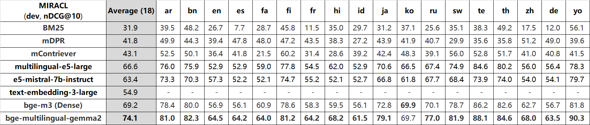
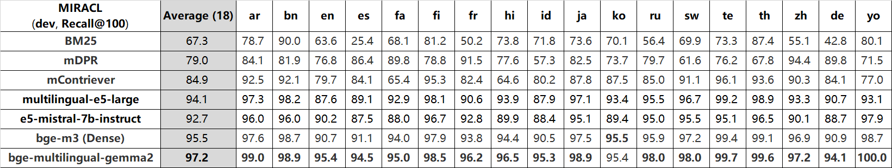
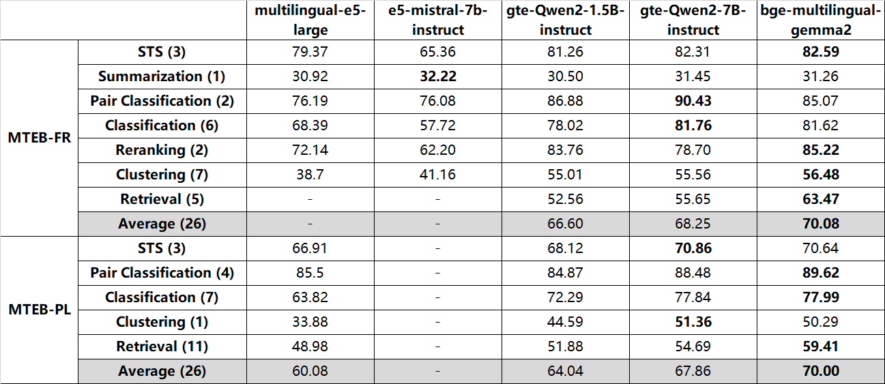
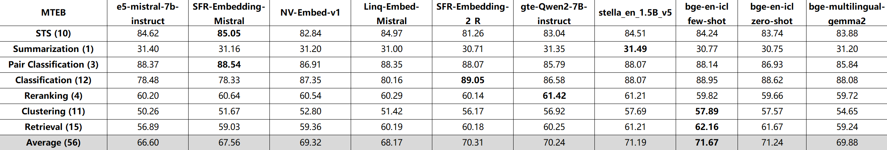
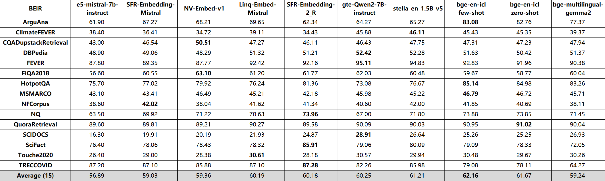
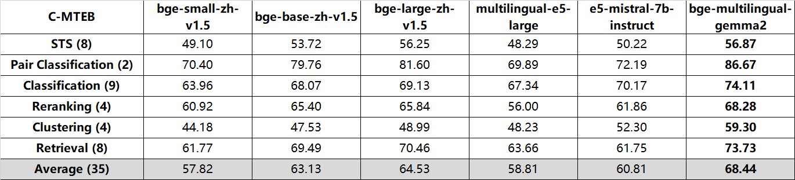
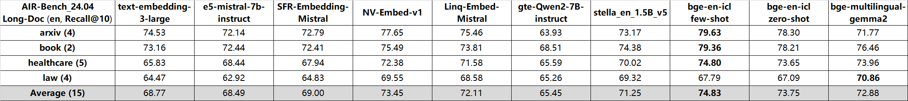
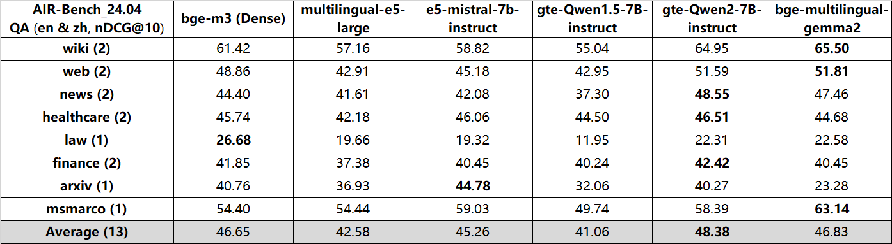

---
tags:
- feature-extraction
- sentence-similarity
- sentence-transformers
- transformers
- mteb
license: gemma
model-index:
- name: bge-multilingual-gemma2
  results:
  - task:
      type: Retrieval
    dataset:
      type: mteb/nfcorpus
      name: MTEB NFCorpus
      config: default
      split: test
      revision: ec0fa4fe99da2ff19ca1214b7966684033a58814
    metrics:
    - type: main_score
      value: 38.11433513284057
    - type: ndcg_at_1
      value: 48.45201238390093
    - type: ndcg_at_3
      value: 44.451438575534574
    - type: ndcg_at_5
      value: 41.13929990797894
    - type: ndcg_at_10
      value: 38.11433513284057
    - type: ndcg_at_100
      value: 35.36065387898559
    - type: ndcg_at_1000
      value: 44.01125752781003
    - type: map_at_1
      value: 5.638004398054564
    - type: map_at_3
      value: 10.375632572339333
    - type: map_at_5
      value: 11.820531148202422
    - type: map_at_10
      value: 14.087436978063389
    - type: map_at_100
      value: 18.25397463114958
    - type: map_at_1000
      value: 19.868440221606203
    - type: precision_at_1
      value: 49.84520123839009
    - type: precision_at_3
      value: 41.89886480908153
    - type: precision_at_5
      value: 35.356037151702814
    - type: precision_at_10
      value: 28.513931888544857
    - type: precision_at_100
      value: 9.337461300309604
    - type: precision_at_1000
      value: 2.210216718266251
    - type: recall_at_1
      value: 5.638004398054564
    - type: recall_at_3
      value: 11.938154656310312
    - type: recall_at_5
      value: 14.06183119422843
    - type: recall_at_10
      value: 18.506397834147705
    - type: recall_at_100
      value: 35.96995569451433
    - type: recall_at_1000
      value: 68.31771509404795
  - task:
      type: Retrieval
    dataset:
      type: mteb/msmarco
      name: MTEB MSMARCO
      config: default
      split: dev
      revision: c5a29a104738b98a9e76336939199e264163d4a0
    metrics:
    - type: main_score
      value: 45.70688915742828
    - type: ndcg_at_1
      value: 26.002865329512893
    - type: ndcg_at_3
      value: 37.49665652114275
    - type: ndcg_at_5
      value: 41.684045067615834
    - type: ndcg_at_10
      value: 45.70688915742828
    - type: ndcg_at_100
      value: 51.08932609519671
    - type: ndcg_at_1000
      value: 51.98806137292924
    - type: map_at_1
      value: 25.35219675262655
    - type: map_at_3
      value: 34.39549506526583
    - type: map_at_5
      value: 36.74936326010824
    - type: map_at_10
      value: 38.44429852488596
    - type: map_at_100
      value: 39.60260286311527
    - type: map_at_1000
      value: 39.64076154054021
    - type: precision_at_1
      value: 26.002865329512893
    - type: precision_at_3
      value: 15.840496657115954
    - type: precision_at_5
      value: 11.647564469914684
    - type: precision_at_10
      value: 7.1275071633243705
    - type: precision_at_100
      value: 0.9782234957019871
    - type: precision_at_1000
      value: 0.10565902578797497
    - type: recall_at_1
      value: 25.35219675262655
    - type: recall_at_3
      value: 45.78438395415474
    - type: recall_at_5
      value: 55.83213944603631
    - type: recall_at_10
      value: 68.08500477554918
    - type: recall_at_100
      value: 92.55133715377269
    - type: recall_at_1000
      value: 99.29083094555875
  - task:
      type: Retrieval
    dataset:
      type: mteb/fiqa
      name: MTEB FiQA2018
      config: default
      split: test
      revision: 27a168819829fe9bcd655c2df245fb19452e8e06
    metrics:
    - type: main_score
      value: 60.04205769404706
    - type: ndcg_at_1
      value: 59.25925925925925
    - type: ndcg_at_3
      value: 55.96637679199298
    - type: ndcg_at_5
      value: 56.937223390223956
    - type: ndcg_at_10
      value: 60.04205769404706
    - type: ndcg_at_100
      value: 66.01619664462949
    - type: ndcg_at_1000
      value: 67.59651529720728
    - type: map_at_1
      value: 31.5081163692275
    - type: map_at_3
      value: 45.7486689836227
    - type: map_at_5
      value: 48.944906602314
    - type: map_at_10
      value: 51.85427043799874
    - type: map_at_100
      value: 53.92920237379484
    - type: map_at_1000
      value: 54.04694438963671
    - type: precision_at_1
      value: 59.25925925925925
    - type: precision_at_3
      value: 37.44855967078195
    - type: precision_at_5
      value: 26.913580246913547
    - type: precision_at_10
      value: 16.52777777777774
    - type: precision_at_100
      value: 2.2962962962962754
    - type: precision_at_1000
      value: 0.2566358024691334
    - type: recall_at_1
      value: 31.5081163692275
    - type: recall_at_3
      value: 50.71759045138676
    - type: recall_at_5
      value: 57.49321152098932
    - type: recall_at_10
      value: 67.36356750245642
    - type: recall_at_100
      value: 88.67335767798735
    - type: recall_at_1000
      value: 97.83069725199356
  - task:
      type: Retrieval
    dataset:
      type: mteb/scidocs
      name: MTEB SCIDOCS
      config: default
      split: test
      revision: f8c2fcf00f625baaa80f62ec5bd9e1fff3b8ae88
    metrics:
    - type: main_score
      value: 26.93150756480961
    - type: ndcg_at_1
      value: 30.8
    - type: ndcg_at_3
      value: 25.048085553386628
    - type: ndcg_at_5
      value: 22.351207380852305
    - type: ndcg_at_10
      value: 26.93150756480961
    - type: ndcg_at_100
      value: 37.965486832874014
    - type: ndcg_at_1000
      value: 43.346046425140244
    - type: map_at_1
      value: 6.238333333333366
    - type: map_at_3
      value: 11.479166666666679
    - type: map_at_5
      value: 14.215999999999983
    - type: map_at_10
      value: 16.774632936507945
    - type: map_at_100
      value: 20.148869158557293
    - type: map_at_1000
      value: 20.528644104490823
    - type: precision_at_1
      value: 30.8
    - type: precision_at_3
      value: 23.466666666666736
    - type: precision_at_5
      value: 19.899999999999967
    - type: precision_at_10
      value: 14.069999999999938
    - type: precision_at_100
      value: 2.9770000000000065
    - type: precision_at_1000
      value: 0.42569999999999486
    - type: recall_at_1
      value: 6.238333333333366
    - type: recall_at_3
      value: 14.29333333333338
    - type: recall_at_5
      value: 20.206666666666628
    - type: recall_at_10
      value: 28.573333333333224
    - type: recall_at_100
      value: 60.43666666666675
    - type: recall_at_1000
      value: 86.3649999999997
  - task:
      type: Retrieval
    dataset:
      type: mteb/fever
      name: MTEB FEVER
      config: default
      split: test
      revision: bea83ef9e8fb933d90a2f1d5515737465d613e12
    metrics:
    - type: main_score
      value: 90.38165339181239
    - type: ndcg_at_1
      value: 84.86348634863486
    - type: ndcg_at_3
      value: 88.98667069230609
    - type: ndcg_at_5
      value: 89.86028996734895
    - type: ndcg_at_10
      value: 90.38165339181239
    - type: ndcg_at_100
      value: 90.99655378684439
    - type: ndcg_at_1000
      value: 91.15536362599602
    - type: map_at_1
      value: 78.8556296105801
    - type: map_at_3
      value: 86.24061810942983
    - type: map_at_5
      value: 86.94776680048933
    - type: map_at_10
      value: 87.26956235873007
    - type: map_at_100
      value: 87.47986397174834
    - type: map_at_1000
      value: 87.4897076664281
    - type: precision_at_1
      value: 84.86348634863486
    - type: precision_at_3
      value: 34.02340234023296
    - type: precision_at_5
      value: 21.10411041104359
    - type: precision_at_10
      value: 10.828082808282083
    - type: precision_at_100
      value: 1.1381638163816703
    - type: precision_at_1000
      value: 0.11662166216622569
    - type: recall_at_1
      value: 78.8556296105801
    - type: recall_at_3
      value: 92.34465708475605
    - type: recall_at_5
      value: 94.58010682020583
    - type: recall_at_10
      value: 96.10713452297611
    - type: recall_at_100
      value: 98.31672452959585
    - type: recall_at_1000
      value: 99.25967001462051
  - task:
      type: Retrieval
    dataset:
      type: mteb/arguana
      name: MTEB ArguAna
      config: default
      split: test
      revision: c22ab2a51041ffd869aaddef7af8d8215647e41a
    metrics:
    - type: main_score
      value: 77.36555747844541
    - type: ndcg_at_1
      value: 57.681365576102415
    - type: ndcg_at_3
      value: 72.01664798084765
    - type: ndcg_at_5
      value: 75.26345973082836
    - type: ndcg_at_10
      value: 77.36555747844541
    - type: ndcg_at_100
      value: 78.15567833673768
    - type: ndcg_at_1000
      value: 78.16528851292641
    - type: map_at_1
      value: 57.681365576102415
    - type: map_at_3
      value: 68.59886201991475
    - type: map_at_5
      value: 70.38051209103858
    - type: map_at_10
      value: 71.26684955632336
    - type: map_at_100
      value: 71.4637216600468
    - type: map_at_1000
      value: 71.46414501573332
    - type: precision_at_1
      value: 57.681365576102415
    - type: precision_at_3
      value: 27.287814129919084
    - type: precision_at_5
      value: 17.965860597439132
    - type: precision_at_10
      value: 9.623044096728066
    - type: precision_at_100
      value: 0.995732574679925
    - type: precision_at_1000
      value: 0.09964438122332549
    - type: recall_at_1
      value: 57.681365576102415
    - type: recall_at_3
      value: 81.86344238975818
    - type: recall_at_5
      value: 89.82930298719772
    - type: recall_at_10
      value: 96.23044096728307
    - type: recall_at_100
      value: 99.57325746799431
    - type: recall_at_1000
      value: 99.6443812233286
  - task:
      type: Retrieval
    dataset:
      type: mteb/scifact
      name: MTEB SciFact
      config: default
      split: test
      revision: 0228b52cf27578f30900b9e5271d331663a030d7
    metrics:
    - type: main_score
      value: 72.0465439956427
    - type: ndcg_at_1
      value: 58.666666666666664
    - type: ndcg_at_3
      value: 66.84566274610046
    - type: ndcg_at_5
      value: 69.46578881873717
    - type: ndcg_at_10
      value: 72.0465439956427
    - type: ndcg_at_100
      value: 74.25705461923272
    - type: ndcg_at_1000
      value: 74.63689058493014
    - type: map_at_1
      value: 55.59444444444445
    - type: map_at_3
      value: 63.71851851851852
    - type: map_at_5
      value: 65.5362962962963
    - type: map_at_10
      value: 66.84112433862435
    - type: map_at_100
      value: 67.36269426417417
    - type: map_at_1000
      value: 67.37568665562833
    - type: precision_at_1
      value: 58.666666666666664
    - type: precision_at_3
      value: 26.444444444444425
    - type: precision_at_5
      value: 17.66666666666672
    - type: precision_at_10
      value: 9.866666666666706
    - type: precision_at_100
      value: 1.0966666666666596
    - type: precision_at_1000
      value: 0.11266666666666675
    - type: recall_at_1
      value: 55.59444444444445
    - type: recall_at_3
      value: 72.72777777777777
    - type: recall_at_5
      value: 79.31666666666666
    - type: recall_at_10
      value: 86.75
    - type: recall_at_100
      value: 96.66666666666667
    - type: recall_at_1000
      value: 99.66666666666667
  - task:
      type: Retrieval
    dataset:
      type: mteb/trec-covid
      name: MTEB TRECCOVID
      config: default
      split: test
      revision: bb9466bac8153a0349341eb1b22e06409e78ef4e
    metrics:
    - type: main_score
      value: 64.26928884606035
    - type: ndcg_at_1
      value: 63.0
    - type: ndcg_at_3
      value: 64.18432764386345
    - type: ndcg_at_5
      value: 64.73235515799435
    - type: ndcg_at_10
      value: 64.26928884606035
    - type: ndcg_at_100
      value: 52.39807133285409
    - type: ndcg_at_1000
      value: 52.19937563361241
    - type: map_at_1
      value: 0.18483494997310454
    - type: map_at_3
      value: 0.5139705769331114
    - type: map_at_5
      value: 0.8245601222717243
    - type: map_at_10
      value: 1.5832530269558573
    - type: map_at_100
      value: 9.664760850102393
    - type: map_at_1000
      value: 25.568347406468334
    - type: precision_at_1
      value: 70.0
    - type: precision_at_3
      value: 71.33333333333333
    - type: precision_at_5
      value: 71.60000000000001
    - type: precision_at_10
      value: 70.99999999999996
    - type: precision_at_100
      value: 55.140000000000015
    - type: precision_at_1000
      value: 23.857999999999997
    - type: recall_at_1
      value: 0.18483494997310454
    - type: recall_at_3
      value: 0.5584287301859913
    - type: recall_at_5
      value: 0.9489025953807098
    - type: recall_at_10
      value: 1.9023711039425688
    - type: recall_at_100
      value: 13.596810701594226
    - type: recall_at_1000
      value: 50.92058432920189
  - task:
      type: Retrieval
    dataset:
      type: mteb/climate-fever
      name: MTEB ClimateFEVER
      config: default
      split: test
      revision: 47f2ac6acb640fc46020b02a5b59fdda04d39380
    metrics:
    - type: main_score
      value: 39.37204193531481
    - type: ndcg_at_1
      value: 35.11400651465798
    - type: ndcg_at_3
      value: 32.36672790229743
    - type: ndcg_at_5
      value: 34.79369234162357
    - type: ndcg_at_10
      value: 39.37204193531481
    - type: ndcg_at_100
      value: 47.544500439419124
    - type: ndcg_at_1000
      value: 50.305733346049855
    - type: map_at_1
      value: 15.516829533116216
    - type: map_at_3
      value: 23.73669923995656
    - type: map_at_5
      value: 26.43208469055373
    - type: map_at_10
      value: 28.912036175309773
    - type: map_at_100
      value: 31.413762299240894
    - type: map_at_1000
      value: 31.596796093997014
    - type: precision_at_1
      value: 35.11400651465798
    - type: precision_at_3
      value: 24.994571118349487
    - type: precision_at_5
      value: 19.231270358305956
    - type: precision_at_10
      value: 12.690553745928165
    - type: precision_at_100
      value: 2.1576547231270466
    - type: precision_at_1000
      value: 0.2676221498371306
    - type: recall_at_1
      value: 15.516829533116216
    - type: recall_at_3
      value: 29.994571118349512
    - type: recall_at_5
      value: 37.14223669923993
    - type: recall_at_10
      value: 47.29207383279043
    - type: recall_at_100
      value: 74.37133550488598
    - type: recall_at_1000
      value: 89.41585233441913
  - task:
      type: Retrieval
    dataset:
      type: mteb/hotpotqa
      name: MTEB HotpotQA
      config: default
      split: test
      revision: ab518f4d6fcca38d87c25209f94beba119d02014
    metrics:
    - type: main_score
      value: 83.26282954330777
    - type: ndcg_at_1
      value: 87.5489534098582
    - type: ndcg_at_3
      value: 78.7646435855166
    - type: ndcg_at_5
      value: 81.41629077444277
    - type: ndcg_at_10
      value: 83.26282954330777
    - type: ndcg_at_100
      value: 85.2771369900158
    - type: ndcg_at_1000
      value: 85.77519303747493
    - type: map_at_1
      value: 43.7744767049291
    - type: map_at_3
      value: 73.4661264911093
    - type: map_at_5
      value: 75.7169705154168
    - type: map_at_10
      value: 76.89183627536043
    - type: map_at_100
      value: 77.53680315727078
    - type: map_at_1000
      value: 77.5649311522075
    - type: precision_at_1
      value: 87.5489534098582
    - type: precision_at_3
      value: 51.74881836596788
    - type: precision_at_5
      value: 33.13977042539127
    - type: precision_at_10
      value: 17.492234976369023
    - type: precision_at_100
      value: 1.9030384875084312
    - type: precision_at_1000
      value: 0.19679945982446267
    - type: recall_at_1
      value: 43.7744767049291
    - type: recall_at_3
      value: 77.62322754895341
    - type: recall_at_5
      value: 82.84942606347063
    - type: recall_at_10
      value: 87.4611748818366
    - type: recall_at_100
      value: 95.15192437542201
    - type: recall_at_1000
      value: 98.39972991222147
  - task:
      type: Retrieval
    dataset:
      type: mteb/nq
      name: MTEB NQ
      config: default
      split: test
      revision: b774495ed302d8c44a3a7ea25c90dbce03968f31
    metrics:
    - type: main_score
      value: 71.44670934705796
    - type: ndcg_at_1
      value: 54.026651216685984
    - type: ndcg_at_3
      value: 65.1267452491225
    - type: ndcg_at_5
      value: 68.6696802020747
    - type: ndcg_at_10
      value: 71.44670934705796
    - type: ndcg_at_100
      value: 73.74642927386503
    - type: ndcg_at_1000
      value: 73.90908268307331
    - type: map_at_1
      value: 48.50086906141366
    - type: map_at_3
      value: 61.07691193510995
    - type: map_at_5
      value: 63.36580243337187
    - type: map_at_10
      value: 64.74485498782997
    - type: map_at_100
      value: 65.34329174534082
    - type: map_at_1000
      value: 65.35107870745652
    - type: precision_at_1
      value: 54.026651216685984
    - type: precision_at_3
      value: 28.437620702974996
    - type: precision_at_5
      value: 19.20625724217861
    - type: precision_at_10
      value: 10.67207415990753
    - type: precision_at_100
      value: 1.1987253765932955
    - type: precision_at_1000
      value: 0.12143684820393259
    - type: recall_at_1
      value: 48.50086906141366
    - type: recall_at_3
      value: 73.19428350714561
    - type: recall_at_5
      value: 81.19689069138664
    - type: recall_at_10
      value: 89.04741212823485
    - type: recall_at_100
      value: 98.58053302433372
    - type: recall_at_1000
      value: 99.75376593279258
  - task:
      type: Retrieval
    dataset:
      type: mteb/quora
      name: MTEB QuoraRetrieval
      config: default
      split: test
      revision: e4e08e0b7dbe3c8700f0daef558ff32256715259
    metrics:
    - type: main_score
      value: 90.03760323006117
    - type: ndcg_at_1
      value: 83.53
    - type: ndcg_at_3
      value: 87.53800795646302
    - type: ndcg_at_5
      value: 88.92909168525203
    - type: ndcg_at_10
      value: 90.03760323006117
    - type: ndcg_at_100
      value: 91.08558507332712
    - type: ndcg_at_1000
      value: 91.1430039358834
    - type: map_at_1
      value: 72.61760432018744
    - type: map_at_3
      value: 83.8457060028347
    - type: map_at_5
      value: 85.6228412692169
    - type: map_at_10
      value: 86.67700531365115
    - type: map_at_100
      value: 87.29851728827602
    - type: map_at_1000
      value: 87.31014621733333
    - type: precision_at_1
      value: 83.53
    - type: precision_at_3
      value: 38.33666666667159
    - type: precision_at_5
      value: 25.12599999999881
    - type: precision_at_10
      value: 13.629999999998683
    - type: precision_at_100
      value: 1.5431999999999773
    - type: precision_at_1000
      value: 0.15671999999997974
    - type: recall_at_1
      value: 72.61760432018744
    - type: recall_at_3
      value: 89.06736052932686
    - type: recall_at_5
      value: 93.09634203522849
    - type: recall_at_10
      value: 96.35128012894234
    - type: recall_at_100
      value: 99.7740237858541
    - type: recall_at_1000
      value: 99.99690476190477
  - task:
      type: Retrieval
    dataset:
      type: mteb/webis-touche2020
      name: MTEB Touche2020
      config: default
      split: test
      revision: a34f9a33db75fa0cbb21bb5cfc3dae8dc8bec93f
    metrics:
    - type: main_score
      value: 30.2563523019649
    - type: ndcg_at_1
      value: 37.755102040816325
    - type: ndcg_at_3
      value: 34.45349994459905
    - type: ndcg_at_5
      value: 32.508805919063086
    - type: ndcg_at_10
      value: 30.2563523019649
    - type: ndcg_at_100
      value: 40.538336664503746
    - type: ndcg_at_1000
      value: 52.2066951614923
    - type: map_at_1
      value: 2.75537988273998
    - type: map_at_3
      value: 6.011397290504469
    - type: map_at_5
      value: 8.666495836494098
    - type: map_at_10
      value: 12.17701515007822
    - type: map_at_100
      value: 18.789086471205852
    - type: map_at_1000
      value: 20.42972375502502
    - type: precision_at_1
      value: 40.816326530612244
    - type: precision_at_3
      value: 35.37414965986394
    - type: precision_at_5
      value: 32.244897959183675
    - type: precision_at_10
      value: 26.93877551020408
    - type: precision_at_100
      value: 8.163265306122451
    - type: precision_at_1000
      value: 1.5979591836734703
    - type: recall_at_1
      value: 2.75537988273998
    - type: recall_at_3
      value: 7.254270324385098
    - type: recall_at_5
      value: 11.580137100328589
    - type: recall_at_10
      value: 18.745232816450553
    - type: recall_at_100
      value: 50.196809658622755
    - type: recall_at_1000
      value: 85.87317364148332
  - task:
      type: Retrieval
    dataset:
      type: mteb/dbpedia
      name: MTEB DBPedia
      config: default
      split: test
      revision: c0f706b76e590d620bd6618b3ca8efdd34e2d659
    metrics:
    - type: main_score
      value: 51.36940792375597
    - type: ndcg_at_1
      value: 65.125
    - type: ndcg_at_3
      value: 55.3967569049025
    - type: ndcg_at_5
      value: 53.09668587926677
    - type: ndcg_at_10
      value: 51.36940792375597
    - type: ndcg_at_100
      value: 56.69623269243084
    - type: ndcg_at_1000
      value: 63.481061270842
    - type: map_at_1
      value: 10.265595545755545
    - type: map_at_3
      value: 16.776544233350698
    - type: map_at_5
      value: 20.184523605272798
    - type: map_at_10
      value: 24.772797659849264
    - type: map_at_100
      value: 36.72689012514183
    - type: map_at_1000
      value: 38.73869985105569
    - type: precision_at_1
      value: 77.5
    - type: precision_at_3
      value: 59.75000000000003
    - type: precision_at_5
      value: 52.849999999999994
    - type: precision_at_10
      value: 42.47499999999995
    - type: precision_at_100
      value: 13.614999999999993
    - type: precision_at_1000
      value: 2.500749999999998
    - type: recall_at_1
      value: 10.265595545755545
    - type: recall_at_3
      value: 17.819804963534246
    - type: recall_at_5
      value: 22.46124219601634
    - type: recall_at_10
      value: 30.44583516613163
    - type: recall_at_100
      value: 63.84118006287797
    - type: recall_at_1000
      value: 85.06450356093833
  - task:
      type: Retrieval
    dataset:
      type: BeIR/cqadupstack
      name: MTEB CQADupstackRetrieval
      config: default
      split: test
      revision: 4ffe81d471b1924886b33c7567bfb200e9eec5c4
    metrics:
    - type: main_score
      value: 47.93921415959017
    - type: ndcg_at_1
      value: 36.526219490536015
    - type: ndcg_at_3
      value: 42.35099043224295
    - type: ndcg_at_5
      value: 44.989685312964156
    - type: ndcg_at_10
      value: 47.93921415959017
    - type: ndcg_at_100
      value: 53.05390282389675
    - type: ndcg_at_1000
      value: 54.776052731794266
    - type: map_at_1
      value: 30.818605279548184
    - type: map_at_3
      value: 38.363350019087974
    - type: map_at_5
      value: 40.295203936887226
    - type: map_at_10
      value: 41.81978941662592
    - type: map_at_100
      value: 43.13300727554278
    - type: map_at_1000
      value: 43.2351061120207
    - type: precision_at_1
      value: 36.526219490536015
    - type: precision_at_3
      value: 19.550515857206346
    - type: precision_at_5
      value: 13.958783060831967
    - type: precision_at_10
      value: 8.498592395773393
    - type: precision_at_100
      value: 1.3024888941713948
    - type: precision_at_1000
      value: 0.1630253057414617
    - type: recall_at_1
      value: 30.818605279548184
    - type: recall_at_3
      value: 45.9132085981904
    - type: recall_at_5
      value: 52.6851323959227
    - type: recall_at_10
      value: 61.39718618970463
    - type: recall_at_100
      value: 83.30757187969981
    - type: recall_at_1000
      value: 94.9192024147964
  - dataset:
      config: en
      name: MTEB AmazonCounterfactualClassification (en)
      revision: e8379541af4e31359cca9fbcf4b00f2671dba205
      split: test
      type: mteb/amazon_counterfactual
    metrics:
    - type: accuracy
      value: 89.47761194029852
    - type: accuracy_stderr
      value: 1.6502495811564162
    - type: ap
      value: 62.20813715457866
    - type: ap_stderr
      value: 3.7902166647587854
    - type: f1
      value: 84.91493292274734
    - type: f1_stderr
      value: 1.9572239640276208
    - type: main_score
      value: 89.47761194029852
    task:
      type: Classification
  - dataset:
      config: default
      name: MTEB AmazonPolarityClassification
      revision: e2d317d38cd51312af73b3d32a06d1a08b442046
      split: test
      type: mteb/amazon_polarity
    metrics:
    - type: accuracy
      value: 96.89569999999999
    - type: accuracy_stderr
      value: 0.6886368582206464
    - type: ap
      value: 95.38531339207739
    - type: ap_stderr
      value: 0.9009257949898158
    - type: f1
      value: 96.8941935264779
    - type: f1_stderr
      value: 0.6908609132985931
    - type: main_score
      value: 96.89569999999999
    task:
      type: Classification
  - dataset:
      config: en
      name: MTEB AmazonReviewsClassification (en)
      revision: 1399c76144fd37290681b995c656ef9b2e06e26d
      split: test
      type: mteb/amazon_reviews_multi
    metrics:
    - type: accuracy
      value: 61.602000000000004
    - type: accuracy_stderr
      value: 1.4532019818318436
    - type: f1
      value: 60.96100449021481
    - type: f1_stderr
      value: 1.8031398419765765
    - type: main_score
      value: 61.602000000000004
    task:
      type: Classification
  - dataset:
      config: default
      name: MTEB ArxivClusteringP2P
      revision: a122ad7f3f0291bf49cc6f4d32aa80929df69d5d
      split: test
      type: mteb/arxiv-clustering-p2p
    metrics:
    - type: main_score
      value: 54.906319409992
    - type: v_measure
      value: 54.906319409992
    - type: v_measure_std
      value: 14.382682652951683
    task:
      type: Clustering
  - dataset:
      config: default
      name: MTEB ArxivClusteringS2S
      revision: f910caf1a6075f7329cdf8c1a6135696f37dbd53
      split: test
      type: mteb/arxiv-clustering-s2s
    metrics:
    - type: main_score
      value: 50.27779516565727
    - type: v_measure
      value: 50.27779516565727
    - type: v_measure_std
      value: 14.463711418590636
    task:
      type: Clustering
  - dataset:
      config: default
      name: MTEB AskUbuntuDupQuestions
      revision: 2000358ca161889fa9c082cb41daa8dcfb161a54
      split: test
      type: mteb/askubuntudupquestions-reranking
    metrics:
    - type: map
      value: 64.59457317979604
    - type: mrr
      value: 78.05214791364376
    - type: main_score
      value: 64.59457317979604
    task:
      type: Reranking
  - dataset:
      config: default
      name: MTEB BIOSSES
      revision: d3fb88f8f02e40887cd149695127462bbcf29b4a
      split: test
      type: mteb/biosses-sts
    metrics:
    - type: cosine_pearson
      value: 86.5833945335644
    - type: cosine_spearman
      value: 85.74472483606
    - type: manhattan_pearson
      value: 85.07748703871708
    - type: manhattan_spearman
      value: 85.1459160110718
    - type: euclidean_pearson
      value: 85.14704290043478
    - type: euclidean_spearman
      value: 85.10073425868336
    - type: main_score
      value: 85.74472483606
    task:
      type: STS
  - dataset:
      config: default
      name: MTEB Banking77Classification
      revision: 0fd18e25b25c072e09e0d92ab615fda904d66300
      split: test
      type: mteb/banking77
    metrics:
    - type: accuracy
      value: 92.53246753246755
    - type: accuracy_stderr
      value: 0.5488837781559508
    - type: f1
      value: 92.5143182074032
    - type: f1_stderr
      value: 0.5657577980223147
    - type: main_score
      value: 92.53246753246755
    task:
      type: Classification
  - dataset:
      config: default
      name: MTEB BiorxivClusteringP2P
      revision: 65b79d1d13f80053f67aca9498d9402c2d9f1f40
      split: test
      type: mteb/biorxiv-clustering-p2p
    metrics:
    - type: main_score
      value: 52.64099497480452
    - type: v_measure
      value: 52.64099497480452
    - type: v_measure_std
      value: 1.081892399559334
    task:
      type: Clustering
  - dataset:
      config: default
      name: MTEB BiorxivClusteringS2S
      revision: 258694dd0231531bc1fd9de6ceb52a0853c6d908
      split: test
      type: mteb/biorxiv-clustering-s2s
    metrics:
    - type: main_score
      value: 49.1972734308178
    - type: v_measure
      value: 49.1972734308178
    - type: v_measure_std
      value: 0.9081245477708283
    task:
      type: Clustering
  - dataset:
      config: default
      name: MTEB EmotionClassification
      revision: 4f58c6b202a23cf9a4da393831edf4f9183cad37
      split: test
      type: mteb/emotion
    metrics:
    - type: accuracy
      value: 92.975
    - type: accuracy_stderr
      value: 0.5287958017987677
    - type: f1
      value: 89.29755895896542
    - type: f1_stderr
      value: 0.6485027046025079
    - type: main_score
      value: 92.975
    task:
      type: Classification
  - dataset:
      config: default
      name: MTEB ImdbClassification
      revision: 3d86128a09e091d6018b6d26cad27f2739fc2db7
      split: test
      type: mteb/imdb
    metrics:
    - type: accuracy
      value: 96.66480000000001
    - type: accuracy_stderr
      value: 0.45673204398202666
    - type: ap
      value: 95.33843919456118
    - type: ap_stderr
      value: 0.6449846039754393
    - type: f1
      value: 96.6637668164617
    - type: f1_stderr
      value: 0.45793673051468287
    - type: main_score
      value: 96.66480000000001
    task:
      type: Classification
  - dataset:
      config: en
      name: MTEB MTOPDomainClassification (en)
      revision: d80d48c1eb48d3562165c59d59d0034df9fff0bf
      split: test
      type: mteb/mtop_domain
    metrics:
    - type: accuracy
      value: 98.61149110807114
    - type: accuracy_stderr
      value: 0.469748178253266
    - type: f1
      value: 98.4685511007568
    - type: f1_stderr
      value: 0.51636776728259
    - type: main_score
      value: 98.61149110807114
    task:
      type: Classification
  - dataset:
      config: en
      name: MTEB MTOPIntentClassification (en)
      revision: ae001d0e6b1228650b7bd1c2c65fb50ad11a8aba
      split: test
      type: mteb/mtop_intent
    metrics:
    - type: accuracy
      value: 95.51299589603283
    - type: accuracy_stderr
      value: 0.3591676911539482
    - type: f1
      value: 85.2464691439773
    - type: f1_stderr
      value: 0.9234502856695337
    - type: main_score
      value: 95.51299589603283
    task:
      type: Classification
  - dataset:
      config: en
      name: MTEB MassiveIntentClassification (en)
      revision: 31efe3c427b0bae9c22cbb560b8f15491cc6bed7
      split: test
      type: mteb/amazon_massive_intent
    metrics:
    - type: accuracy
      value: 82.04774714189644
    - type: accuracy_stderr
      value: 0.7288818520309376
    - type: f1
      value: 79.28060657840692
    - type: f1_stderr
      value: 0.6872008571781982
    - type: main_score
      value: 82.04774714189644
    task:
      type: Classification
  - dataset:
      config: en
      name: MTEB MassiveScenarioClassification (en)
      revision: 7d571f92784cd94a019292a1f45445077d0ef634
      split: test
      type: mteb/amazon_massive_scenario
    metrics:
    - type: accuracy
      value: 84.40147948890383
    - type: accuracy_stderr
      value: 1.2939587629143627
    - type: f1
      value: 83.97779287582267
    - type: f1_stderr
      value: 0.9970599222060901
    - type: main_score
      value: 84.40147948890383
    task:
      type: Classification
  - dataset:
      config: default
      name: MTEB MedrxivClusteringP2P
      revision: e7a26af6f3ae46b30dde8737f02c07b1505bcc73
      split: test
      type: mteb/medrxiv-clustering-p2p
    metrics:
    - type: main_score
      value: 45.80879120838561
    - type: v_measure
      value: 45.80879120838561
    - type: v_measure_std
      value: 1.257800489264564
    task:
      type: Clustering
  - dataset:
      config: default
      name: MTEB MedrxivClusteringS2S
      revision: 35191c8c0dca72d8ff3efcd72aa802307d469663
      split: test
      type: mteb/medrxiv-clustering-s2s
    metrics:
    - type: main_score
      value: 44.106849261042505
    - type: v_measure
      value: 44.106849261042505
    - type: v_measure_std
      value: 1.4347344477874981
    task:
      type: Clustering
  - dataset:
      config: default
      name: MTEB MindSmallReranking
      revision: 3bdac13927fdc888b903db93b2ffdbd90b295a69
      split: test
      type: mteb/mind_small
    metrics:
    - type: map
      value: 31.794062752995345
    - type: mrr
      value: 32.98581714772614
    - type: main_score
      value: 31.794062752995345
    task:
      type: Reranking
  - dataset:
      config: default
      name: MTEB RedditClustering
      revision: 24640382cdbf8abc73003fb0fa6d111a705499eb
      split: test
      type: mteb/reddit-clustering
    metrics:
    - type: main_score
      value: 56.03342473834434
    - type: v_measure
      value: 56.03342473834434
    - type: v_measure_std
      value: 5.972192613803461
    task:
      type: Clustering
  - dataset:
      config: default
      name: MTEB RedditClusteringP2P
      revision: 282350215ef01743dc01b456c7f5241fa8937f16
      split: test
      type: mteb/reddit-clustering-p2p
    metrics:
    - type: main_score
      value: 65.83156688381274
    - type: v_measure
      value: 65.83156688381274
    - type: v_measure_std
      value: 14.180225112120162
    task:
      type: Clustering
  - dataset:
      config: default
      name: MTEB SICK-R
      revision: a6ea5a8cab320b040a23452cc28066d9beae2cee
      split: test
      type: mteb/sickr-sts
    metrics:
    - type: cosine_pearson
      value: 84.15759544348467
    - type: cosine_spearman
      value: 82.66085892322664
    - type: manhattan_pearson
      value: 82.27257241990692
    - type: manhattan_spearman
      value: 82.57752467555896
    - type: euclidean_pearson
      value: 82.20795646456065
    - type: euclidean_spearman
      value: 82.51008729416401
    - type: main_score
      value: 82.66085892322664
    task:
      type: STS
  - dataset:
      config: default
      name: MTEB STS12
      revision: a0d554a64d88156834ff5ae9920b964011b16384
      split: test
      type: mteb/sts12-sts
    metrics:
    - type: cosine_pearson
      value: 84.3406321391237
    - type: cosine_spearman
      value: 77.71091257651071
    - type: manhattan_pearson
      value: 81.25784268400994
    - type: manhattan_spearman
      value: 77.98426383345507
    - type: euclidean_pearson
      value: 81.25641851462917
    - type: euclidean_spearman
      value: 77.93254971878063
    - type: main_score
      value: 77.71091257651071
    task:
      type: STS
  - dataset:
      config: default
      name: MTEB STS13
      revision: 7e90230a92c190f1bf69ae9002b8cea547a64cca
      split: test
      type: mteb/sts13-sts
    metrics:
    - type: cosine_pearson
      value: 86.1528398894769
    - type: cosine_spearman
      value: 87.44662352358895
    - type: manhattan_pearson
      value: 86.92164570802663
    - type: manhattan_spearman
      value: 86.9132692625668
    - type: euclidean_pearson
      value: 87.00156426580821
    - type: euclidean_spearman
      value: 86.98750068631274
    - type: main_score
      value: 87.44662352358895
    task:
      type: STS
  - dataset:
      config: default
      name: MTEB STS14
      revision: 6031580fec1f6af667f0bd2da0a551cf4f0b2375
      split: test
      type: mteb/sts14-sts
    metrics:
    - type: cosine_pearson
      value: 83.32782491176253
    - type: cosine_spearman
      value: 83.48313793311584
    - type: manhattan_pearson
      value: 82.60528063429948
    - type: manhattan_spearman
      value: 83.10434862310481
    - type: euclidean_pearson
      value: 82.68016090104034
    - type: euclidean_spearman
      value: 83.14418662406631
    - type: main_score
      value: 83.48313793311584
    task:
      type: STS
  - dataset:
      config: default
      name: MTEB STS15
      revision: ae752c7c21bf194d8b67fd573edf7ae58183cbe3
      split: test
      type: mteb/sts15-sts
    metrics:
    - type: cosine_pearson
      value: 86.31535441436343
    - type: cosine_spearman
      value: 87.63145141246594
    - type: manhattan_pearson
      value: 86.95972711389149
    - type: manhattan_spearman
      value: 86.9849824463052
    - type: euclidean_pearson
      value: 86.95391575487379
    - type: euclidean_spearman
      value: 86.97613682266213
    - type: main_score
      value: 87.63145141246594
    task:
      type: STS
  - dataset:
      config: default
      name: MTEB STS16
      revision: 4d8694f8f0e0100860b497b999b3dbed754a0513
      split: test
      type: mteb/sts16-sts
    metrics:
    - type: cosine_pearson
      value: 83.43854397443079
    - type: cosine_spearman
      value: 86.70176531845136
    - type: manhattan_pearson
      value: 85.82302317064868
    - type: manhattan_spearman
      value: 86.36561734213241
    - type: euclidean_pearson
      value: 85.80127366135169
    - type: euclidean_spearman
      value: 86.34803859754834
    - type: main_score
      value: 86.70176531845136
    task:
      type: STS
  - dataset:
      config: en-en
      name: MTEB STS17 (en-en)
      revision: af5e6fb845001ecf41f4c1e033ce921939a2a68d
      split: test
      type: mteb/sts17-crosslingual-sts
    metrics:
    - type: cosine_pearson
      value: 90.38940955877999
    - type: cosine_spearman
      value: 91.18282119920893
    - type: manhattan_pearson
      value: 91.31823663739615
    - type: manhattan_spearman
      value: 90.67257321731341
    - type: euclidean_pearson
      value: 91.30318753138528
    - type: euclidean_spearman
      value: 90.69044765693836
    - type: main_score
      value: 91.18282119920893
    task:
      type: STS
  - dataset:
      config: en
      name: MTEB STS22 (en)
      revision: eea2b4fe26a775864c896887d910b76a8098ad3f
      split: test
      type: mteb/sts22-crosslingual-sts
    metrics:
    - type: cosine_pearson
      value: 69.33936467780947
    - type: cosine_spearman
      value: 69.02345807358802
    - type: manhattan_pearson
      value: 70.11799452953082
    - type: manhattan_spearman
      value: 68.55450923481405
    - type: euclidean_pearson
      value: 70.10857680491809
    - type: euclidean_spearman
      value: 68.44610245708984
    - type: main_score
      value: 69.02345807358802
    task:
      type: STS
  - dataset:
      config: default
      name: MTEB STSBenchmark
      revision: b0fddb56ed78048fa8b90373c8a3cfc37b684831
      split: test
      type: mteb/stsbenchmark-sts
    metrics:
    - type: cosine_pearson
      value: 85.97288135509513
    - type: cosine_spearman
      value: 87.25208310840168
    - type: manhattan_pearson
      value: 86.3786471501451
    - type: manhattan_spearman
      value: 86.71177136523868
    - type: euclidean_pearson
      value: 86.40522339296625
    - type: euclidean_spearman
      value: 86.73930576508816
    - type: main_score
      value: 87.25208310840168
    task:
      type: STS
  - dataset:
      config: default
      name: MTEB SciDocsRR
      revision: d3c5e1fc0b855ab6097bf1cda04dd73947d7caab
      split: test
      type: mteb/scidocs-reranking
    metrics:
    - type: map
      value: 87.60324164489178
    - type: mrr
      value: 96.30331904841708
    - type: main_score
      value: 87.60324164489178
    task:
      type: Reranking
  - dataset:
      config: default
      name: MTEB SprintDuplicateQuestions
      revision: d66bd1f72af766a5cc4b0ca5e00c162f89e8cc46
      split: test
      type: mteb/sprintduplicatequestions-pairclassification
    metrics:
    - type: cos_sim_accuracy
      value: 99.6920792079208
    - type: cos_sim_accuracy_threshold
      value: 90.36337347155474
    - type: cos_sim_ap
      value: 90.93952679056765
    - type: cos_sim_f1
      value: 83.10700706137968
    - type: cos_sim_f1_threshold
      value: 90.36337347155474
    - type: cos_sim_precision
      value: 90.96313912009512
    - type: cos_sim_recall
      value: 76.5
    - type: dot_accuracy
      value: 99.54554455445545
    - type: dot_accuracy_threshold
      value: 2876800.0
    - type: dot_ap
      value: 84.01112287735286
    - type: dot_f1
      value: 75.7622739018088
    - type: dot_f1_threshold
      value: 2820800.0
    - type: dot_precision
      value: 78.39572192513369
    - type: dot_recall
      value: 73.3
    - type: euclidean_accuracy
      value: 99.6930693069307
    - type: euclidean_accuracy_threshold
      value: 7718.054017089397
    - type: euclidean_ap
      value: 91.1257568881301
    - type: euclidean_f1
      value: 83.09022150189087
    - type: euclidean_f1_threshold
      value: 7817.08324628535
    - type: euclidean_precision
      value: 90.36427732079906
    - type: euclidean_recall
      value: 76.9
    - type: manhattan_accuracy
      value: 99.6920792079208
    - type: manhattan_accuracy_threshold
      value: 364735.19654273987
    - type: manhattan_ap
      value: 91.2326885940691
    - type: manhattan_f1
      value: 83.36008560727663
    - type: manhattan_f1_threshold
      value: 375395.8945572376
    - type: manhattan_precision
      value: 89.64326812428078
    - type: manhattan_recall
      value: 77.9
    - type: max_accuracy
      value: 99.6930693069307
    - type: max_ap
      value: 91.2326885940691
    - type: max_f1
      value: 83.36008560727663
    task:
      type: PairClassification
  - dataset:
      config: default
      name: MTEB StackExchangeClustering
      revision: 6cbc1f7b2bc0622f2e39d2c77fa502909748c259
      split: test
      type: mteb/stackexchange-clustering
    metrics:
    - type: main_score
      value: 66.2095300942637
    - type: v_measure
      value: 66.2095300942637
    - type: v_measure_std
      value: 3.214369679617631
    task:
      type: Clustering
  - dataset:
      config: default
      name: MTEB StackExchangeClusteringP2P
      revision: 815ca46b2622cec33ccafc3735d572c266efdb44
      split: test
      type: mteb/stackexchange-clustering-p2p
    metrics:
    - type: main_score
      value: 45.74307000935057
    - type: v_measure
      value: 45.74307000935057
    - type: v_measure_std
      value: 1.5352466748569888
    task:
      type: Clustering
  - dataset:
      config: default
      name: MTEB StackOverflowDupQuestions
      revision: e185fbe320c72810689fc5848eb6114e1ef5ec69
      split: test
      type: mteb/stackoverflowdupquestions-reranking
    metrics:
    - type: map
      value: 54.90337951829123
    - type: mrr
      value: 56.12889663441134
    - type: main_score
      value: 54.90337951829123
    task:
      type: Reranking
  - dataset:
      config: default
      name: MTEB SummEval
      revision: cda12ad7615edc362dbf25a00fdd61d3b1eaf93c
      split: test
      type: mteb/summeval
    metrics:
    - type: cosine_pearson
      value: 31.0669308484832
    - type: cosine_spearman
      value: 31.19637421540861
    - type: dot_pearson
      value: 30.62326176666765
    - type: dot_spearman
      value: 30.42135737502967
    - type: main_score
      value: 31.19637421540861
    task:
      type: Summarization
  - dataset:
      config: default
      name: MTEB ToxicConversationsClassification
      revision: d7c0de2777da35d6aae2200a62c6e0e5af397c4c
      split: test
      type: mteb/toxic_conversations_50k
    metrics:
    - type: accuracy
      value: 87.34339999999999
    - type: accuracy_stderr
      value: 1.838245696309393
    - type: ap
      value: 33.536584790435406
    - type: ap_stderr
      value: 2.276373512492581
    - type: f1
      value: 72.47307082324448
    - type: f1_stderr
      value: 1.9964640292072542
    - type: main_score
      value: 87.34339999999999
    task:
      type: Classification
  - dataset:
      config: default
      name: MTEB TweetSentimentExtractionClassification
      revision: d604517c81ca91fe16a244d1248fc021f9ecee7a
      split: test
      type: mteb/tweet_sentiment_extraction
    metrics:
    - type: accuracy
      value: 78.86247877758915
    - type: accuracy_stderr
      value: 1.1273253738982443
    - type: f1
      value: 79.14666244848874
    - type: f1_stderr
      value: 1.1532640958036497
    - type: main_score
      value: 78.86247877758915
    task:
      type: Classification
  - dataset:
      config: default
      name: MTEB TwentyNewsgroupsClustering
      revision: 6125ec4e24fa026cec8a478383ee943acfbd5449
      split: test
      type: mteb/twentynewsgroups-clustering
    metrics:
    - type: main_score
      value: 70.44270836680788
    - type: v_measure
      value: 70.44270836680788
    - type: v_measure_std
      value: 1.5185423698266132
    task:
      type: Clustering
  - dataset:
      config: default
      name: MTEB TwitterSemEval2015
      revision: 70970daeab8776df92f5ea462b6173c0b46fd2d1
      split: test
      type: mteb/twittersemeval2015-pairclassification
    metrics:
    - type: cos_sim_accuracy
      value: 87.74512725755498
    - type: cos_sim_accuracy_threshold
      value: 82.34941560483547
    - type: cos_sim_ap
      value: 79.6389274210382
    - type: cos_sim_f1
      value: 71.76319176319176
    - type: cos_sim_f1_threshold
      value: 80.1523829249257
    - type: cos_sim_precision
      value: 70.0502512562814
    - type: cos_sim_recall
      value: 73.56200527704485
    - type: dot_accuracy
      value: 85.13441020444657
    - type: dot_accuracy_threshold
      value: 2220800.0
    - type: dot_ap
      value: 71.67080150823449
    - type: dot_f1
      value: 66.18984119287187
    - type: dot_f1_threshold
      value: 2086400.0
    - type: dot_precision
      value: 61.224489795918366
    - type: dot_recall
      value: 72.0316622691293
    - type: euclidean_accuracy
      value: 87.69148238660071
    - type: euclidean_accuracy_threshold
      value: 9221.50036619459
    - type: euclidean_ap
      value: 79.65326151280289
    - type: euclidean_f1
      value: 71.7903489983621
    - type: euclidean_f1_threshold
      value: 10313.528386219872
    - type: euclidean_precision
      value: 68.70026525198939
    - type: euclidean_recall
      value: 75.17150395778364
    - type: manhattan_accuracy
      value: 87.74512725755498
    - type: manhattan_accuracy_threshold
      value: 444289.1119837761
    - type: manhattan_ap
      value: 79.67744645365104
    - type: manhattan_f1
      value: 71.94423699278066
    - type: manhattan_f1_threshold
      value: 491676.24004781246
    - type: manhattan_precision
      value: 68.0961357210179
    - type: manhattan_recall
      value: 76.2532981530343
    - type: max_accuracy
      value: 87.74512725755498
    - type: max_ap
      value: 79.67744645365104
    - type: max_f1
      value: 71.94423699278066
    task:
      type: PairClassification
  - dataset:
      config: default
      name: MTEB TwitterURLCorpus
      revision: 8b6510b0b1fa4e4c4f879467980e9be563ec1cdf
      split: test
      type: mteb/twitterurlcorpus-pairclassification
    metrics:
    - type: cos_sim_accuracy
      value: 89.5544688943222
    - type: cos_sim_accuracy_threshold
      value: 81.58909533293946
    - type: cos_sim_ap
      value: 86.95174990178396
    - type: cos_sim_f1
      value: 79.1543756145526
    - type: cos_sim_f1_threshold
      value: 80.08573448087095
    - type: cos_sim_precision
      value: 77.78355879292404
    - type: cos_sim_recall
      value: 80.5743763473976
    - type: dot_accuracy
      value: 88.60752124810804
    - type: dot_accuracy_threshold
      value: 2136000.0
    - type: dot_ap
      value: 84.26724775947629
    - type: dot_f1
      value: 77.67666146985243
    - type: dot_f1_threshold
      value: 2064000.0
    - type: dot_precision
      value: 73.40505721921468
    - type: dot_recall
      value: 82.47613181398214
    - type: euclidean_accuracy
      value: 89.5370046959289
    - type: euclidean_accuracy_threshold
      value: 9750.113991666478
    - type: euclidean_ap
      value: 86.99393092403776
    - type: euclidean_f1
      value: 79.07167337207571
    - type: euclidean_f1_threshold
      value: 10338.095928500366
    - type: euclidean_precision
      value: 76.59497690531177
    - type: euclidean_recall
      value: 81.71388974437943
    - type: manhattan_accuracy
      value: 89.57581402569178
    - type: manhattan_accuracy_threshold
      value: 463812.92815208435
    - type: manhattan_ap
      value: 87.00849868076658
    - type: manhattan_f1
      value: 79.08583576933297
    - type: manhattan_f1_threshold
      value: 482453.35128605366
    - type: manhattan_precision
      value: 78.00494270950348
    - type: manhattan_recall
      value: 80.19710502001848
    - type: max_accuracy
      value: 89.57581402569178
    - type: max_ap
      value: 87.00849868076658
    - type: max_f1
      value: 79.1543756145526
    task:
      type: PairClassification
  - dataset:
      config: default
      name: MTEB AFQMC
      revision: b44c3b011063adb25877c13823db83bb193913c4
      split: validation
      type: C-MTEB/AFQMC
    metrics:
    - type: cosine_pearson
      value: 45.108559635369325
    - type: cosine_spearman
      value: 47.172833128216176
    - type: manhattan_pearson
      value: 45.75443077564791
    - type: manhattan_spearman
      value: 47.13974146235398
    - type: euclidean_pearson
      value: 45.78921257223492
    - type: euclidean_spearman
      value: 47.177095238278625
    - type: main_score
      value: 47.172833128216176
    task:
      type: STS
  - dataset:
      config: default
      name: MTEB ATEC
      revision: 0f319b1142f28d00e055a6770f3f726ae9b7d865
      split: test
      type: C-MTEB/ATEC
    metrics:
    - type: cosine_pearson
      value: 48.304409578388466
    - type: cosine_spearman
      value: 50.75006977697012
    - type: manhattan_pearson
      value: 52.688818756177035
    - type: manhattan_spearman
      value: 50.739214155741095
    - type: euclidean_pearson
      value: 52.71788557204978
    - type: euclidean_spearman
      value: 50.77895730336448
    - type: main_score
      value: 50.75006977697012
    task:
      type: STS
  - dataset:
      config: zh
      name: MTEB AmazonReviewsClassification (zh)
      revision: 1399c76144fd37290681b995c656ef9b2e06e26d
      split: test
      type: mteb/amazon_reviews_multi
    metrics:
    - type: accuracy
      value: 54.339999999999996
    - type: accuracy_stderr
      value: 1.6518837731511269
    - type: f1
      value: 53.37316538790502
    - type: f1_stderr
      value: 1.6112926272861336
    - type: main_score
      value: 54.339999999999996
    task:
      type: Classification
  - dataset:
      config: default
      name: MTEB BQ
      revision: e3dda5e115e487b39ec7e618c0c6a29137052a55
      split: test
      type: C-MTEB/BQ
    metrics:
    - type: cosine_pearson
      value: 59.62831218167518
    - type: cosine_spearman
      value: 62.02213472473759
    - type: manhattan_pearson
      value: 61.122261197018176
    - type: manhattan_spearman
      value: 62.208780520694454
    - type: euclidean_pearson
      value: 61.17827629627213
    - type: euclidean_spearman
      value: 62.266859648664244
    - type: main_score
      value: 62.02213472473759
    task:
      type: STS
  - dataset:
      config: default
      name: MTEB CLSClusteringP2P
      revision: 4b6227591c6c1a73bc76b1055f3b7f3588e72476
      split: test
      type: C-MTEB/CLSClusteringP2P
    metrics:
    - type: main_score
      value: 54.64518394835408
    - type: v_measure
      value: 54.64518394835408
    - type: v_measure_std
      value: 1.2745946640208072
    task:
      type: Clustering
  - dataset:
      config: default
      name: MTEB CLSClusteringS2S
      revision: e458b3f5414b62b7f9f83499ac1f5497ae2e869f
      split: test
      type: C-MTEB/CLSClusteringS2S
    metrics:
    - type: main_score
      value: 63.68323477729556
    - type: v_measure
      value: 63.68323477729556
    - type: v_measure_std
      value: 1.740918833098302
    task:
      type: Clustering
  - dataset:
      config: default
      name: MTEB CMedQAv1
      revision: 8d7f1e942507dac42dc58017c1a001c3717da7df
      split: test
      type: C-MTEB/CMedQAv1-reranking
    metrics:
    - type: map
      value: 84.61500884703916
    - type: mrr
      value: 87.01424603174604
    - type: main_score
      value: 84.61500884703916
    task:
      type: Reranking
  - dataset:
      config: default
      name: MTEB CMedQAv2
      revision: 23d186750531a14a0357ca22cd92d712fd512ea0
      split: test
      type: C-MTEB/CMedQAv2-reranking
    metrics:
    - type: map
      value: 85.60137988993483
    - type: mrr
      value: 87.96857142857142
    - type: main_score
      value: 85.60137988993483
    task:
      type: Reranking
  - dataset:
      config: default
      name: MTEB CmedqaRetrieval
      revision: cd540c506dae1cf9e9a59c3e06f42030d54e7301
      split: dev
      type: C-MTEB/CmedqaRetrieval
    metrics:
    - type: map_at_1
      value: 24.191
    - type: map_at_10
      value: 35.819
    - type: map_at_100
      value: 37.639
    - type: map_at_1000
      value: 37.775
    - type: map_at_3
      value: 32.045
    - type: map_at_5
      value: 34.008
    - type: mrr_at_1
      value: 36.684
    - type: mrr_at_10
      value: 44.769
    - type: mrr_at_100
      value: 45.754
    - type: mrr_at_1000
      value: 45.809
    - type: mrr_at_3
      value: 42.465
    - type: mrr_at_5
      value: 43.696
    - type: ndcg_at_1
      value: 36.834
    - type: ndcg_at_10
      value: 42.208
    - type: ndcg_at_100
      value: 49.507
    - type: ndcg_at_1000
      value: 51.834
    - type: ndcg_at_3
      value: 37.416
    - type: ndcg_at_5
      value: 39.152
    - type: precision_at_1
      value: 36.834
    - type: precision_at_10
      value: 9.357
    - type: precision_at_100
      value: 1.5310000000000001
    - type: precision_at_1000
      value: 0.183
    - type: precision_at_3
      value: 21.08
    - type: precision_at_5
      value: 15.068999999999999
    - type: recall_at_1
      value: 24.191
    - type: recall_at_10
      value: 52.078
    - type: recall_at_100
      value: 82.548
    - type: recall_at_1000
      value: 98.017
    - type: recall_at_3
      value: 37.484
    - type: recall_at_5
      value: 43.187
    - type: main_score
      value: 42.208
    task:
      type: Retrieval
  - dataset:
      config: default
      name: MTEB Cmnli
      revision: 41bc36f332156f7adc9e38f53777c959b2ae9766
      split: validation
      type: C-MTEB/CMNLI
    metrics:
    - type: cos_sim_accuracy
      value: 81.98436560432953
    - type: cos_sim_accuracy_threshold
      value: 67.33228049687503
    - type: cos_sim_ap
      value: 90.13312662430796
    - type: cos_sim_f1
      value: 83.2163938077737
    - type: cos_sim_f1_threshold
      value: 64.44945196171463
    - type: cos_sim_precision
      value: 79.45555082943429
    - type: cos_sim_recall
      value: 87.350946925415
    - type: dot_accuracy
      value: 80.50511124473843
    - type: dot_accuracy_threshold
      value: 1736000.0
    - type: dot_ap
      value: 88.76136186445322
    - type: dot_f1
      value: 81.75838631878973
    - type: dot_f1_threshold
      value: 1681600.0
    - type: dot_precision
      value: 76.96594427244582
    - type: dot_recall
      value: 87.18728080430208
    - type: euclidean_accuracy
      value: 82.21286831028262
    - type: euclidean_accuracy_threshold
      value: 13240.938473272565
    - type: euclidean_ap
      value: 90.14863232280865
    - type: euclidean_f1
      value: 83.277292086976
    - type: euclidean_f1_threshold
      value: 13667.852165734186
    - type: euclidean_precision
      value: 79.97847147470398
    - type: euclidean_recall
      value: 86.85994856207621
    - type: manhattan_accuracy
      value: 82.21286831028262
    - type: manhattan_accuracy_threshold
      value: 629412.1389746666
    - type: manhattan_ap
      value: 90.03868533208357
    - type: manhattan_f1
      value: 83.15683870248579
    - type: manhattan_f1_threshold
      value: 649621.3114321232
    - type: manhattan_precision
      value: 79.46314443971026
    - type: manhattan_recall
      value: 87.21066167874679
    - type: max_accuracy
      value: 82.21286831028262
    - type: max_ap
      value: 90.14863232280865
    - type: max_f1
      value: 83.277292086976
    task:
      type: PairClassification
  - dataset:
      config: default
      name: MTEB CovidRetrieval
      revision: 1271c7809071a13532e05f25fb53511ffce77117
      split: dev
      type: C-MTEB/CovidRetrieval
    metrics:
    - type: map_at_1
      value: 65.595
    - type: map_at_10
      value: 73.717
    - type: map_at_100
      value: 74.134
    - type: map_at_1000
      value: 74.143
    - type: map_at_3
      value: 71.97
    - type: map_at_5
      value: 73.11800000000001
    - type: mrr_at_1
      value: 65.648
    - type: mrr_at_10
      value: 73.618
    - type: mrr_at_100
      value: 74.02499999999999
    - type: mrr_at_1000
      value: 74.033
    - type: mrr_at_3
      value: 71.865
    - type: mrr_at_5
      value: 73.04
    - type: ndcg_at_1
      value: 65.753
    - type: ndcg_at_10
      value: 77.458
    - type: ndcg_at_100
      value: 79.46
    - type: ndcg_at_1000
      value: 79.666
    - type: ndcg_at_3
      value: 73.988
    - type: ndcg_at_5
      value: 76.038
    - type: precision_at_1
      value: 65.753
    - type: precision_at_10
      value: 8.999
    - type: precision_at_100
      value: 0.9939999999999999
    - type: precision_at_1000
      value: 0.101
    - type: precision_at_3
      value: 26.765
    - type: precision_at_5
      value: 17.092
    - type: recall_at_1
      value: 65.595
    - type: recall_at_10
      value: 89.041
    - type: recall_at_100
      value: 98.31400000000001
    - type: recall_at_1000
      value: 99.895
    - type: recall_at_3
      value: 79.768
    - type: recall_at_5
      value: 84.66799999999999
    - type: main_score
      value: 77.458
    task:
      type: Retrieval
  - dataset:
      config: default
      name: MTEB DuRetrieval
      revision: a1a333e290fe30b10f3f56498e3a0d911a693ced
      split: dev
      type: C-MTEB/DuRetrieval
    metrics:
    - type: map_at_1
      value: 27.248
    - type: map_at_10
      value: 84.303
    - type: map_at_100
      value: 86.866
    - type: map_at_1000
      value: 86.888
    - type: map_at_3
      value: 58.658
    - type: map_at_5
      value: 74.265
    - type: mrr_at_1
      value: 92.2
    - type: mrr_at_10
      value: 94.733
    - type: mrr_at_100
      value: 94.767
    - type: mrr_at_1000
      value: 94.768
    - type: mrr_at_3
      value: 94.492
    - type: mrr_at_5
      value: 94.627
    - type: ndcg_at_1
      value: 92.2
    - type: ndcg_at_10
      value: 90.462
    - type: ndcg_at_100
      value: 92.562
    - type: ndcg_at_1000
      value: 92.757
    - type: ndcg_at_3
      value: 89.44800000000001
    - type: ndcg_at_5
      value: 88.683
    - type: precision_at_1
      value: 92.2
    - type: precision_at_10
      value: 42.980000000000004
    - type: precision_at_100
      value: 4.851
    - type: precision_at_1000
      value: 0.49
    - type: precision_at_3
      value: 80.233
    - type: precision_at_5
      value: 67.95
    - type: recall_at_1
      value: 27.248
    - type: recall_at_10
      value: 91.46600000000001
    - type: recall_at_100
      value: 98.566
    - type: recall_at_1000
      value: 99.557
    - type: recall_at_3
      value: 60.671
    - type: recall_at_5
      value: 78.363
    - type: main_score
      value: 90.462
    task:
      type: Retrieval
  - dataset:
      config: default
      name: MTEB EcomRetrieval
      revision: 687de13dc7294d6fd9be10c6945f9e8fec8166b9
      split: dev
      type: C-MTEB/EcomRetrieval
    metrics:
    - type: map_at_1
      value: 54.7
    - type: map_at_10
      value: 64.574
    - type: map_at_100
      value: 65.144
    - type: map_at_1000
      value: 65.156
    - type: map_at_3
      value: 62.333000000000006
    - type: map_at_5
      value: 63.63799999999999
    - type: mrr_at_1
      value: 54.7
    - type: mrr_at_10
      value: 64.603
    - type: mrr_at_100
      value: 65.172
    - type: mrr_at_1000
      value: 65.184
    - type: mrr_at_3
      value: 62.383
    - type: mrr_at_5
      value: 63.683
    - type: ndcg_at_1
      value: 54.7
    - type: ndcg_at_10
      value: 69.298
    - type: ndcg_at_100
      value: 71.81
    - type: ndcg_at_1000
      value: 72.117
    - type: ndcg_at_3
      value: 64.72099999999999
    - type: ndcg_at_5
      value: 67.071
    - type: precision_at_1
      value: 54.7
    - type: precision_at_10
      value: 8.41
    - type: precision_at_100
      value: 0.9530000000000001
    - type: precision_at_1000
      value: 0.098
    - type: precision_at_3
      value: 23.867
    - type: precision_at_5
      value: 15.459999999999999
    - type: recall_at_1
      value: 54.7
    - type: recall_at_10
      value: 84.1
    - type: recall_at_100
      value: 95.3
    - type: recall_at_1000
      value: 97.7
    - type: recall_at_3
      value: 71.6
    - type: recall_at_5
      value: 77.3
    - type: main_score
      value: 69.298
    task:
      type: Retrieval
  - dataset:
      config: default
      name: MTEB IFlyTek
      revision: 421605374b29664c5fc098418fe20ada9bd55f8a
      split: validation
      type: C-MTEB/IFlyTek-classification
    metrics:
    - type: accuracy
      value: 49.942285494420936
    - type: accuracy_stderr
      value: 0.9218275144833329
    - type: f1
      value: 41.32381790374152
    - type: f1_stderr
      value: 0.8291507105327707
    - type: main_score
      value: 49.942285494420936
    task:
      type: Classification
  - dataset:
      config: default
      name: MTEB JDReview
      revision: b7c64bd89eb87f8ded463478346f76731f07bf8b
      split: test
      type: C-MTEB/JDReview-classification
    metrics:
    - type: accuracy
      value: 88.91181988742964
    - type: accuracy_stderr
      value: 1.952391767940518
    - type: ap
      value: 60.18509628974178
    - type: ap_stderr
      value: 4.273060966573582
    - type: f1
      value: 84.02722221827027
    - type: f1_stderr
      value: 2.238197243395083
    - type: main_score
      value: 88.91181988742964
    task:
      type: Classification
  - dataset:
      config: default
      name: MTEB LCQMC
      revision: 17f9b096f80380fce5ed12a9be8be7784b337daf
      split: test
      type: C-MTEB/LCQMC
    metrics:
    - type: cosine_pearson
      value: 68.32691294171383
    - type: cosine_spearman
      value: 75.95458618586729
    - type: manhattan_pearson
      value: 74.37198807732018
    - type: manhattan_spearman
      value: 75.99352157963375
    - type: euclidean_pearson
      value: 74.36294627886716
    - type: euclidean_spearman
      value: 75.98632511635132
    - type: main_score
      value: 75.95458618586729
    task:
      type: STS
  - dataset:
      config: default
      name: MTEB MMarcoReranking
      revision: 8e0c766dbe9e16e1d221116a3f36795fbade07f6
      split: dev
      type: C-MTEB/Mmarco-reranking
    metrics:
    - type: map
      value: 35.4327533126161
    - type: mrr
      value: 34.61507936507937
    - type: main_score
      value: 35.4327533126161
    task:
      type: Reranking
  - dataset:
      config: default
      name: MTEB MMarcoRetrieval
      revision: 539bbde593d947e2a124ba72651aafc09eb33fc2
      split: dev
      type: C-MTEB/MMarcoRetrieval
    metrics:
    - type: map_at_1
      value: 72.652
    - type: map_at_10
      value: 81.396
    - type: map_at_100
      value: 81.597
    - type: map_at_1000
      value: 81.60300000000001
    - type: map_at_3
      value: 79.757
    - type: map_at_5
      value: 80.798
    - type: mrr_at_1
      value: 75.01400000000001
    - type: mrr_at_10
      value: 81.842
    - type: mrr_at_100
      value: 82.025
    - type: mrr_at_1000
      value: 82.03099999999999
    - type: mrr_at_3
      value: 80.45400000000001
    - type: mrr_at_5
      value: 81.345
    - type: ndcg_at_1
      value: 74.98599999999999
    - type: ndcg_at_10
      value: 84.70100000000001
    - type: ndcg_at_100
      value: 85.568
    - type: ndcg_at_1000
      value: 85.721
    - type: ndcg_at_3
      value: 81.64099999999999
    - type: ndcg_at_5
      value: 83.375
    - type: precision_at_1
      value: 74.98599999999999
    - type: precision_at_10
      value: 10.049
    - type: precision_at_100
      value: 1.047
    - type: precision_at_1000
      value: 0.106
    - type: precision_at_3
      value: 30.458000000000002
    - type: precision_at_5
      value: 19.206
    - type: recall_at_1
      value: 72.652
    - type: recall_at_10
      value: 94.40899999999999
    - type: recall_at_100
      value: 98.241
    - type: recall_at_1000
      value: 99.42
    - type: recall_at_3
      value: 86.354
    - type: recall_at_5
      value: 90.472
    - type: main_score
      value: 84.70100000000001
    task:
      type: Retrieval
  - dataset:
      config: zh-CN
      name: MTEB MassiveIntentClassification (zh-CN)
      revision: 31efe3c427b0bae9c22cbb560b8f15491cc6bed7
      split: test
      type: mteb/amazon_massive_intent
    metrics:
    - type: accuracy
      value: 78.19098856758575
    - type: accuracy_stderr
      value: 0.6325028678427684
    - type: f1
      value: 74.80611425574001
    - type: f1_stderr
      value: 0.9021806207904779
    - type: main_score
      value: 78.19098856758575
    task:
      type: Classification
  - dataset:
      config: zh-CN
      name: MTEB MassiveScenarioClassification (zh-CN)
      revision: 7d571f92784cd94a019292a1f45445077d0ef634
      split: test
      type: mteb/amazon_massive_scenario
    metrics:
    - type: accuracy
      value: 82.58238063214526
    - type: accuracy_stderr
      value: 1.0999970213165273
    - type: f1
      value: 81.94734854057064
    - type: f1_stderr
      value: 1.248633855872851
    - type: main_score
      value: 82.58238063214526
    task:
      type: Classification
  - dataset:
      config: default
      name: MTEB MedicalRetrieval
      revision: 2039188fb5800a9803ba5048df7b76e6fb151fc6
      split: dev
      type: C-MTEB/MedicalRetrieval
    metrics:
    - type: map_at_1
      value: 53.7
    - type: map_at_10
      value: 59.184000000000005
    - type: map_at_100
      value: 59.754
    - type: map_at_1000
      value: 59.8
    - type: map_at_3
      value: 57.833
    - type: map_at_5
      value: 58.548
    - type: mrr_at_1
      value: 54.0
    - type: mrr_at_10
      value: 59.352000000000004
    - type: mrr_at_100
      value: 59.926
    - type: mrr_at_1000
      value: 59.971
    - type: mrr_at_3
      value: 57.99999999999999
    - type: mrr_at_5
      value: 58.714999999999996
    - type: ndcg_at_1
      value: 53.7
    - type: ndcg_at_10
      value: 62.022
    - type: ndcg_at_100
      value: 65.038
    - type: ndcg_at_1000
      value: 66.366
    - type: ndcg_at_3
      value: 59.209
    - type: ndcg_at_5
      value: 60.51299999999999
    - type: precision_at_1
      value: 53.7
    - type: precision_at_10
      value: 7.1
    - type: precision_at_100
      value: 0.856
    - type: precision_at_1000
      value: 0.096
    - type: precision_at_3
      value: 21.067
    - type: precision_at_5
      value: 13.28
    - type: recall_at_1
      value: 53.7
    - type: recall_at_10
      value: 71.0
    - type: recall_at_100
      value: 85.6
    - type: recall_at_1000
      value: 96.3
    - type: recall_at_3
      value: 63.2
    - type: recall_at_5
      value: 66.4
    - type: main_score
      value: 62.022
    task:
      type: Retrieval
  - dataset:
      config: default
      name: MTEB MultilingualSentiment
      revision: 46958b007a63fdbf239b7672c25d0bea67b5ea1a
      split: validation
      type: C-MTEB/MultilingualSentiment-classification
    metrics:
    - type: accuracy
      value: 78.91333333333334
    - type: accuracy_stderr
      value: 1.0834307648494321
    - type: f1
      value: 78.881433228092
    - type: f1_stderr
      value: 1.122457277013712
    - type: main_score
      value: 78.91333333333334
    task:
      type: Classification
  - dataset:
      config: default
      name: MTEB Ocnli
      revision: 66e76a618a34d6d565d5538088562851e6daa7ec
      split: validation
      type: C-MTEB/OCNLI
    metrics:
    - type: cos_sim_accuracy
      value: 76.39415268002165
    - type: cos_sim_accuracy_threshold
      value: 68.98242139321592
    - type: cos_sim_ap
      value: 83.20687440058073
    - type: cos_sim_f1
      value: 78.4351145038168
    - type: cos_sim_f1_threshold
      value: 65.47409929698304
    - type: cos_sim_precision
      value: 71.54046997389034
    - type: cos_sim_recall
      value: 86.80042238648363
    - type: dot_accuracy
      value: 74.60747157552788
    - type: dot_accuracy_threshold
      value: 1737600.0
    - type: dot_ap
      value: 79.78938545919723
    - type: dot_f1
      value: 76.92307692307692
    - type: dot_f1_threshold
      value: 1652800.0
    - type: dot_precision
      value: 67.90622473726758
    - type: dot_recall
      value: 88.70116156283
    - type: euclidean_accuracy
      value: 76.34001082837032
    - type: euclidean_accuracy_threshold
      value: 12597.299662420446
    - type: euclidean_ap
      value: 83.60222701792158
    - type: euclidean_f1
      value: 78.77947295423024
    - type: euclidean_f1_threshold
      value: 13639.653702639469
    - type: euclidean_precision
      value: 70.06578947368422
    - type: euclidean_recall
      value: 89.96832101372756
    - type: manhattan_accuracy
      value: 76.23172712506768
    - type: manhattan_accuracy_threshold
      value: 587601.2824743986
    - type: manhattan_ap
      value: 83.51813426548178
    - type: manhattan_f1
      value: 78.6654135338346
    - type: manhattan_f1_threshold
      value: 639711.1931562424
    - type: manhattan_precision
      value: 70.87214225232854
    - type: manhattan_recall
      value: 88.3843717001056
    - type: max_accuracy
      value: 76.39415268002165
    - type: max_ap
      value: 83.60222701792158
    - type: max_f1
      value: 78.77947295423024
    task:
      type: PairClassification
  - dataset:
      config: default
      name: MTEB OnlineShopping
      revision: e610f2ebd179a8fda30ae534c3878750a96db120
      split: test
      type: C-MTEB/OnlineShopping-classification
    metrics:
    - type: accuracy
      value: 94.59
    - type: accuracy_stderr
      value: 0.8971621926942733
    - type: ap
      value: 93.01229797205905
    - type: ap_stderr
      value: 1.0519542956523058
    - type: f1
      value: 94.58077736915268
    - type: f1_stderr
      value: 0.8954928292768671
    - type: main_score
      value: 94.59
    task:
      type: Classification
  - dataset:
      config: default
      name: MTEB PAWSX
      revision: 9c6a90e430ac22b5779fb019a23e820b11a8b5e1
      split: test
      type: C-MTEB/PAWSX
    metrics:
    - type: cosine_pearson
      value: 24.341872875292857
    - type: cosine_spearman
      value: 30.570037022875436
    - type: manhattan_pearson
      value: 31.41015320258418
    - type: manhattan_spearman
      value: 30.604526098895114
    - type: euclidean_pearson
      value: 31.400038084432175
    - type: euclidean_spearman
      value: 30.61062265273698
    - type: main_score
      value: 30.570037022875436
    task:
      type: STS
  - dataset:
      config: default
      name: MTEB QBQTC
      revision: 790b0510dc52b1553e8c49f3d2afb48c0e5c48b7
      split: test
      type: C-MTEB/QBQTC
    metrics:
    - type: cosine_pearson
      value: 36.61757468091905
    - type: cosine_spearman
      value: 38.981417359835504
    - type: manhattan_pearson
      value: 37.971127169578764
    - type: manhattan_spearman
      value: 39.55028286687854
    - type: euclidean_pearson
      value: 37.96983777648438
    - type: euclidean_spearman
      value: 39.542856511171784
    - type: main_score
      value: 38.981417359835504
    task:
      type: STS
  - dataset:
      config: zh
      name: MTEB STS22 (zh)
      revision: eea2b4fe26a775864c896887d910b76a8098ad3f
      split: test
      type: mteb/sts22-crosslingual-sts
    metrics:
    - type: cosine_pearson
      value: 68.29834902017382
    - type: cosine_spearman
      value: 68.6823378297782
    - type: manhattan_pearson
      value: 68.47336169904406
    - type: manhattan_spearman
      value: 69.08033223619941
    - type: euclidean_pearson
      value: 68.38785956191622
    - type: euclidean_spearman
      value: 68.97973814449657
    - type: main_score
      value: 68.6823378297782
    task:
      type: STS
  - dataset:
      config: default
      name: MTEB STSB
      revision: 0cde68302b3541bb8b3c340dc0644b0b745b3dc0
      split: test
      type: C-MTEB/STSB
    metrics:
    - type: cosine_pearson
      value: 80.60572958563593
    - type: cosine_spearman
      value: 80.87063761195603
    - type: manhattan_pearson
      value: 79.30174059269083
    - type: manhattan_spearman
      value: 80.02203618135883
    - type: euclidean_pearson
      value: 79.3314553444783
    - type: euclidean_spearman
      value: 80.04556415585255
    - type: main_score
      value: 80.87063761195603
    task:
      type: STS
  - dataset:
      config: default
      name: MTEB T2Reranking
      revision: 76631901a18387f85eaa53e5450019b87ad58ef9
      split: dev
      type: C-MTEB/T2Reranking
    metrics:
    - type: map
      value: 67.47921173708028
    - type: mrr
      value: 77.9396513739777
    - type: main_score
      value: 67.47921173708028
    task:
      type: Reranking
  - dataset:
      config: default
      name: MTEB T2Retrieval
      revision: 8731a845f1bf500a4f111cf1070785c793d10e64
      split: dev
      type: C-MTEB/T2Retrieval
    metrics:
    - type: map_at_1
      value: 28.021
    - type: map_at_10
      value: 79.149
    - type: map_at_100
      value: 82.613
    - type: map_at_1000
      value: 82.67099999999999
    - type: map_at_3
      value: 55.665
    - type: map_at_5
      value: 68.46900000000001
    - type: mrr_at_1
      value: 91.106
    - type: mrr_at_10
      value: 93.372
    - type: mrr_at_100
      value: 93.44200000000001
    - type: mrr_at_1000
      value: 93.445
    - type: mrr_at_3
      value: 92.99300000000001
    - type: mrr_at_5
      value: 93.24900000000001
    - type: ndcg_at_1
      value: 91.106
    - type: ndcg_at_10
      value: 86.259
    - type: ndcg_at_100
      value: 89.46600000000001
    - type: ndcg_at_1000
      value: 90.012
    - type: ndcg_at_3
      value: 87.574
    - type: ndcg_at_5
      value: 86.283
    - type: precision_at_1
      value: 91.106
    - type: precision_at_10
      value: 42.742999999999995
    - type: precision_at_100
      value: 5.029999999999999
    - type: precision_at_1000
      value: 0.516
    - type: precision_at_3
      value: 76.593
    - type: precision_at_5
      value: 64.243
    - type: recall_at_1
      value: 28.021
    - type: recall_at_10
      value: 85.184
    - type: recall_at_100
      value: 95.79299999999999
    - type: recall_at_1000
      value: 98.547
    - type: recall_at_3
      value: 57.233000000000004
    - type: recall_at_5
      value: 71.628
    - type: main_score
      value: 86.259
    task:
      type: Retrieval
  - dataset:
      config: default
      name: MTEB TNews
      revision: 317f262bf1e6126357bbe89e875451e4b0938fe4
      split: validation
      type: C-MTEB/TNews-classification
    metrics:
    - type: accuracy
      value: 50.255
    - type: accuracy_stderr
      value: 0.9341868121526873
    - type: f1
      value: 48.65080322457893
    - type: f1_stderr
      value: 0.9391547591179161
    - type: main_score
      value: 50.255
    task:
      type: Classification
  - dataset:
      config: default
      name: MTEB ThuNewsClusteringP2P
      revision: 5798586b105c0434e4f0fe5e767abe619442cf93
      split: test
      type: C-MTEB/ThuNewsClusteringP2P
    metrics:
    - type: main_score
      value: 64.32076022871308
    - type: v_measure
      value: 64.32076022871308
    - type: v_measure_std
      value: 0.7190996709617924
    task:
      type: Clustering
  - dataset:
      config: default
      name: MTEB ThuNewsClusteringS2S
      revision: 8a8b2caeda43f39e13c4bc5bea0f8a667896e10d
      split: test
      type: C-MTEB/ThuNewsClusteringS2S
    metrics:
    - type: main_score
      value: 54.57080911705562
    - type: v_measure
      value: 54.57080911705562
    - type: v_measure_std
      value: 1.5185826402845883
    task:
      type: Clustering
  - dataset:
      config: default
      name: MTEB VideoRetrieval
      revision: 58c2597a5943a2ba48f4668c3b90d796283c5639
      split: dev
      type: C-MTEB/VideoRetrieval
    metrics:
    - type: map_at_1
      value: 63.1
    - type: map_at_10
      value: 73.137
    - type: map_at_100
      value: 73.539
    - type: map_at_1000
      value: 73.546
    - type: map_at_3
      value: 71.467
    - type: map_at_5
      value: 72.552
    - type: mrr_at_1
      value: 63.3
    - type: mrr_at_10
      value: 73.238
    - type: mrr_at_100
      value: 73.64
    - type: mrr_at_1000
      value: 73.64699999999999
    - type: mrr_at_3
      value: 71.56700000000001
    - type: mrr_at_5
      value: 72.652
    - type: ndcg_at_1
      value: 63.1
    - type: ndcg_at_10
      value: 77.397
    - type: ndcg_at_100
      value: 79.11399999999999
    - type: ndcg_at_1000
      value: 79.305
    - type: ndcg_at_3
      value: 74.031
    - type: ndcg_at_5
      value: 75.976
    - type: precision_at_1
      value: 63.1
    - type: precision_at_10
      value: 9.049999999999999
    - type: precision_at_100
      value: 0.98
    - type: precision_at_1000
      value: 0.1
    - type: precision_at_3
      value: 27.133000000000003
    - type: precision_at_5
      value: 17.22
    - type: recall_at_1
      value: 63.1
    - type: recall_at_10
      value: 90.5
    - type: recall_at_100
      value: 98.0
    - type: recall_at_1000
      value: 99.5
    - type: recall_at_3
      value: 81.39999999999999
    - type: recall_at_5
      value: 86.1
    - type: main_score
      value: 77.397
    task:
      type: Retrieval
  - dataset:
      config: default
      name: MTEB Waimai
      revision: 339287def212450dcaa9df8c22bf93e9980c7023
      split: test
      type: C-MTEB/waimai-classification
    metrics:
    - type: accuracy
      value: 89.26
    - type: accuracy_stderr
      value: 1.44651304867948
    - type: ap
      value: 75.17154345788362
    - type: ap_stderr
      value: 2.7356371110082565
    - type: f1
      value: 87.94016849813178
    - type: f1_stderr
      value: 1.3897605039980534
    - type: main_score
      value: 89.26
    task:
      type: Classification
  - dataset:
      config: default
      name: MTEB AlloProfClusteringP2P
      revision: 392ba3f5bcc8c51f578786c1fc3dae648662cb9b
      split: test
      type: lyon-nlp/alloprof
    metrics:
    - type: main_score
      value: 71.20310003742769
    - type: v_measure
      value: 71.20310003742769
    - type: v_measure_std
      value: 2.3682783706448687
    task:
      type: Clustering
  - dataset:
      config: default
      name: MTEB AlloProfClusteringS2S
      revision: 392ba3f5bcc8c51f578786c1fc3dae648662cb9b
      split: test
      type: lyon-nlp/alloprof
    metrics:
    - type: main_score
      value: 59.64232194434788
    - type: v_measure
      value: 59.64232194434788
    - type: v_measure_std
      value: 2.4292956011867557
    task:
      type: Clustering
  - dataset:
      config: default
      name: MTEB AlloprofReranking
      revision: 65393d0d7a08a10b4e348135e824f385d420b0fd
      split: test
      type: lyon-nlp/mteb-fr-reranking-alloprof-s2p
    metrics:
    - type: main_score
      value: 78.62041803111894
    - type: map
      value: 78.62041803111894
    - type: mrr
      value: 79.82309057762426
    - type: nAUC_map_diff1
      value: 58.23586953459263
    - type: nAUC_map_max
      value: 16.162821346484357
    - type: nAUC_map_std
      value: 20.727030444422525
    - type: nAUC_mrr_diff1
      value: 57.89675675999501
    - type: nAUC_mrr_max
      value: 17.188359535738417
    - type: nAUC_mrr_std
      value: 20.121404571879598
    task:
      type: Reranking
  - dataset:
      config: default
      name: MTEB AlloprofRetrieval
      revision: fcf295ea64c750f41fadbaa37b9b861558e1bfbd
      split: test
      type: lyon-nlp/alloprof
    metrics:
    - type: main_score
      value: 58.499
    - type: map_at_1
      value: 40.371
    - type: map_at_10
      value: 52.337
    - type: map_at_100
      value: 53.04
    - type: map_at_1000
      value: 53.065
    - type: map_at_20
      value: 52.772
    - type: map_at_3
      value: 49.201
    - type: map_at_5
      value: 51.025
    - type: mrr_at_1
      value: 40.3713298791019
    - type: mrr_at_10
      value: 52.322165337061755
    - type: mrr_at_100
      value: 53.02092832847133
    - type: mrr_at_1000
      value: 53.04594680215603
    - type: mrr_at_20
      value: 52.750849914358135
    - type: mrr_at_3
      value: 49.150834772596475
    - type: mrr_at_5
      value: 50.998848589522275
    - type: nauc_map_at_1000_diff1
      value: 44.71946249374932
    - type: nauc_map_at_1000_max
      value: 28.074204125714193
    - type: nauc_map_at_1000_std
      value: -5.1319087890196275
    - type: nauc_map_at_100_diff1
      value: 44.71140286780233
    - type: nauc_map_at_100_max
      value: 28.09677884622645
    - type: nauc_map_at_100_std
      value: -5.116353867480612
    - type: nauc_map_at_10_diff1
      value: 44.737968596047736
    - type: nauc_map_at_10_max
      value: 28.103186472557184
    - type: nauc_map_at_10_std
      value: -5.258817287329683
    - type: nauc_map_at_1_diff1
      value: 47.48389890056789
    - type: nauc_map_at_1_max
      value: 24.803734709402654
    - type: nauc_map_at_1_std
      value: -6.504759899363267
    - type: nauc_map_at_20_diff1
      value: 44.67268454863271
    - type: nauc_map_at_20_max
      value: 28.068912295976933
    - type: nauc_map_at_20_std
      value: -5.1971060419801836
    - type: nauc_map_at_3_diff1
      value: 44.59399231542881
    - type: nauc_map_at_3_max
      value: 27.097806786915502
    - type: nauc_map_at_3_std
      value: -5.957120508111229
    - type: nauc_map_at_5_diff1
      value: 44.549807218619236
    - type: nauc_map_at_5_max
      value: 28.03902312965202
    - type: nauc_map_at_5_std
      value: -5.279585300980128
    - type: nauc_mrr_at_1000_diff1
      value: 44.70183532803094
    - type: nauc_mrr_at_1000_max
      value: 28.08833759937601
    - type: nauc_mrr_at_1000_std
      value: -5.097929115475795
    - type: nauc_mrr_at_100_diff1
      value: 44.693824401340684
    - type: nauc_mrr_at_100_max
      value: 28.110898009292296
    - type: nauc_mrr_at_100_std
      value: -5.082401300601749
    - type: nauc_mrr_at_10_diff1
      value: 44.74052791862188
    - type: nauc_mrr_at_10_max
      value: 28.125378341430725
    - type: nauc_mrr_at_10_std
      value: -5.209767905428716
    - type: nauc_mrr_at_1_diff1
      value: 47.48389890056789
    - type: nauc_mrr_at_1_max
      value: 24.803734709402654
    - type: nauc_mrr_at_1_std
      value: -6.504759899363267
    - type: nauc_mrr_at_20_diff1
      value: 44.65204014980107
    - type: nauc_mrr_at_20_max
      value: 28.071523791101487
    - type: nauc_mrr_at_20_std
      value: -5.176680495032765
    - type: nauc_mrr_at_3_diff1
      value: 44.566371489967835
    - type: nauc_mrr_at_3_max
      value: 27.138418179089243
    - type: nauc_mrr_at_3_std
      value: -5.8860676927947715
    - type: nauc_mrr_at_5_diff1
      value: 44.513022796226025
    - type: nauc_mrr_at_5_max
      value: 28.037968016529184
    - type: nauc_mrr_at_5_std
      value: -5.286851060853457
    - type: nauc_ndcg_at_1000_diff1
      value: 44.31019947897497
    - type: nauc_ndcg_at_1000_max
      value: 29.332844099450185
    - type: nauc_ndcg_at_1000_std
      value: -4.185675731246788
    - type: nauc_ndcg_at_100_diff1
      value: 44.15415366286996
    - type: nauc_ndcg_at_100_max
      value: 30.098413084162345
    - type: nauc_ndcg_at_100_std
      value: -3.557438303045246
    - type: nauc_ndcg_at_10_diff1
      value: 44.117356815361376
    - type: nauc_ndcg_at_10_max
      value: 30.090057186506147
    - type: nauc_ndcg_at_10_std
      value: -4.294561567142078
    - type: nauc_ndcg_at_1_diff1
      value: 47.48389890056789
    - type: nauc_ndcg_at_1_max
      value: 24.803734709402654
    - type: nauc_ndcg_at_1_std
      value: -6.504759899363267
    - type: nauc_ndcg_at_20_diff1
      value: 43.868556983413285
    - type: nauc_ndcg_at_20_max
      value: 30.06455269775592
    - type: nauc_ndcg_at_20_std
      value: -3.9645560243946623
    - type: nauc_ndcg_at_3_diff1
      value: 43.71970793339256
    - type: nauc_ndcg_at_3_max
      value: 28.057786581438034
    - type: nauc_ndcg_at_3_std
      value: -5.597352364190012
    - type: nauc_ndcg_at_5_diff1
      value: 43.57692922989753
    - type: nauc_ndcg_at_5_max
      value: 29.811975056854994
    - type: nauc_ndcg_at_5_std
      value: -4.362865924703688
    - type: nauc_precision_at_1000_diff1
      value: 37.65255144893002
    - type: nauc_precision_at_1000_max
      value: 88.70768683938714
    - type: nauc_precision_at_1000_std
      value: 69.77642765639528
    - type: nauc_precision_at_100_diff1
      value: 38.99412121382678
    - type: nauc_precision_at_100_max
      value: 61.57652450016459
    - type: nauc_precision_at_100_std
      value: 24.826035139656348
    - type: nauc_precision_at_10_diff1
      value: 41.78189732924517
    - type: nauc_precision_at_10_max
      value: 39.83536802453079
    - type: nauc_precision_at_10_std
      value: 0.431964006091015
    - type: nauc_precision_at_1_diff1
      value: 47.48389890056789
    - type: nauc_precision_at_1_max
      value: 24.803734709402654
    - type: nauc_precision_at_1_std
      value: -6.504759899363267
    - type: nauc_precision_at_20_diff1
      value: 39.33781305274886
    - type: nauc_precision_at_20_max
      value: 43.00448814568695
    - type: nauc_precision_at_20_std
      value: 4.5633424143661365
    - type: nauc_precision_at_3_diff1
      value: 40.99977742505519
    - type: nauc_precision_at_3_max
      value: 31.14585236181214
    - type: nauc_precision_at_3_std
      value: -4.404002104899136
    - type: nauc_precision_at_5_diff1
      value: 40.12130730401297
    - type: nauc_precision_at_5_max
      value: 36.45000981581976
    - type: nauc_precision_at_5_std
      value: -0.8603896798394983
    - type: nauc_recall_at_1000_diff1
      value: 37.652551448927504
    - type: nauc_recall_at_1000_max
      value: 88.70768683938547
    - type: nauc_recall_at_1000_std
      value: 69.77642765638893
    - type: nauc_recall_at_100_diff1
      value: 38.9941212138267
    - type: nauc_recall_at_100_max
      value: 61.57652450016457
    - type: nauc_recall_at_100_std
      value: 24.82603513965631
    - type: nauc_recall_at_10_diff1
      value: 41.781897329245105
    - type: nauc_recall_at_10_max
      value: 39.83536802453082
    - type: nauc_recall_at_10_std
      value: 0.4319640060909985
    - type: nauc_recall_at_1_diff1
      value: 47.48389890056789
    - type: nauc_recall_at_1_max
      value: 24.803734709402654
    - type: nauc_recall_at_1_std
      value: -6.504759899363267
    - type: nauc_recall_at_20_diff1
      value: 39.337813052748835
    - type: nauc_recall_at_20_max
      value: 43.00448814568676
    - type: nauc_recall_at_20_std
      value: 4.56334241436601
    - type: nauc_recall_at_3_diff1
      value: 40.99977742505522
    - type: nauc_recall_at_3_max
      value: 31.14585236181218
    - type: nauc_recall_at_3_std
      value: -4.404002104899084
    - type: nauc_recall_at_5_diff1
      value: 40.121307304013
    - type: nauc_recall_at_5_max
      value: 36.450009815819726
    - type: nauc_recall_at_5_std
      value: -0.8603896798395225
    - type: ndcg_at_1
      value: 40.371
    - type: ndcg_at_10
      value: 58.499
    - type: ndcg_at_100
      value: 61.958
    - type: ndcg_at_1000
      value: 62.638000000000005
    - type: ndcg_at_20
      value: 60.068
    - type: ndcg_at_3
      value: 52.079
    - type: ndcg_at_5
      value: 55.359
    - type: precision_at_1
      value: 40.371
    - type: precision_at_10
      value: 7.797999999999999
    - type: precision_at_100
      value: 0.943
    - type: precision_at_1000
      value: 0.1
    - type: precision_at_20
      value: 4.208
    - type: precision_at_3
      value: 20.135
    - type: precision_at_5
      value: 13.669999999999998
    - type: recall_at_1
      value: 40.371
    - type: recall_at_10
      value: 77.979
    - type: recall_at_100
      value: 94.257
    - type: recall_at_1000
      value: 99.655
    - type: recall_at_20
      value: 84.154
    - type: recall_at_3
      value: 60.406000000000006
    - type: recall_at_5
      value: 68.351
    task:
      type: Retrieval
  - dataset:
      config: fr
      name: MTEB AmazonReviewsClassification (fr)
      revision: 1399c76144fd37290681b995c656ef9b2e06e26d
      split: test
      type: mteb/amazon_reviews_multi
    metrics:
    - type: accuracy
      value: 55.186
    - type: f1
      value: 54.46705535013317
    - type: f1_weighted
      value: 54.46705535013317
    - type: main_score
      value: 55.186
    task:
      type: Classification
  - dataset:
      config: default
      name: MTEB BSARDRetrieval
      revision: 5effa1b9b5fa3b0f9e12523e6e43e5f86a6e6d59
      split: test
      type: maastrichtlawtech/bsard
    metrics:
    - type: main_score
      value: 65.766
    - type: map_at_1
      value: 17.116999999999997
    - type: map_at_10
      value: 24.2
    - type: map_at_100
      value: 25.196
    - type: map_at_1000
      value: 25.285999999999998
    - type: map_at_20
      value: 24.84
    - type: map_at_3
      value: 21.246000000000002
    - type: map_at_5
      value: 23.386000000000003
    - type: mrr_at_1
      value: 17.117117117117118
    - type: mrr_at_10
      value: 24.19955669955671
    - type: mrr_at_100
      value: 25.195531920335007
    - type: mrr_at_1000
      value: 25.284600511909495
    - type: mrr_at_20
      value: 24.840254977638896
    - type: mrr_at_3
      value: 21.246246246246244
    - type: mrr_at_5
      value: 23.38588588588589
    - type: nauc_map_at_1000_diff1
      value: 10.81116818873305
    - type: nauc_map_at_1000_max
      value: 18.081485212587296
    - type: nauc_map_at_1000_std
      value: 15.55247182359811
    - type: nauc_map_at_100_diff1
      value: 10.769025561727476
    - type: nauc_map_at_100_max
      value: 18.05422658310923
    - type: nauc_map_at_100_std
      value: 15.5467718904851
    - type: nauc_map_at_10_diff1
      value: 10.683272018434048
    - type: nauc_map_at_10_max
      value: 18.142476171157714
    - type: nauc_map_at_10_std
      value: 15.160871943210017
    - type: nauc_map_at_1_diff1
      value: 15.136874216646229
    - type: nauc_map_at_1_max
      value: 19.68585969419655
    - type: nauc_map_at_1_std
      value: 15.169957564848444
    - type: nauc_map_at_20_diff1
      value: 11.04316522915875
    - type: nauc_map_at_20_max
      value: 17.817024791267443
    - type: nauc_map_at_20_std
      value: 15.071246935999893
    - type: nauc_map_at_3_diff1
      value: 8.893328353778843
    - type: nauc_map_at_3_max
      value: 16.402408590507946
    - type: nauc_map_at_3_std
      value: 14.631998787185735
    - type: nauc_map_at_5_diff1
      value: 9.802455874823172
    - type: nauc_map_at_5_max
      value: 17.939476196078495
    - type: nauc_map_at_5_std
      value: 14.130589132632698
    - type: nauc_mrr_at_1000_diff1
      value: 10.813072323683013
    - type: nauc_mrr_at_1000_max
      value: 18.08332318614462
    - type: nauc_mrr_at_1000_std
      value: 15.553043223942819
    - type: nauc_mrr_at_100_diff1
      value: 10.77091057430458
    - type: nauc_mrr_at_100_max
      value: 18.055798185778123
    - type: nauc_mrr_at_100_std
      value: 15.547068262312003
    - type: nauc_mrr_at_10_diff1
      value: 10.683272018434048
    - type: nauc_mrr_at_10_max
      value: 18.142476171157714
    - type: nauc_mrr_at_10_std
      value: 15.160871943210017
    - type: nauc_mrr_at_1_diff1
      value: 15.136874216646229
    - type: nauc_mrr_at_1_max
      value: 19.68585969419655
    - type: nauc_mrr_at_1_std
      value: 15.169957564848444
    - type: nauc_mrr_at_20_diff1
      value: 11.04316522915875
    - type: nauc_mrr_at_20_max
      value: 17.817024791267443
    - type: nauc_mrr_at_20_std
      value: 15.071246935999893
    - type: nauc_mrr_at_3_diff1
      value: 8.893328353778843
    - type: nauc_mrr_at_3_max
      value: 16.402408590507946
    - type: nauc_mrr_at_3_std
      value: 14.631998787185735
    - type: nauc_mrr_at_5_diff1
      value: 9.802455874823172
    - type: nauc_mrr_at_5_max
      value: 17.939476196078495
    - type: nauc_mrr_at_5_std
      value: 14.130589132632698
    - type: nauc_ndcg_at_1000_diff1
      value: 11.202853727201774
    - type: nauc_ndcg_at_1000_max
      value: 19.0293189527563
    - type: nauc_ndcg_at_1000_std
      value: 18.390388750658357
    - type: nauc_ndcg_at_100_diff1
      value: 10.087335018055228
    - type: nauc_ndcg_at_100_max
      value: 18.78516003607274
    - type: nauc_ndcg_at_100_std
      value: 18.780357674944415
    - type: nauc_ndcg_at_10_diff1
      value: 10.574953671198443
    - type: nauc_ndcg_at_10_max
      value: 18.572291623672044
    - type: nauc_ndcg_at_10_std
      value: 15.808055075116057
    - type: nauc_ndcg_at_1_diff1
      value: 15.136874216646229
    - type: nauc_ndcg_at_1_max
      value: 19.68585969419655
    - type: nauc_ndcg_at_1_std
      value: 15.169957564848444
    - type: nauc_ndcg_at_20_diff1
      value: 11.86104023461335
    - type: nauc_ndcg_at_20_max
      value: 17.436985589044458
    - type: nauc_ndcg_at_20_std
      value: 15.588720372098383
    - type: nauc_ndcg_at_3_diff1
      value: 7.212552449189805
    - type: nauc_ndcg_at_3_max
      value: 15.573909877641508
    - type: nauc_ndcg_at_3_std
      value: 14.53705493856145
    - type: nauc_ndcg_at_5_diff1
      value: 8.778923731622235
    - type: nauc_ndcg_at_5_max
      value: 18.140995131168534
    - type: nauc_ndcg_at_5_std
      value: 13.608313703781533
    - type: nauc_precision_at_1000_diff1
      value: 21.242679241621413
    - type: nauc_precision_at_1000_max
      value: 28.358433127289924
    - type: nauc_precision_at_1000_std
      value: 43.82822797432329
    - type: nauc_precision_at_100_diff1
      value: 6.627014646720404
    - type: nauc_precision_at_100_max
      value: 22.40433487802035
    - type: nauc_precision_at_100_std
      value: 34.933889742457595
    - type: nauc_precision_at_10_diff1
      value: 10.885683410075934
    - type: nauc_precision_at_10_max
      value: 19.96889041019717
    - type: nauc_precision_at_10_std
      value: 17.798863824564464
    - type: nauc_precision_at_1_diff1
      value: 15.136874216646229
    - type: nauc_precision_at_1_max
      value: 19.68585969419655
    - type: nauc_precision_at_1_std
      value: 15.169957564848444
    - type: nauc_precision_at_20_diff1
      value: 15.496066928172066
    - type: nauc_precision_at_20_max
      value: 16.03026652303162
    - type: nauc_precision_at_20_std
      value: 17.26605341902364
    - type: nauc_precision_at_3_diff1
      value: 2.968469300914268
    - type: nauc_precision_at_3_max
      value: 13.49791571660617
    - type: nauc_precision_at_3_std
      value: 14.311739399090806
    - type: nauc_precision_at_5_diff1
      value: 6.502154730668018
    - type: nauc_precision_at_5_max
      value: 18.889080152631124
    - type: nauc_precision_at_5_std
      value: 12.221319698087786
    - type: nauc_recall_at_1000_diff1
      value: 21.242679241621435
    - type: nauc_recall_at_1000_max
      value: 28.358433127289974
    - type: nauc_recall_at_1000_std
      value: 43.82822797432328
    - type: nauc_recall_at_100_diff1
      value: 6.62701464672039
    - type: nauc_recall_at_100_max
      value: 22.404334878020286
    - type: nauc_recall_at_100_std
      value: 34.93388974245755
    - type: nauc_recall_at_10_diff1
      value: 10.885683410075906
    - type: nauc_recall_at_10_max
      value: 19.968890410197133
    - type: nauc_recall_at_10_std
      value: 17.7988638245644
    - type: nauc_recall_at_1_diff1
      value: 15.136874216646229
    - type: nauc_recall_at_1_max
      value: 19.68585969419655
    - type: nauc_recall_at_1_std
      value: 15.169957564848444
    - type: nauc_recall_at_20_diff1
      value: 15.49606692817206
    - type: nauc_recall_at_20_max
      value: 16.030266523031628
    - type: nauc_recall_at_20_std
      value: 17.26605341902362
    - type: nauc_recall_at_3_diff1
      value: 2.968469300914263
    - type: nauc_recall_at_3_max
      value: 13.497915716606142
    - type: nauc_recall_at_3_std
      value: 14.31173939909079
    - type: nauc_recall_at_5_diff1
      value: 6.50215473066801
    - type: nauc_recall_at_5_max
      value: 18.889080152631095
    - type: nauc_recall_at_5_std
      value: 12.221319698087767
    - type: ndcg_at_1
      value: 17.116999999999997
    - type: ndcg_at_10
      value: 28.524
    - type: ndcg_at_100
      value: 33.476
    - type: ndcg_at_1000
      value: 36.012
    - type: ndcg_at_20
      value: 30.820999999999998
    - type: ndcg_at_3
      value: 22.721
    - type: ndcg_at_5
      value: 26.596999999999998
    - type: precision_at_1
      value: 17.116999999999997
    - type: precision_at_10
      value: 4.234
    - type: precision_at_100
      value: 0.658
    - type: precision_at_1000
      value: 0.086
    - type: precision_at_20
      value: 2.568
    - type: precision_at_3
      value: 9.009
    - type: precision_at_5
      value: 7.297
    - type: recall_at_1
      value: 17.116999999999997
    - type: recall_at_10
      value: 42.342
    - type: recall_at_100
      value: 65.766
    - type: recall_at_1000
      value: 86.036
    - type: recall_at_20
      value: 51.351
    - type: recall_at_3
      value: 27.027
    - type: recall_at_5
      value: 36.486000000000004
    task:
      type: Retrieval
  - dataset:
      config: default
      name: MTEB HALClusteringS2S
      revision: e06ebbbb123f8144bef1a5d18796f3dec9ae2915
      split: test
      type: lyon-nlp/clustering-hal-s2s
    metrics:
    - type: main_score
      value: 28.18744772954557
    - type: v_measure
      value: 28.18744772954557
    - type: v_measure_std
      value: 3.239838057506439
    task:
      type: Clustering
  - dataset:
      config: fr
      name: MTEB MLSUMClusteringP2P (fr)
      revision: b5d54f8f3b61ae17845046286940f03c6bc79bc7
      split: test
      type: reciTAL/mlsum
    metrics:
    - type: main_score
      value: 47.75009059283003
    - type: v_measure
      value: 47.75009059283003
    - type: v_measure_std
      value: 2.009277732690298
    task:
      type: Clustering
  - dataset:
      config: fr
      name: MTEB MLSUMClusteringS2S (fr)
      revision: b5d54f8f3b61ae17845046286940f03c6bc79bc7
      split: test
      type: reciTAL/mlsum
    metrics:
    - type: main_score
      value: 47.46091989113078
    - type: v_measure
      value: 47.46091989113078
    - type: v_measure_std
      value: 2.604802270948194
    task:
      type: Clustering
  - dataset:
      config: fr
      name: MTEB MTOPDomainClassification (fr)
      revision: d80d48c1eb48d3562165c59d59d0034df9fff0bf
      split: test
      type: mteb/mtop_domain
    metrics:
    - type: accuracy
      value: 97.20325712496086
    - type: f1
      value: 97.05991090368462
    - type: f1_weighted
      value: 97.20748006323807
    - type: main_score
      value: 97.20325712496086
    task:
      type: Classification
  - dataset:
      config: fr
      name: MTEB MTOPIntentClassification (fr)
      revision: ae001d0e6b1228650b7bd1c2c65fb50ad11a8aba
      split: test
      type: mteb/mtop_intent
    metrics:
    - type: accuracy
      value: 93.07234575634199
    - type: f1
      value: 76.54521288506878
    - type: f1_weighted
      value: 93.6903586431893
    - type: main_score
      value: 93.07234575634199
    task:
      type: Classification
  - dataset:
      config: fra
      name: MTEB MasakhaNEWSClassification (fra)
      revision: 18193f187b92da67168c655c9973a165ed9593dd
      split: test
      type: mteb/masakhanews
    metrics:
    - type: accuracy
      value: 82.48815165876778
    - type: f1
      value: 78.71164464238117
    - type: f1_weighted
      value: 82.38927389376973
    - type: main_score
      value: 82.48815165876778
    task:
      type: Classification
  - dataset:
      config: fra
      name: MTEB MasakhaNEWSClusteringP2P (fra)
      revision: 8ccc72e69e65f40c70e117d8b3c08306bb788b60
      split: test
      type: masakhane/masakhanews
    metrics:
    - type: main_score
      value: 73.85712952800003
    - type: v_measure
      value: 73.85712952800003
    - type: v_measure_std
      value: 22.471668299794416
    task:
      type: Clustering
  - dataset:
      config: fra
      name: MTEB MasakhaNEWSClusteringS2S (fra)
      revision: 8ccc72e69e65f40c70e117d8b3c08306bb788b60
      split: test
      type: masakhane/masakhanews
    metrics:
    - type: main_score
      value: 67.23960512566751
    - type: v_measure
      value: 67.23960512566751
    - type: v_measure_std
      value: 24.65079601360142
    task:
      type: Clustering
  - dataset:
      config: fr
      name: MTEB MassiveIntentClassification (fr)
      revision: 4672e20407010da34463acc759c162ca9734bca6
      split: test
      type: mteb/amazon_massive_intent
    metrics:
    - type: accuracy
      value: 79.59986550100874
    - type: f1
      value: 76.0439154517916
    - type: f1_weighted
      value: 79.48538292013761
    - type: main_score
      value: 79.59986550100874
    task:
      type: Classification
  - dataset:
      config: fr
      name: MTEB MassiveScenarioClassification (fr)
      revision: fad2c6e8459f9e1c45d9315f4953d921437d70f8
      split: test
      type: mteb/amazon_massive_scenario
    metrics:
    - type: accuracy
      value: 82.182246133154
    - type: f1
      value: 81.68006668655397
    - type: f1_weighted
      value: 81.94775072858566
    - type: main_score
      value: 82.182246133154
    task:
      type: Classification
  - dataset:
      config: fr
      name: MTEB MintakaRetrieval (fr)
      revision: efa78cc2f74bbcd21eff2261f9e13aebe40b814e
      split: test
      type: jinaai/mintakaqa
    metrics:
    - type: main_score
      value: 62.532
    - type: map_at_1
      value: 45.823
    - type: map_at_10
      value: 57.174
    - type: map_at_100
      value: 57.735
    - type: map_at_1000
      value: 57.767
    - type: map_at_20
      value: 57.53
    - type: map_at_3
      value: 54.716
    - type: map_at_5
      value: 56.227000000000004
    - type: mrr_at_1
      value: 45.82309582309582
    - type: mrr_at_10
      value: 57.17958217958217
    - type: mrr_at_100
      value: 57.744059413627866
    - type: mrr_at_1000
      value: 57.776651992832605
    - type: mrr_at_20
      value: 57.53890924556554
    - type: mrr_at_3
      value: 54.716079716079676
    - type: mrr_at_5
      value: 56.227136227136256
    - type: nauc_map_at_1000_diff1
      value: 39.48401851944296
    - type: nauc_map_at_1000_max
      value: 36.55276875160682
    - type: nauc_map_at_1000_std
      value: 3.9173787361040913
    - type: nauc_map_at_100_diff1
      value: 39.45696514871956
    - type: nauc_map_at_100_max
      value: 36.55786982498759
    - type: nauc_map_at_100_std
      value: 3.9506714061766557
    - type: nauc_map_at_10_diff1
      value: 39.31548009319837
    - type: nauc_map_at_10_max
      value: 36.75711871602276
    - type: nauc_map_at_10_std
      value: 3.782911249250981
    - type: nauc_map_at_1_diff1
      value: 44.190649439568766
    - type: nauc_map_at_1_max
      value: 31.017419446234317
    - type: nauc_map_at_1_std
      value: 0.5544388561183956
    - type: nauc_map_at_20_diff1
      value: 39.443640617310585
    - type: nauc_map_at_20_max
      value: 36.63799366674228
    - type: nauc_map_at_20_std
      value: 3.934276303386171
    - type: nauc_map_at_3_diff1
      value: 40.30871768246873
    - type: nauc_map_at_3_max
      value: 36.944169455458656
    - type: nauc_map_at_3_std
      value: 2.9847330185694556
    - type: nauc_map_at_5_diff1
      value: 39.590461060438095
    - type: nauc_map_at_5_max
      value: 36.998781454405574
    - type: nauc_map_at_5_std
      value: 3.532693606637119
    - type: nauc_mrr_at_1000_diff1
      value: 39.46102363098429
    - type: nauc_mrr_at_1000_max
      value: 36.56900606103558
    - type: nauc_mrr_at_1000_std
      value: 3.972436075561705
    - type: nauc_mrr_at_100_diff1
      value: 39.43269261665982
    - type: nauc_mrr_at_100_max
      value: 36.574081599242014
    - type: nauc_mrr_at_100_std
      value: 4.006374171904806
    - type: nauc_mrr_at_10_diff1
      value: 39.29970560564493
    - type: nauc_mrr_at_10_max
      value: 36.778388879484716
    - type: nauc_mrr_at_10_std
      value: 3.8335456201567206
    - type: nauc_mrr_at_1_diff1
      value: 44.190649439568766
    - type: nauc_mrr_at_1_max
      value: 31.017419446234317
    - type: nauc_mrr_at_1_std
      value: 0.5544388561183956
    - type: nauc_mrr_at_20_diff1
      value: 39.42091158484574
    - type: nauc_mrr_at_20_max
      value: 36.65421566061936
    - type: nauc_mrr_at_20_std
      value: 3.988695948848555
    - type: nauc_mrr_at_3_diff1
      value: 40.313976315898195
    - type: nauc_mrr_at_3_max
      value: 36.960483501441985
    - type: nauc_mrr_at_3_std
      value: 3.0112756156560394
    - type: nauc_mrr_at_5_diff1
      value: 39.56386294620379
    - type: nauc_mrr_at_5_max
      value: 37.02119815939672
    - type: nauc_mrr_at_5_std
      value: 3.6118004205573184
    - type: nauc_ndcg_at_1000_diff1
      value: 38.05281585863137
    - type: nauc_ndcg_at_1000_max
      value: 37.41178875860201
    - type: nauc_ndcg_at_1000_std
      value: 5.525420555163393
    - type: nauc_ndcg_at_100_diff1
      value: 37.18408005856676
    - type: nauc_ndcg_at_100_max
      value: 37.617851212997685
    - type: nauc_ndcg_at_100_std
      value: 6.871461890669446
    - type: nauc_ndcg_at_10_diff1
      value: 36.624444841382484
    - type: nauc_ndcg_at_10_max
      value: 38.62100324849529
    - type: nauc_ndcg_at_10_std
      value: 6.027810657475449
    - type: nauc_ndcg_at_1_diff1
      value: 44.190649439568766
    - type: nauc_ndcg_at_1_max
      value: 31.017419446234317
    - type: nauc_ndcg_at_1_std
      value: 0.5544388561183956
    - type: nauc_ndcg_at_20_diff1
      value: 37.057047514121564
    - type: nauc_ndcg_at_20_max
      value: 38.19839331454421
    - type: nauc_ndcg_at_20_std
      value: 6.770369938343684
    - type: nauc_ndcg_at_3_diff1
      value: 38.95821428563954
    - type: nauc_ndcg_at_3_max
      value: 38.87440219376017
    - type: nauc_ndcg_at_3_std
      value: 4.097498274708613
    - type: nauc_ndcg_at_5_diff1
      value: 37.515589837182034
    - type: nauc_ndcg_at_5_max
      value: 39.165561493023276
    - type: nauc_ndcg_at_5_std
      value: 5.291512124344874
    - type: nauc_precision_at_1000_diff1
      value: -13.365474882749279
    - type: nauc_precision_at_1000_max
      value: 50.68568417959442
    - type: nauc_precision_at_1000_std
      value: 37.847145129019054
    - type: nauc_precision_at_100_diff1
      value: 12.081443207482383
    - type: nauc_precision_at_100_max
      value: 43.67561356191485
    - type: nauc_precision_at_100_std
      value: 44.64523987759538
    - type: nauc_precision_at_10_diff1
      value: 23.20358204183261
    - type: nauc_precision_at_10_max
      value: 46.93706139285088
    - type: nauc_precision_at_10_std
      value: 17.36243956517301
    - type: nauc_precision_at_1_diff1
      value: 44.190649439568766
    - type: nauc_precision_at_1_max
      value: 31.017419446234317
    - type: nauc_precision_at_1_std
      value: 0.5544388561183956
    - type: nauc_precision_at_20_diff1
      value: 22.42836999246196
    - type: nauc_precision_at_20_max
      value: 46.29381413041759
    - type: nauc_precision_at_20_std
      value: 26.126609401922696
    - type: nauc_precision_at_3_diff1
      value: 34.503018704702484
    - type: nauc_precision_at_3_max
      value: 45.194775358016095
    - type: nauc_precision_at_3_std
      value: 7.864444241838433
    - type: nauc_precision_at_5_diff1
      value: 29.494641243672138
    - type: nauc_precision_at_5_max
      value: 47.326071718857484
    - type: nauc_precision_at_5_std
      value: 12.273738036245172
    - type: nauc_recall_at_1000_diff1
      value: -13.365474882756335
    - type: nauc_recall_at_1000_max
      value: 50.68568417959348
    - type: nauc_recall_at_1000_std
      value: 37.8471451290128
    - type: nauc_recall_at_100_diff1
      value: 12.08144320748251
    - type: nauc_recall_at_100_max
      value: 43.675613561914986
    - type: nauc_recall_at_100_std
      value: 44.645239877595564
    - type: nauc_recall_at_10_diff1
      value: 23.203582041832526
    - type: nauc_recall_at_10_max
      value: 46.9370613928509
    - type: nauc_recall_at_10_std
      value: 17.36243956517297
    - type: nauc_recall_at_1_diff1
      value: 44.190649439568766
    - type: nauc_recall_at_1_max
      value: 31.017419446234317
    - type: nauc_recall_at_1_std
      value: 0.5544388561183956
    - type: nauc_recall_at_20_diff1
      value: 22.42836999246212
    - type: nauc_recall_at_20_max
      value: 46.29381413041773
    - type: nauc_recall_at_20_std
      value: 26.12660940192268
    - type: nauc_recall_at_3_diff1
      value: 34.50301870470248
    - type: nauc_recall_at_3_max
      value: 45.19477535801611
    - type: nauc_recall_at_3_std
      value: 7.8644442418384335
    - type: nauc_recall_at_5_diff1
      value: 29.494641243672216
    - type: nauc_recall_at_5_max
      value: 47.32607171885759
    - type: nauc_recall_at_5_std
      value: 12.273738036245142
    - type: ndcg_at_1
      value: 45.823
    - type: ndcg_at_10
      value: 62.532
    - type: ndcg_at_100
      value: 65.298
    - type: ndcg_at_1000
      value: 66.214
    - type: ndcg_at_20
      value: 63.82600000000001
    - type: ndcg_at_3
      value: 57.528999999999996
    - type: ndcg_at_5
      value: 60.24
    - type: precision_at_1
      value: 45.823
    - type: precision_at_10
      value: 7.928
    - type: precision_at_100
      value: 0.923
    - type: precision_at_1000
      value: 0.1
    - type: precision_at_20
      value: 4.22
    - type: precision_at_3
      value: 21.881
    - type: precision_at_5
      value: 14.438999999999998
    - type: recall_at_1
      value: 45.823
    - type: recall_at_10
      value: 79.279
    - type: recall_at_100
      value: 92.301
    - type: recall_at_1000
      value: 99.631
    - type: recall_at_20
      value: 84.398
    - type: recall_at_3
      value: 65.643
    - type: recall_at_5
      value: 72.195
    task:
      type: Retrieval
  - dataset:
      config: fr
      name: MTEB OpusparcusPC (fr)
      revision: 9e9b1f8ef51616073f47f306f7f47dd91663f86a
      split: test
      type: GEM/opusparcus
    metrics:
    - type: cosine_accuracy
      value: 99.90069513406156
    - type: cosine_accuracy_threshold
      value: 54.45001207375879
    - type: cosine_ap
      value: 100.0
    - type: cosine_f1
      value: 99.95032290114257
    - type: cosine_f1_threshold
      value: 54.45001207375879
    - type: cosine_precision
      value: 100.0
    - type: cosine_recall
      value: 99.90069513406156
    - type: dot_accuracy
      value: 99.90069513406156
    - type: dot_accuracy_threshold
      value: 1312800.0
    - type: dot_ap
      value: 100.0
    - type: dot_f1
      value: 99.95032290114257
    - type: dot_f1_threshold
      value: 1312800.0
    - type: dot_precision
      value: 100.0
    - type: dot_recall
      value: 99.90069513406156
    - type: euclidean_accuracy
      value: 99.90069513406156
    - type: euclidean_accuracy_threshold
      value: 15150.791732002876
    - type: euclidean_ap
      value: 100.0
    - type: euclidean_f1
      value: 99.95032290114257
    - type: euclidean_f1_threshold
      value: 15150.791732002876
    - type: euclidean_precision
      value: 100.0
    - type: euclidean_recall
      value: 99.90069513406156
    - type: main_score
      value: 100.0
    - type: manhattan_accuracy
      value: 99.90069513406156
    - type: manhattan_accuracy_threshold
      value: 717903.2791554928
    - type: manhattan_ap
      value: 100.0
    - type: manhattan_f1
      value: 99.95032290114257
    - type: manhattan_f1_threshold
      value: 717903.2791554928
    - type: manhattan_precision
      value: 100.0
    - type: manhattan_recall
      value: 99.90069513406156
    - type: max_ap
      value: 100.0
    - type: max_f1
      value: 99.95032290114257
    - type: max_precision
      value: 100.0
    - type: max_recall
      value: 99.90069513406156
    - type: similarity_accuracy
      value: 99.90069513406156
    - type: similarity_accuracy_threshold
      value: 54.45001207375879
    - type: similarity_ap
      value: 100.0
    - type: similarity_f1
      value: 99.95032290114257
    - type: similarity_f1_threshold
      value: 54.45001207375879
    - type: similarity_precision
      value: 100.0
    - type: similarity_recall
      value: 99.90069513406156
    task:
      type: PairClassification
  - dataset:
      config: fr
      name: MTEB PawsXPairClassification (fr)
      revision: 8a04d940a42cd40658986fdd8e3da561533a3646
      split: test
      type: google-research-datasets/paws-x
    metrics:
    - type: cosine_accuracy
      value: 67.95
    - type: cosine_accuracy_threshold
      value: 97.36901285947026
    - type: cosine_ap
      value: 70.14158727060726
    - type: cosine_f1
      value: 65.38108356290174
    - type: cosine_f1_threshold
      value: 94.90683744884689
    - type: cosine_precision
      value: 55.84313725490196
    - type: cosine_recall
      value: 78.8482834994463
    - type: dot_accuracy
      value: 60.5
    - type: dot_accuracy_threshold
      value: 2606400.0
    - type: dot_ap
      value: 57.0114505567262
    - type: dot_f1
      value: 63.29394387001477
    - type: dot_f1_threshold
      value: 2345600.0
    - type: dot_precision
      value: 47.4792243767313
    - type: dot_recall
      value: 94.90586932447398
    - type: euclidean_accuracy
      value: 68.05
    - type: euclidean_accuracy_threshold
      value: 3824.99743197985
    - type: euclidean_ap
      value: 70.01158306654237
    - type: euclidean_f1
      value: 65.21939953810623
    - type: euclidean_f1_threshold
      value: 5187.47968966464
    - type: euclidean_precision
      value: 55.942947702060216
    - type: euclidean_recall
      value: 78.18383167220377
    - type: main_score
      value: 70.14158727060726
    - type: manhattan_accuracy
      value: 68.05
    - type: manhattan_accuracy_threshold
      value: 191852.34832763672
    - type: manhattan_ap
      value: 70.01670033904287
    - type: manhattan_f1
      value: 65.2854511970534
    - type: manhattan_f1_threshold
      value: 246807.1710705757
    - type: manhattan_precision
      value: 55.87076438140268
    - type: manhattan_recall
      value: 78.51605758582502
    - type: max_ap
      value: 70.14158727060726
    - type: max_f1
      value: 65.38108356290174
    - type: max_precision
      value: 55.942947702060216
    - type: max_recall
      value: 94.90586932447398
    - type: similarity_accuracy
      value: 67.95
    - type: similarity_accuracy_threshold
      value: 97.36901285947026
    - type: similarity_ap
      value: 70.14158727060726
    - type: similarity_f1
      value: 65.38108356290174
    - type: similarity_f1_threshold
      value: 94.90683744884689
    - type: similarity_precision
      value: 55.84313725490196
    - type: similarity_recall
      value: 78.8482834994463
    task:
      type: PairClassification
  - dataset:
      config: default
      name: MTEB SICKFr
      revision: e077ab4cf4774a1e36d86d593b150422fafd8e8a
      split: test
      type: Lajavaness/SICK-fr
    metrics:
    - type: cosine_pearson
      value: 79.79861486027
    - type: cosine_spearman
      value: 79.3918786992987
    - type: euclidean_pearson
      value: 77.73226212475764
    - type: euclidean_spearman
      value: 79.08856888397014
    - type: main_score
      value: 79.3918786992987
    - type: manhattan_pearson
      value: 77.8002206650809
    - type: manhattan_spearman
      value: 79.15284532531264
    - type: pearson
      value: 79.79861486027
    - type: spearman
      value: 79.3918786992987
    task:
      type: STS
  - dataset:
      config: fr
      name: MTEB STS22 (fr)
      revision: de9d86b3b84231dc21f76c7b7af1f28e2f57f6e3
      split: test
      type: mteb/sts22-crosslingual-sts
    metrics:
    - type: cosine_pearson
      value: 83.32314025534286
    - type: cosine_spearman
      value: 83.2806004701507
    - type: euclidean_pearson
      value: 81.88040500817269
    - type: euclidean_spearman
      value: 82.73179823676206
    - type: main_score
      value: 83.2806004701507
    - type: manhattan_pearson
      value: 82.0438174605579
    - type: manhattan_spearman
      value: 83.0253049811576
    - type: pearson
      value: 83.32314025534286
    - type: spearman
      value: 83.2806004701507
    task:
      type: STS
  - dataset:
      config: fr
      name: MTEB STSBenchmarkMultilingualSTS (fr)
      revision: 29afa2569dcedaaa2fe6a3dcfebab33d28b82e8c
      split: test
      type: mteb/stsb_multi_mt
    metrics:
    - type: cosine_pearson
      value: 84.56723075054445
    - type: cosine_spearman
      value: 85.08759191551403
    - type: euclidean_pearson
      value: 83.186096744725
    - type: euclidean_spearman
      value: 84.36958569816491
    - type: main_score
      value: 85.08759191551403
    - type: manhattan_pearson
      value: 83.1405072165467
    - type: manhattan_spearman
      value: 84.34227830781155
    - type: pearson
      value: 84.56723075054445
    - type: spearman
      value: 85.08759191551403
    task:
      type: STS
  - dataset:
      config: default
      name: MTEB SummEvalFr
      revision: b385812de6a9577b6f4d0f88c6a6e35395a94054
      split: test
      type: lyon-nlp/summarization-summeval-fr-p2p
    metrics:
    - type: cosine_pearson
      value: 31.921764332449115
    - type: cosine_spearman
      value: 31.260442997631806
    - type: dot_pearson
      value: 31.585578707631406
    - type: dot_spearman
      value: 31.479238746310028
    - type: main_score
      value: 31.260442997631806
    - type: pearson
      value: 31.921764332449115
    - type: spearman
      value: 31.260442997631806
    task:
      type: Summarization
  - dataset:
      config: default
      name: MTEB SyntecReranking
      revision: daf0863838cd9e3ba50544cdce3ac2b338a1b0ad
      split: test
      type: lyon-nlp/mteb-fr-reranking-syntec-s2p
    metrics:
    - type: main_score
      value: 91.83333333333333
    - type: map
      value: 91.83333333333333
    - type: mrr
      value: 92.0
    - type: nAUC_map_diff1
      value: 53.97793263646914
    - type: nAUC_map_max
      value: 44.264158743282195
    - type: nAUC_map_std
      value: 14.692218350754885
    - type: nAUC_mrr_diff1
      value: 54.36926882239366
    - type: nAUC_mrr_max
      value: 46.43108510296003
    - type: nAUC_mrr_std
      value: 17.48914092664096
    task:
      type: Reranking
  - dataset:
      config: default
      name: MTEB SyntecRetrieval
      revision: 19661ccdca4dfc2d15122d776b61685f48c68ca9
      split: test
      type: lyon-nlp/mteb-fr-retrieval-syntec-s2p
    metrics:
    - type: main_score
      value: 90.36699999999999
    - type: map_at_1
      value: 79.0
    - type: map_at_10
      value: 87.18599999999999
    - type: map_at_100
      value: 87.18599999999999
    - type: map_at_1000
      value: 87.18599999999999
    - type: map_at_20
      value: 87.18599999999999
    - type: map_at_3
      value: 86.0
    - type: map_at_5
      value: 86.95
    - type: mrr_at_1
      value: 79.0
    - type: mrr_at_10
      value: 87.18611111111112
    - type: mrr_at_100
      value: 87.18611111111112
    - type: mrr_at_1000
      value: 87.18611111111112
    - type: mrr_at_20
      value: 87.18611111111112
    - type: mrr_at_3
      value: 86.0
    - type: mrr_at_5
      value: 86.95
    - type: nauc_map_at_1000_diff1
      value: 63.05539428169271
    - type: nauc_map_at_1000_max
      value: 45.428107132447124
    - type: nauc_map_at_1000_std
      value: 13.94507583970834
    - type: nauc_map_at_100_diff1
      value: 63.05539428169271
    - type: nauc_map_at_100_max
      value: 45.428107132447124
    - type: nauc_map_at_100_std
      value: 13.94507583970834
    - type: nauc_map_at_10_diff1
      value: 63.05539428169271
    - type: nauc_map_at_10_max
      value: 45.428107132447124
    - type: nauc_map_at_10_std
      value: 13.94507583970834
    - type: nauc_map_at_1_diff1
      value: 64.24122923028831
    - type: nauc_map_at_1_max
      value: 44.34077957053877
    - type: nauc_map_at_1_std
      value: 9.594344386466878
    - type: nauc_map_at_20_diff1
      value: 63.05539428169271
    - type: nauc_map_at_20_max
      value: 45.428107132447124
    - type: nauc_map_at_20_std
      value: 13.94507583970834
    - type: nauc_map_at_3_diff1
      value: 62.30831315577075
    - type: nauc_map_at_3_max
      value: 47.33980193586779
    - type: nauc_map_at_3_std
      value: 16.132624025733
    - type: nauc_map_at_5_diff1
      value: 63.079622378971834
    - type: nauc_map_at_5_max
      value: 45.13424437707254
    - type: nauc_map_at_5_std
      value: 13.730785051570013
    - type: nauc_mrr_at_1000_diff1
      value: 63.05539428169271
    - type: nauc_mrr_at_1000_max
      value: 45.428107132447124
    - type: nauc_mrr_at_1000_std
      value: 13.94507583970834
    - type: nauc_mrr_at_100_diff1
      value: 63.05539428169271
    - type: nauc_mrr_at_100_max
      value: 45.428107132447124
    - type: nauc_mrr_at_100_std
      value: 13.94507583970834
    - type: nauc_mrr_at_10_diff1
      value: 63.05539428169271
    - type: nauc_mrr_at_10_max
      value: 45.428107132447124
    - type: nauc_mrr_at_10_std
      value: 13.94507583970834
    - type: nauc_mrr_at_1_diff1
      value: 64.24122923028831
    - type: nauc_mrr_at_1_max
      value: 44.34077957053877
    - type: nauc_mrr_at_1_std
      value: 9.594344386466878
    - type: nauc_mrr_at_20_diff1
      value: 63.05539428169271
    - type: nauc_mrr_at_20_max
      value: 45.428107132447124
    - type: nauc_mrr_at_20_std
      value: 13.94507583970834
    - type: nauc_mrr_at_3_diff1
      value: 62.30831315577075
    - type: nauc_mrr_at_3_max
      value: 47.33980193586779
    - type: nauc_mrr_at_3_std
      value: 16.132624025733
    - type: nauc_mrr_at_5_diff1
      value: 63.079622378971834
    - type: nauc_mrr_at_5_max
      value: 45.13424437707254
    - type: nauc_mrr_at_5_std
      value: 13.730785051570013
    - type: nauc_ndcg_at_1000_diff1
      value: 62.97376441474187
    - type: nauc_ndcg_at_1000_max
      value: 45.457846840130586
    - type: nauc_ndcg_at_1000_std
      value: 14.17695491254452
    - type: nauc_ndcg_at_100_diff1
      value: 62.97376441474187
    - type: nauc_ndcg_at_100_max
      value: 45.457846840130586
    - type: nauc_ndcg_at_100_std
      value: 14.17695491254452
    - type: nauc_ndcg_at_10_diff1
      value: 62.97376441474187
    - type: nauc_ndcg_at_10_max
      value: 45.457846840130586
    - type: nauc_ndcg_at_10_std
      value: 14.17695491254452
    - type: nauc_ndcg_at_1_diff1
      value: 64.24122923028831
    - type: nauc_ndcg_at_1_max
      value: 44.34077957053877
    - type: nauc_ndcg_at_1_std
      value: 9.594344386466878
    - type: nauc_ndcg_at_20_diff1
      value: 62.97376441474187
    - type: nauc_ndcg_at_20_max
      value: 45.457846840130586
    - type: nauc_ndcg_at_20_std
      value: 14.17695491254452
    - type: nauc_ndcg_at_3_diff1
      value: 61.47043349797183
    - type: nauc_ndcg_at_3_max
      value: 49.12165820225059
    - type: nauc_ndcg_at_3_std
      value: 18.525396343409568
    - type: nauc_ndcg_at_5_diff1
      value: 63.04022063936115
    - type: nauc_ndcg_at_5_max
      value: 44.381937619091765
    - type: nauc_ndcg_at_5_std
      value: 13.3263412698325
    - type: nauc_precision_at_1000_diff1
      value: .nan
    - type: nauc_precision_at_1000_max
      value: .nan
    - type: nauc_precision_at_1000_std
      value: .nan
    - type: nauc_precision_at_100_diff1
      value: .nan
    - type: nauc_precision_at_100_max
      value: .nan
    - type: nauc_precision_at_100_std
      value: .nan
    - type: nauc_precision_at_10_diff1
      value: 100.0
    - type: nauc_precision_at_10_max
      value: 100.0
    - type: nauc_precision_at_10_std
      value: 100.0
    - type: nauc_precision_at_1_diff1
      value: 64.24122923028831
    - type: nauc_precision_at_1_max
      value: 44.34077957053877
    - type: nauc_precision_at_1_std
      value: 9.594344386466878
    - type: nauc_precision_at_20_diff1
      value: 100.0
    - type: nauc_precision_at_20_max
      value: 100.0
    - type: nauc_precision_at_20_std
      value: 100.0
    - type: nauc_precision_at_3_diff1
      value: 56.27917833800158
    - type: nauc_precision_at_3_max
      value: 60.51976346093969
    - type: nauc_precision_at_3_std
      value: 33.02209772798002
    - type: nauc_precision_at_5_diff1
      value: 63.81886087768404
    - type: nauc_precision_at_5_max
      value: 27.544351073763345
    - type: nauc_precision_at_5_std
      value: -0.4668534080301362
    - type: nauc_recall_at_1000_diff1
      value: .nan
    - type: nauc_recall_at_1000_max
      value: .nan
    - type: nauc_recall_at_1000_std
      value: .nan
    - type: nauc_recall_at_100_diff1
      value: .nan
    - type: nauc_recall_at_100_max
      value: .nan
    - type: nauc_recall_at_100_std
      value: .nan
    - type: nauc_recall_at_10_diff1
      value: .nan
    - type: nauc_recall_at_10_max
      value: .nan
    - type: nauc_recall_at_10_std
      value: .nan
    - type: nauc_recall_at_1_diff1
      value: 64.24122923028831
    - type: nauc_recall_at_1_max
      value: 44.34077957053877
    - type: nauc_recall_at_1_std
      value: 9.594344386466878
    - type: nauc_recall_at_20_diff1
      value: .nan
    - type: nauc_recall_at_20_max
      value: .nan
    - type: nauc_recall_at_20_std
      value: .nan
    - type: nauc_recall_at_3_diff1
      value: 56.27917833800187
    - type: nauc_recall_at_3_max
      value: 60.51976346094
    - type: nauc_recall_at_3_std
      value: 33.022097727980125
    - type: nauc_recall_at_5_diff1
      value: 63.81886087768457
    - type: nauc_recall_at_5_max
      value: 27.544351073763107
    - type: nauc_recall_at_5_std
      value: -0.46685340803013775
    - type: ndcg_at_1
      value: 79.0
    - type: ndcg_at_10
      value: 90.36699999999999
    - type: ndcg_at_100
      value: 90.36699999999999
    - type: ndcg_at_1000
      value: 90.36699999999999
    - type: ndcg_at_20
      value: 90.36699999999999
    - type: ndcg_at_3
      value: 88.071
    - type: ndcg_at_5
      value: 89.75
    - type: precision_at_1
      value: 79.0
    - type: precision_at_10
      value: 10.0
    - type: precision_at_100
      value: 1.0
    - type: precision_at_1000
      value: 0.1
    - type: precision_at_20
      value: 5.0
    - type: precision_at_3
      value: 31.333
    - type: precision_at_5
      value: 19.6
    - type: recall_at_1
      value: 79.0
    - type: recall_at_10
      value: 100.0
    - type: recall_at_100
      value: 100.0
    - type: recall_at_1000
      value: 100.0
    - type: recall_at_20
      value: 100.0
    - type: recall_at_3
      value: 94.0
    - type: recall_at_5
      value: 98.0
    task:
      type: Retrieval
  - dataset:
      config: fra-fra
      name: MTEB XPQARetrieval (fr)
      revision: c99d599f0a6ab9b85b065da6f9d94f9cf731679f
      split: test
      type: jinaai/xpqa
    metrics:
    - type: main_score
      value: 77.425
    - type: map_at_1
      value: 46.749
    - type: map_at_10
      value: 72.108
    - type: map_at_100
      value: 73.32499999999999
    - type: map_at_1000
      value: 73.341
    - type: map_at_20
      value: 72.991
    - type: map_at_3
      value: 65.09
    - type: map_at_5
      value: 70.137
    - type: mrr_at_1
      value: 71.82910547396529
    - type: mrr_at_10
      value: 78.63357492529722
    - type: mrr_at_100
      value: 78.97374961354801
    - type: mrr_at_1000
      value: 78.97840549855806
    - type: mrr_at_20
      value: 78.86005025292395
    - type: mrr_at_3
      value: 77.28081886960389
    - type: mrr_at_5
      value: 78.0551846906987
    - type: nauc_map_at_1000_diff1
      value: 57.508397030020156
    - type: nauc_map_at_1000_max
      value: 43.80251983780665
    - type: nauc_map_at_1000_std
      value: -16.231491160419434
    - type: nauc_map_at_100_diff1
      value: 57.48614844875469
    - type: nauc_map_at_100_max
      value: 43.797011627763055
    - type: nauc_map_at_100_std
      value: -16.239303348969592
    - type: nauc_map_at_10_diff1
      value: 57.254064849553934
    - type: nauc_map_at_10_max
      value: 42.765535577219026
    - type: nauc_map_at_10_std
      value: -17.255606315997156
    - type: nauc_map_at_1_diff1
      value: 65.04324659040175
    - type: nauc_map_at_1_max
      value: 17.852220653388855
    - type: nauc_map_at_1_std
      value: -14.257753661018779
    - type: nauc_map_at_20_diff1
      value: 57.48367588324867
    - type: nauc_map_at_20_max
      value: 43.680084254814425
    - type: nauc_map_at_20_std
      value: -16.59381108810359
    - type: nauc_map_at_3_diff1
      value: 58.328817274958276
    - type: nauc_map_at_3_max
      value: 34.603370607250675
    - type: nauc_map_at_3_std
      value: -15.326569334165047
    - type: nauc_map_at_5_diff1
      value: 57.544271139796365
    - type: nauc_map_at_5_max
      value: 41.58159814532708
    - type: nauc_map_at_5_std
      value: -17.035562345654515
    - type: nauc_mrr_at_1000_diff1
      value: 67.23053035385993
    - type: nauc_mrr_at_1000_max
      value: 53.982556981667095
    - type: nauc_mrr_at_1000_std
      value: -12.015571062417035
    - type: nauc_mrr_at_100_diff1
      value: 67.23047293440347
    - type: nauc_mrr_at_100_max
      value: 53.97931489747768
    - type: nauc_mrr_at_100_std
      value: -12.026957248146365
    - type: nauc_mrr_at_10_diff1
      value: 67.25927907237941
    - type: nauc_mrr_at_10_max
      value: 53.99647347811833
    - type: nauc_mrr_at_10_std
      value: -12.356365137919108
    - type: nauc_mrr_at_1_diff1
      value: 67.80552098159194
    - type: nauc_mrr_at_1_max
      value: 52.34740974885752
    - type: nauc_mrr_at_1_std
      value: -9.009347371853096
    - type: nauc_mrr_at_20_diff1
      value: 67.22472566769486
    - type: nauc_mrr_at_20_max
      value: 54.03480374123263
    - type: nauc_mrr_at_20_std
      value: -12.129416933895373
    - type: nauc_mrr_at_3_diff1
      value: 66.86636026044627
    - type: nauc_mrr_at_3_max
      value: 53.84675762408544
    - type: nauc_mrr_at_3_std
      value: -12.318414220208327
    - type: nauc_mrr_at_5_diff1
      value: 67.16713697443882
    - type: nauc_mrr_at_5_max
      value: 54.174275682276765
    - type: nauc_mrr_at_5_std
      value: -12.382704200660772
    - type: nauc_ndcg_at_1000_diff1
      value: 60.076768803793875
    - type: nauc_ndcg_at_1000_max
      value: 48.06880976583911
    - type: nauc_ndcg_at_1000_std
      value: -14.8002468401513
    - type: nauc_ndcg_at_100_diff1
      value: 59.84195440900073
    - type: nauc_ndcg_at_100_max
      value: 48.031759882567265
    - type: nauc_ndcg_at_100_std
      value: -14.93671795434138
    - type: nauc_ndcg_at_10_diff1
      value: 59.091362656630984
    - type: nauc_ndcg_at_10_max
      value: 45.902216798175296
    - type: nauc_ndcg_at_10_std
      value: -18.225812204918686
    - type: nauc_ndcg_at_1_diff1
      value: 67.80552098159194
    - type: nauc_ndcg_at_1_max
      value: 52.34740974885752
    - type: nauc_ndcg_at_1_std
      value: -9.009347371853096
    - type: nauc_ndcg_at_20_diff1
      value: 59.80472569029982
    - type: nauc_ndcg_at_20_max
      value: 47.92221974783734
    - type: nauc_ndcg_at_20_std
      value: -16.589965314279805
    - type: nauc_ndcg_at_3_diff1
      value: 56.9195769675713
    - type: nauc_ndcg_at_3_max
      value: 44.992740041222575
    - type: nauc_ndcg_at_3_std
      value: -16.329730380555382
    - type: nauc_ndcg_at_5_diff1
      value: 59.31912266230594
    - type: nauc_ndcg_at_5_max
      value: 44.75423089733974
    - type: nauc_ndcg_at_5_std
      value: -17.744216780645583
    - type: nauc_precision_at_1000_diff1
      value: -30.976050318575094
    - type: nauc_precision_at_1000_max
      value: 16.55619583017722
    - type: nauc_precision_at_1000_std
      value: 10.549164466552044
    - type: nauc_precision_at_100_diff1
      value: -30.217028356940872
    - type: nauc_precision_at_100_max
      value: 17.709049202840184
    - type: nauc_precision_at_100_std
      value: 10.04190905252673
    - type: nauc_precision_at_10_diff1
      value: -19.588612396735584
    - type: nauc_precision_at_10_max
      value: 23.97095583735318
    - type: nauc_precision_at_10_std
      value: 1.3308819095790259
    - type: nauc_precision_at_1_diff1
      value: 67.80552098159194
    - type: nauc_precision_at_1_max
      value: 52.34740974885752
    - type: nauc_precision_at_1_std
      value: -9.009347371853096
    - type: nauc_precision_at_20_diff1
      value: -24.56372903999468
    - type: nauc_precision_at_20_max
      value: 21.970766470092478
    - type: nauc_precision_at_20_std
      value: 5.690019568793079
    - type: nauc_precision_at_3_diff1
      value: -5.293993834675436
    - type: nauc_precision_at_3_max
      value: 33.48037221970611
    - type: nauc_precision_at_3_std
      value: -0.9905029996040207
    - type: nauc_precision_at_5_diff1
      value: -12.477204961113433
    - type: nauc_precision_at_5_max
      value: 28.41320824321574
    - type: nauc_precision_at_5_std
      value: -0.25510168506666026
    - type: nauc_recall_at_1000_diff1
      value: 63.80720019823024
    - type: nauc_recall_at_1000_max
      value: 100.0
    - type: nauc_recall_at_1000_std
      value: 100.0
    - type: nauc_recall_at_100_diff1
      value: 45.99503772001805
    - type: nauc_recall_at_100_max
      value: 53.62256247578381
    - type: nauc_recall_at_100_std
      value: -2.1521605315502126
    - type: nauc_recall_at_10_diff1
      value: 51.49183566173087
    - type: nauc_recall_at_10_max
      value: 39.94460610694432
    - type: nauc_recall_at_10_std
      value: -27.417226994058534
    - type: nauc_recall_at_1_diff1
      value: 65.04324659040175
    - type: nauc_recall_at_1_max
      value: 17.852220653388855
    - type: nauc_recall_at_1_std
      value: -14.257753661018779
    - type: nauc_recall_at_20_diff1
      value: 53.65987970751146
    - type: nauc_recall_at_20_max
      value: 48.20536243702891
    - type: nauc_recall_at_20_std
      value: -24.77784527777353
    - type: nauc_recall_at_3_diff1
      value: 53.27794448209969
    - type: nauc_recall_at_3_max
      value: 30.304767840963283
    - type: nauc_recall_at_3_std
      value: -19.099603261339936
    - type: nauc_recall_at_5_diff1
      value: 53.77383683020561
    - type: nauc_recall_at_5_max
      value: 39.58616026474047
    - type: nauc_recall_at_5_std
      value: -23.255086482736036
    - type: ndcg_at_1
      value: 71.829
    - type: ndcg_at_10
      value: 77.425
    - type: ndcg_at_100
      value: 80.88
    - type: ndcg_at_1000
      value: 81.128
    - type: ndcg_at_20
      value: 79.403
    - type: ndcg_at_3
      value: 72.89
    - type: ndcg_at_5
      value: 74.521
    - type: precision_at_1
      value: 71.829
    - type: precision_at_10
      value: 17.596999999999998
    - type: precision_at_100
      value: 2.033
    - type: precision_at_1000
      value: 0.207
    - type: precision_at_20
      value: 9.513
    - type: precision_at_3
      value: 44.192
    - type: precision_at_5
      value: 31.776
    - type: recall_at_1
      value: 46.749
    - type: recall_at_10
      value: 85.49799999999999
    - type: recall_at_100
      value: 98.17099999999999
    - type: recall_at_1000
      value: 99.733
    - type: recall_at_20
      value: 91.70700000000001
    - type: recall_at_3
      value: 70.309
    - type: recall_at_5
      value: 78.507
    task:
      type: Retrieval
  - dataset:
      config: default
      name: MTEB AllegroReviews
      revision: b89853e6de927b0e3bfa8ecc0e56fe4e02ceafc6
      split: test
      type: PL-MTEB/allegro-reviews
    metrics:
    - type: accuracy
      value: 65.0
    - type: f1
      value: 58.85888258599016
    - type: f1_weighted
      value: 65.99554726292321
    - type: main_score
      value: 65.0
    task:
      type: Classification
  - dataset:
      config: default
      name: MTEB ArguAna-PL
      revision: 63fc86750af76253e8c760fc9e534bbf24d260a2
      split: test
      type: clarin-knext/arguana-pl
    metrics:
    - type: main_score
      value: 59.71300000000001
    - type: map_at_1
      value: 35.135
    - type: map_at_10
      value: 51.092000000000006
    - type: map_at_100
      value: 51.773
    - type: map_at_1000
      value: 51.776999999999994
    - type: map_at_20
      value: 51.665000000000006
    - type: map_at_3
      value: 46.574
    - type: map_at_5
      value: 49.032
    - type: mrr_at_1
      value: 36.201991465149355
    - type: mrr_at_10
      value: 51.546405427984475
    - type: mrr_at_100
      value: 52.202374673015285
    - type: mrr_at_1000
      value: 52.20610086068531
    - type: mrr_at_20
      value: 52.096805353180756
    - type: mrr_at_3
      value: 47.01280227596022
    - type: mrr_at_5
      value: 49.49146514935999
    - type: nauc_map_at_1000_diff1
      value: 19.758403663654388
    - type: nauc_map_at_1000_max
      value: 1.9211716901459552
    - type: nauc_map_at_1000_std
      value: -12.391775130617594
    - type: nauc_map_at_100_diff1
      value: 19.75801012476506
    - type: nauc_map_at_100_max
      value: 1.927233271789035
    - type: nauc_map_at_100_std
      value: -12.390686358565384
    - type: nauc_map_at_10_diff1
      value: 19.618023487744257
    - type: nauc_map_at_10_max
      value: 1.948823709088292
    - type: nauc_map_at_10_std
      value: -12.590649627823774
    - type: nauc_map_at_1_diff1
      value: 22.704520355653777
    - type: nauc_map_at_1_max
      value: -0.7340073588952427
    - type: nauc_map_at_1_std
      value: -11.685082615631233
    - type: nauc_map_at_20_diff1
      value: 19.710150386755245
    - type: nauc_map_at_20_max
      value: 1.9579689185617946
    - type: nauc_map_at_20_std
      value: -12.454848473878485
    - type: nauc_map_at_3_diff1
      value: 19.88571571635227
    - type: nauc_map_at_3_max
      value: 2.2089391275055754
    - type: nauc_map_at_3_std
      value: -12.152625563551476
    - type: nauc_map_at_5_diff1
      value: 19.345423817148774
    - type: nauc_map_at_5_max
      value: 2.4471831202433783
    - type: nauc_map_at_5_std
      value: -11.60532301686549
    - type: nauc_mrr_at_1000_diff1
      value: 16.90786453167799
    - type: nauc_mrr_at_1000_max
      value: 0.65578323377857
    - type: nauc_mrr_at_1000_std
      value: -12.395929715413015
    - type: nauc_mrr_at_100_diff1
      value: 16.90781127619206
    - type: nauc_mrr_at_100_max
      value: 0.6619900297824423
    - type: nauc_mrr_at_100_std
      value: -12.394826789608906
    - type: nauc_mrr_at_10_diff1
      value: 16.785894192163838
    - type: nauc_mrr_at_10_max
      value: 0.7096666849274212
    - type: nauc_mrr_at_10_std
      value: -12.592883550594735
    - type: nauc_mrr_at_1_diff1
      value: 19.59282927806732
    - type: nauc_mrr_at_1_max
      value: -1.1271716729359413
    - type: nauc_mrr_at_1_std
      value: -11.710668880297517
    - type: nauc_mrr_at_20_diff1
      value: 16.86673477981559
    - type: nauc_mrr_at_20_max
      value: 0.6897167399764257
    - type: nauc_mrr_at_20_std
      value: -12.464631471378414
    - type: nauc_mrr_at_3_diff1
      value: 17.0481261621288
    - type: nauc_mrr_at_3_max
      value: 0.7183007174016199
    - type: nauc_mrr_at_3_std
      value: -12.329335728574527
    - type: nauc_mrr_at_5_diff1
      value: 16.698916629443854
    - type: nauc_mrr_at_5_max
      value: 1.2515514207224299
    - type: nauc_mrr_at_5_std
      value: -11.662599392805308
    - type: nauc_ndcg_at_1000_diff1
      value: 19.30605856078901
    - type: nauc_ndcg_at_1000_max
      value: 2.3402231520806835
    - type: nauc_ndcg_at_1000_std
      value: -12.370409989770332
    - type: nauc_ndcg_at_100_diff1
      value: 19.31155460872256
    - type: nauc_ndcg_at_100_max
      value: 2.510633162779702
    - type: nauc_ndcg_at_100_std
      value: -12.313796276064673
    - type: nauc_ndcg_at_10_diff1
      value: 18.511651466450843
    - type: nauc_ndcg_at_10_max
      value: 2.6756675185155263
    - type: nauc_ndcg_at_10_std
      value: -13.573610085360095
    - type: nauc_ndcg_at_1_diff1
      value: 22.704520355653777
    - type: nauc_ndcg_at_1_max
      value: -0.7340073588952427
    - type: nauc_ndcg_at_1_std
      value: -11.685082615631233
    - type: nauc_ndcg_at_20_diff1
      value: 19.01305812933961
    - type: nauc_ndcg_at_20_max
      value: 2.777977280012548
    - type: nauc_ndcg_at_20_std
      value: -12.959515013552128
    - type: nauc_ndcg_at_3_diff1
      value: 19.15053976740578
    - type: nauc_ndcg_at_3_max
      value: 3.2587972262385496
    - type: nauc_ndcg_at_3_std
      value: -12.105808757691328
    - type: nauc_ndcg_at_5_diff1
      value: 18.010082675090597
    - type: nauc_ndcg_at_5_max
      value: 3.753876824229378
    - type: nauc_ndcg_at_5_std
      value: -11.044202434548701
    - type: nauc_precision_at_1000_diff1
      value: -11.75783343822487
    - type: nauc_precision_at_1000_max
      value: 5.7856460776313465
    - type: nauc_precision_at_1000_std
      value: 62.79171280927037
    - type: nauc_precision_at_100_diff1
      value: 9.08527555500537
    - type: nauc_precision_at_100_max
      value: 36.16754653078746
    - type: nauc_precision_at_100_std
      value: 28.37969482833522
    - type: nauc_precision_at_10_diff1
      value: 10.685081888632977
    - type: nauc_precision_at_10_max
      value: 7.185779514361452
    - type: nauc_precision_at_10_std
      value: -22.209758078034394
    - type: nauc_precision_at_1_diff1
      value: 22.704520355653777
    - type: nauc_precision_at_1_max
      value: -0.7340073588952427
    - type: nauc_precision_at_1_std
      value: -11.685082615631233
    - type: nauc_precision_at_20_diff1
      value: 10.0745772945806
    - type: nauc_precision_at_20_max
      value: 16.81469938479116
    - type: nauc_precision_at_20_std
      value: -22.804277740935298
    - type: nauc_precision_at_3_diff1
      value: 16.900587067301714
    - type: nauc_precision_at_3_max
      value: 6.595958907337978
    - type: nauc_precision_at_3_std
      value: -11.888316132805594
    - type: nauc_precision_at_5_diff1
      value: 12.771428972972895
    - type: nauc_precision_at_5_max
      value: 8.79201485711544
    - type: nauc_precision_at_5_std
      value: -8.609881800940762
    - type: nauc_recall_at_1000_diff1
      value: -11.757833438225305
    - type: nauc_recall_at_1000_max
      value: 5.785646077628613
    - type: nauc_recall_at_1000_std
      value: 62.791712809264176
    - type: nauc_recall_at_100_diff1
      value: 9.085275555005722
    - type: nauc_recall_at_100_max
      value: 36.167546530787995
    - type: nauc_recall_at_100_std
      value: 28.37969482833511
    - type: nauc_recall_at_10_diff1
      value: 10.68508188863288
    - type: nauc_recall_at_10_max
      value: 7.185779514361484
    - type: nauc_recall_at_10_std
      value: -22.209758078034465
    - type: nauc_recall_at_1_diff1
      value: 22.704520355653777
    - type: nauc_recall_at_1_max
      value: -0.7340073588952427
    - type: nauc_recall_at_1_std
      value: -11.685082615631233
    - type: nauc_recall_at_20_diff1
      value: 10.074577294581067
    - type: nauc_recall_at_20_max
      value: 16.814699384791545
    - type: nauc_recall_at_20_std
      value: -22.80427774093497
    - type: nauc_recall_at_3_diff1
      value: 16.900587067301768
    - type: nauc_recall_at_3_max
      value: 6.595958907337955
    - type: nauc_recall_at_3_std
      value: -11.888316132805613
    - type: nauc_recall_at_5_diff1
      value: 12.77142897297289
    - type: nauc_recall_at_5_max
      value: 8.792014857115413
    - type: nauc_recall_at_5_std
      value: -8.609881800940697
    - type: ndcg_at_1
      value: 35.135
    - type: ndcg_at_10
      value: 59.71300000000001
    - type: ndcg_at_100
      value: 62.5
    - type: ndcg_at_1000
      value: 62.578
    - type: ndcg_at_20
      value: 61.775000000000006
    - type: ndcg_at_3
      value: 50.336999999999996
    - type: ndcg_at_5
      value: 54.748
    - type: precision_at_1
      value: 35.135
    - type: precision_at_10
      value: 8.72
    - type: precision_at_100
      value: 0.991
    - type: precision_at_1000
      value: 0.1
    - type: precision_at_20
      value: 4.765
    - type: precision_at_3
      value: 20.413
    - type: precision_at_5
      value: 14.381
    - type: recall_at_1
      value: 35.135
    - type: recall_at_10
      value: 87.198
    - type: recall_at_100
      value: 99.075
    - type: recall_at_1000
      value: 99.644
    - type: recall_at_20
      value: 95.306
    - type: recall_at_3
      value: 61.23800000000001
    - type: recall_at_5
      value: 71.906
    task:
      type: Retrieval
  - dataset:
      config: default
      name: MTEB CBD
      revision: 36ddb419bcffe6a5374c3891957912892916f28d
      split: test
      type: PL-MTEB/cbd
    metrics:
    - type: accuracy
      value: 84.13000000000001
    - type: ap
      value: 38.21674564144456
    - type: ap_weighted
      value: 38.21674564144456
    - type: f1
      value: 73.58128735002478
    - type: f1_weighted
      value: 85.75596717538494
    - type: main_score
      value: 84.13000000000001
    task:
      type: Classification
  - dataset:
      config: default
      name: MTEB CDSC-E
      revision: 0a3d4aa409b22f80eb22cbf59b492637637b536d
      split: test
      type: PL-MTEB/cdsce-pairclassification
    metrics:
    - type: cosine_accuracy
      value: 89.0
    - type: cosine_accuracy_threshold
      value: 95.30268088769837
    - type: cosine_ap
      value: 78.23422403821777
    - type: cosine_f1
      value: 69.23076923076923
    - type: cosine_f1_threshold
      value: 87.1877340095262
    - type: cosine_precision
      value: 67.5
    - type: cosine_recall
      value: 71.05263157894737
    - type: dot_accuracy
      value: 88.3
    - type: dot_accuracy_threshold
      value: 2472000.0
    - type: dot_ap
      value: 74.26705897704197
    - type: dot_f1
      value: 66.49874055415617
    - type: dot_f1_threshold
      value: 2316800.0
    - type: dot_precision
      value: 63.76811594202898
    - type: dot_recall
      value: 69.47368421052632
    - type: euclidean_accuracy
      value: 89.2
    - type: euclidean_accuracy_threshold
      value: 6878.705188647788
    - type: euclidean_ap
      value: 78.51718555534579
    - type: euclidean_f1
      value: 69.54314720812182
    - type: euclidean_f1_threshold
      value: 8323.035838252725
    - type: euclidean_precision
      value: 67.15686274509804
    - type: euclidean_recall
      value: 72.10526315789474
    - type: main_score
      value: 78.51718555534579
    - type: manhattan_accuracy
      value: 89.2
    - type: manhattan_accuracy_threshold
      value: 326812.48528957367
    - type: manhattan_ap
      value: 78.50895632545628
    - type: manhattan_f1
      value: 69.84924623115577
    - type: manhattan_f1_threshold
      value: 398102.616417408
    - type: manhattan_precision
      value: 66.82692307692307
    - type: manhattan_recall
      value: 73.15789473684211
    - type: max_ap
      value: 78.51718555534579
    - type: max_f1
      value: 69.84924623115577
    - type: max_precision
      value: 67.5
    - type: max_recall
      value: 73.15789473684211
    - type: similarity_accuracy
      value: 89.0
    - type: similarity_accuracy_threshold
      value: 95.30268088769837
    - type: similarity_ap
      value: 78.23422403821777
    - type: similarity_f1
      value: 69.23076923076923
    - type: similarity_f1_threshold
      value: 87.1877340095262
    - type: similarity_precision
      value: 67.5
    - type: similarity_recall
      value: 71.05263157894737
    task:
      type: PairClassification
  - dataset:
      config: default
      name: MTEB CDSC-R
      revision: 1cd6abbb00df7d14be3dbd76a7dcc64b3a79a7cd
      split: test
      type: PL-MTEB/cdscr-sts
    metrics:
    - type: cosine_pearson
      value: 91.04238667979497
    - type: cosine_spearman
      value: 90.96758456402505
    - type: euclidean_pearson
      value: 88.88396869759062
    - type: euclidean_spearman
      value: 90.80235709678217
    - type: main_score
      value: 90.96758456402505
    - type: manhattan_pearson
      value: 88.91331977492183
    - type: manhattan_spearman
      value: 90.82823486754444
    - type: pearson
      value: 91.04238667979497
    - type: spearman
      value: 90.96758456402505
    task:
      type: STS
  - dataset:
      config: default
      name: MTEB DBPedia-PL
      revision: 76afe41d9af165cc40999fcaa92312b8b012064a
      split: test
      type: clarin-knext/dbpedia-pl
    metrics:
    - type: main_score
      value: 43.189
    - type: map_at_1
      value: 8.838
    - type: map_at_10
      value: 20.335
    - type: map_at_100
      value: 29.818
    - type: map_at_1000
      value: 31.672
    - type: map_at_20
      value: 24.037
    - type: map_at_3
      value: 14.144000000000002
    - type: map_at_5
      value: 16.674
    - type: mrr_at_1
      value: 66.25
    - type: mrr_at_10
      value: 74.51428571428573
    - type: mrr_at_100
      value: 74.85025528596333
    - type: mrr_at_1000
      value: 74.861579760375
    - type: mrr_at_20
      value: 74.75227906231197
    - type: mrr_at_3
      value: 73.25
    - type: mrr_at_5
      value: 73.825
    - type: nauc_map_at_1000_diff1
      value: 25.397956304548963
    - type: nauc_map_at_1000_max
      value: 34.60045634629073
    - type: nauc_map_at_1000_std
      value: 25.484338507029523
    - type: nauc_map_at_100_diff1
      value: 26.732402811074362
    - type: nauc_map_at_100_max
      value: 33.16273154550298
    - type: nauc_map_at_100_std
      value: 22.705558316419694
    - type: nauc_map_at_10_diff1
      value: 31.048350740517666
    - type: nauc_map_at_10_max
      value: 20.58247280790142
    - type: nauc_map_at_10_std
      value: -0.3057740988996755
    - type: nauc_map_at_1_diff1
      value: 37.44384898753489
    - type: nauc_map_at_1_max
      value: 2.009066872007797
    - type: nauc_map_at_1_std
      value: -18.38972044447374
    - type: nauc_map_at_20_diff1
      value: 29.145950023489974
    - type: nauc_map_at_20_max
      value: 25.337239700245075
    - type: nauc_map_at_20_std
      value: 7.680343084384305
    - type: nauc_map_at_3_diff1
      value: 32.41886776815376
    - type: nauc_map_at_3_max
      value: 8.976460728750666
    - type: nauc_map_at_3_std
      value: -14.206927116348458
    - type: nauc_map_at_5_diff1
      value: 31.316919153957873
    - type: nauc_map_at_5_max
      value: 14.015365438005226
    - type: nauc_map_at_5_std
      value: -8.909007562143335
    - type: nauc_mrr_at_1000_diff1
      value: 42.77521158292109
    - type: nauc_mrr_at_1000_max
      value: 58.03733674934908
    - type: nauc_mrr_at_1000_std
      value: 42.65118460573791
    - type: nauc_mrr_at_100_diff1
      value: 42.76917109803571
    - type: nauc_mrr_at_100_max
      value: 58.04747433083853
    - type: nauc_mrr_at_100_std
      value: 42.65151388365855
    - type: nauc_mrr_at_10_diff1
      value: 42.4992726119988
    - type: nauc_mrr_at_10_max
      value: 58.157080658302974
    - type: nauc_mrr_at_10_std
      value: 42.98778606676595
    - type: nauc_mrr_at_1_diff1
      value: 46.67764597969527
    - type: nauc_mrr_at_1_max
      value: 54.52896662427813
    - type: nauc_mrr_at_1_std
      value: 35.71181387979735
    - type: nauc_mrr_at_20_diff1
      value: 42.79101300218034
    - type: nauc_mrr_at_20_max
      value: 58.05679669975563
    - type: nauc_mrr_at_20_std
      value: 42.72288886007032
    - type: nauc_mrr_at_3_diff1
      value: 41.85440967628899
    - type: nauc_mrr_at_3_max
      value: 57.975577899726126
    - type: nauc_mrr_at_3_std
      value: 43.523432037784985
    - type: nauc_mrr_at_5_diff1
      value: 42.3041465494315
    - type: nauc_mrr_at_5_max
      value: 58.54530113479029
    - type: nauc_mrr_at_5_std
      value: 43.2944834223015
    - type: nauc_ndcg_at_1000_diff1
      value: 32.16216922989725
    - type: nauc_ndcg_at_1000_max
      value: 50.03467332768009
    - type: nauc_ndcg_at_1000_std
      value: 42.87877265207483
    - type: nauc_ndcg_at_100_diff1
      value: 33.55193527551313
    - type: nauc_ndcg_at_100_max
      value: 45.12048953873363
    - type: nauc_ndcg_at_100_std
      value: 34.788021436199024
    - type: nauc_ndcg_at_10_diff1
      value: 31.14168233882658
    - type: nauc_ndcg_at_10_max
      value: 45.31079148382448
    - type: nauc_ndcg_at_10_std
      value: 28.555214349385466
    - type: nauc_ndcg_at_1_diff1
      value: 45.12481069889602
    - type: nauc_ndcg_at_1_max
      value: 45.93377570654117
    - type: nauc_ndcg_at_1_std
      value: 26.672617000885186
    - type: nauc_ndcg_at_20_diff1
      value: 31.81216979830056
    - type: nauc_ndcg_at_20_max
      value: 41.93464767693644
    - type: nauc_ndcg_at_20_std
      value: 26.08707327004535
    - type: nauc_ndcg_at_3_diff1
      value: 29.90627202771331
    - type: nauc_ndcg_at_3_max
      value: 46.50414958925517
    - type: nauc_ndcg_at_3_std
      value: 29.66009841753563
    - type: nauc_ndcg_at_5_diff1
      value: 29.08122779713697
    - type: nauc_ndcg_at_5_max
      value: 46.81499760516951
    - type: nauc_ndcg_at_5_std
      value: 29.935930977468267
    - type: nauc_precision_at_1000_diff1
      value: -18.71150014402453
    - type: nauc_precision_at_1000_max
      value: -0.9220395765472844
    - type: nauc_precision_at_1000_std
      value: 7.219897945975822
    - type: nauc_precision_at_100_diff1
      value: -8.609528664023014
    - type: nauc_precision_at_100_max
      value: 29.147048677242864
    - type: nauc_precision_at_100_std
      value: 44.958041507680036
    - type: nauc_precision_at_10_diff1
      value: 2.8689201908213477
    - type: nauc_precision_at_10_max
      value: 44.40893361361308
    - type: nauc_precision_at_10_std
      value: 47.18569807586499
    - type: nauc_precision_at_1_diff1
      value: 46.01228536231763
    - type: nauc_precision_at_1_max
      value: 54.30280987857099
    - type: nauc_precision_at_1_std
      value: 36.923128493492776
    - type: nauc_precision_at_20_diff1
      value: -1.9783515948740122
    - type: nauc_precision_at_20_max
      value: 38.42066921295958
    - type: nauc_precision_at_20_std
      value: 47.41935674153161
    - type: nauc_precision_at_3_diff1
      value: 9.877584475384026
    - type: nauc_precision_at_3_max
      value: 44.77006526403546
    - type: nauc_precision_at_3_std
      value: 39.51299545977156
    - type: nauc_precision_at_5_diff1
      value: 5.096217475317008
    - type: nauc_precision_at_5_max
      value: 45.66716959157208
    - type: nauc_precision_at_5_std
      value: 42.651208343259505
    - type: nauc_recall_at_1000_diff1
      value: 25.395292649442965
    - type: nauc_recall_at_1000_max
      value: 44.94193476114992
    - type: nauc_recall_at_1000_std
      value: 53.58345238223027
    - type: nauc_recall_at_100_diff1
      value: 23.962022146293293
    - type: nauc_recall_at_100_max
      value: 32.15140842028602
    - type: nauc_recall_at_100_std
      value: 30.57126984952762
    - type: nauc_recall_at_10_diff1
      value: 28.120539807446004
    - type: nauc_recall_at_10_max
      value: 18.154834280193572
    - type: nauc_recall_at_10_std
      value: -0.6032386653260938
    - type: nauc_recall_at_1_diff1
      value: 37.44384898753489
    - type: nauc_recall_at_1_max
      value: 2.009066872007797
    - type: nauc_recall_at_1_std
      value: -18.38972044447374
    - type: nauc_recall_at_20_diff1
      value: 23.438945970294554
    - type: nauc_recall_at_20_max
      value: 17.201259624644326
    - type: nauc_recall_at_20_std
      value: 3.75587033487961
    - type: nauc_recall_at_3_diff1
      value: 29.867460507200587
    - type: nauc_recall_at_3_max
      value: 8.066960542463528
    - type: nauc_recall_at_3_std
      value: -15.13440571172203
    - type: nauc_recall_at_5_diff1
      value: 28.657118879661887
    - type: nauc_recall_at_5_max
      value: 12.942552735963842
    - type: nauc_recall_at_5_std
      value: -9.57735672972808
    - type: ndcg_at_1
      value: 54.50000000000001
    - type: ndcg_at_10
      value: 43.189
    - type: ndcg_at_100
      value: 48.595
    - type: ndcg_at_1000
      value: 55.681000000000004
    - type: ndcg_at_20
      value: 43.09
    - type: ndcg_at_3
      value: 47.599000000000004
    - type: ndcg_at_5
      value: 44.907000000000004
    - type: precision_at_1
      value: 66.5
    - type: precision_at_10
      value: 35.725
    - type: precision_at_100
      value: 11.583
    - type: precision_at_1000
      value: 2.302
    - type: precision_at_20
      value: 27.375
    - type: precision_at_3
      value: 52.0
    - type: precision_at_5
      value: 44.7
    - type: recall_at_1
      value: 8.838
    - type: recall_at_10
      value: 25.424999999999997
    - type: recall_at_100
      value: 55.632000000000005
    - type: recall_at_1000
      value: 77.857
    - type: recall_at_20
      value: 34.458
    - type: recall_at_3
      value: 15.229999999999999
    - type: recall_at_5
      value: 18.872
    task:
      type: Retrieval
  - dataset:
      config: default
      name: MTEB 8TagsClustering
      revision: None
      split: test
      type: PL-MTEB/8tags-clustering
    metrics:
    - type: main_score
      value: 50.28804848851286
    - type: v_measure
      value: 50.28804848851286
    - type: v_measure_std
      value: 2.9879120747919505
    task:
      type: Clustering
  - dataset:
      config: default
      name: MTEB FiQA-PL
      revision: 2e535829717f8bf9dc829b7f911cc5bbd4e6608e
      split: test
      type: clarin-knext/fiqa-pl
    metrics:
    - type: main_score
      value: 46.121
    - type: map_at_1
      value: 24.027
    - type: map_at_10
      value: 38.14
    - type: map_at_100
      value: 40.092
    - type: map_at_1000
      value: 40.266000000000005
    - type: map_at_20
      value: 39.195
    - type: map_at_3
      value: 33.415
    - type: map_at_5
      value: 36.115
    - type: mrr_at_1
      value: 46.60493827160494
    - type: mrr_at_10
      value: 54.70305457573974
    - type: mrr_at_100
      value: 55.355642920233414
    - type: mrr_at_1000
      value: 55.3908291424442
    - type: mrr_at_20
      value: 55.00793641725012
    - type: mrr_at_3
      value: 52.3148148148148
    - type: mrr_at_5
      value: 53.54166666666664
    - type: nauc_map_at_1000_diff1
      value: 37.73510043188139
    - type: nauc_map_at_1000_max
      value: 28.32920495001755
    - type: nauc_map_at_1000_std
      value: 2.1388839190211293
    - type: nauc_map_at_100_diff1
      value: 37.670108404247685
    - type: nauc_map_at_100_max
      value: 28.227406812543826
    - type: nauc_map_at_100_std
      value: 2.120931632442644
    - type: nauc_map_at_10_diff1
      value: 37.465256098544174
    - type: nauc_map_at_10_max
      value: 27.091226456549666
    - type: nauc_map_at_10_std
      value: 1.1173775566235409
    - type: nauc_map_at_1_diff1
      value: 41.23855326212752
    - type: nauc_map_at_1_max
      value: 21.290748552864557
    - type: nauc_map_at_1_std
      value: -0.8385928448565472
    - type: nauc_map_at_20_diff1
      value: 37.47054494805535
    - type: nauc_map_at_20_max
      value: 27.729045702955386
    - type: nauc_map_at_20_std
      value: 1.7216485460777051
    - type: nauc_map_at_3_diff1
      value: 37.262641031829105
    - type: nauc_map_at_3_max
      value: 23.89124216989901
    - type: nauc_map_at_3_std
      value: -0.14736489529369678
    - type: nauc_map_at_5_diff1
      value: 37.054030521972926
    - type: nauc_map_at_5_max
      value: 25.37485175729055
    - type: nauc_map_at_5_std
      value: 0.1603899014557275
    - type: nauc_mrr_at_1000_diff1
      value: 45.74249029214392
    - type: nauc_mrr_at_1000_max
      value: 36.07619933100338
    - type: nauc_mrr_at_1000_std
      value: 4.393752835100674
    - type: nauc_mrr_at_100_diff1
      value: 45.72338919745602
    - type: nauc_mrr_at_100_max
      value: 36.07500193737586
    - type: nauc_mrr_at_100_std
      value: 4.415904610787372
    - type: nauc_mrr_at_10_diff1
      value: 45.712821401955814
    - type: nauc_mrr_at_10_max
      value: 36.077633940467855
    - type: nauc_mrr_at_10_std
      value: 4.31515612100577
    - type: nauc_mrr_at_1_diff1
      value: 48.95197646135339
    - type: nauc_mrr_at_1_max
      value: 37.627960253727124
    - type: nauc_mrr_at_1_std
      value: 4.355410396712492
    - type: nauc_mrr_at_20_diff1
      value: 45.657031672968316
    - type: nauc_mrr_at_20_max
      value: 36.02034080808377
    - type: nauc_mrr_at_20_std
      value: 4.291569107759258
    - type: nauc_mrr_at_3_diff1
      value: 46.14016248486381
    - type: nauc_mrr_at_3_max
      value: 35.096997959937816
    - type: nauc_mrr_at_3_std
      value: 3.473234729162835
    - type: nauc_mrr_at_5_diff1
      value: 46.044456362138746
    - type: nauc_mrr_at_5_max
      value: 35.54259698630834
    - type: nauc_mrr_at_5_std
      value: 3.242035621890524
    - type: nauc_ndcg_at_1000_diff1
      value: 39.37342092420808
    - type: nauc_ndcg_at_1000_max
      value: 32.34854163612446
    - type: nauc_ndcg_at_1000_std
      value: 4.9764682793258865
    - type: nauc_ndcg_at_100_diff1
      value: 38.396532780365966
    - type: nauc_ndcg_at_100_max
      value: 31.427345966345072
    - type: nauc_ndcg_at_100_std
      value: 5.436384757156155
    - type: nauc_ndcg_at_10_diff1
      value: 38.33852883060773
    - type: nauc_ndcg_at_10_max
      value: 29.405844267873825
    - type: nauc_ndcg_at_10_std
      value: 2.9724473995284453
    - type: nauc_ndcg_at_1_diff1
      value: 49.360894087944914
    - type: nauc_ndcg_at_1_max
      value: 37.10711812240423
    - type: nauc_ndcg_at_1_std
      value: 3.8523559329866988
    - type: nauc_ndcg_at_20_diff1
      value: 38.050204646363945
    - type: nauc_ndcg_at_20_max
      value: 29.935603389108866
    - type: nauc_ndcg_at_20_std
      value: 3.779925764680313
    - type: nauc_ndcg_at_3_diff1
      value: 39.4668764835337
    - type: nauc_ndcg_at_3_max
      value: 30.65976708125836
    - type: nauc_ndcg_at_3_std
      value: 1.2337033504877237
    - type: nauc_ndcg_at_5_diff1
      value: 38.86503445443355
    - type: nauc_ndcg_at_5_max
      value: 29.0023578220992
    - type: nauc_ndcg_at_5_std
      value: 0.8206100069462643
    - type: nauc_precision_at_1000_diff1
      value: 5.84775168273073
    - type: nauc_precision_at_1000_max
      value: 27.58660371315182
    - type: nauc_precision_at_1000_std
      value: 9.028324162807364
    - type: nauc_precision_at_100_diff1
      value: 10.655637431827838
    - type: nauc_precision_at_100_max
      value: 32.11889757111383
    - type: nauc_precision_at_100_std
      value: 13.051376462007925
    - type: nauc_precision_at_10_diff1
      value: 20.55227291550576
    - type: nauc_precision_at_10_max
      value: 34.48969436232284
    - type: nauc_precision_at_10_std
      value: 7.57890876950882
    - type: nauc_precision_at_1_diff1
      value: 49.360894087944914
    - type: nauc_precision_at_1_max
      value: 37.10711812240423
    - type: nauc_precision_at_1_std
      value: 3.8523559329866988
    - type: nauc_precision_at_20_diff1
      value: 16.62880025315897
    - type: nauc_precision_at_20_max
      value: 34.15703662717139
    - type: nauc_precision_at_20_std
      value: 10.909431920732883
    - type: nauc_precision_at_3_diff1
      value: 28.04332082306772
    - type: nauc_precision_at_3_max
      value: 31.009374202971753
    - type: nauc_precision_at_3_std
      value: 2.307756409916575
    - type: nauc_precision_at_5_diff1
      value: 24.824270715808705
    - type: nauc_precision_at_5_max
      value: 31.644036540931886
    - type: nauc_precision_at_5_std
      value: 2.958068954639614
    - type: nauc_recall_at_1000_diff1
      value: 23.79234063489045
    - type: nauc_recall_at_1000_max
      value: 26.76365425679858
    - type: nauc_recall_at_1000_std
      value: 23.815318997671913
    - type: nauc_recall_at_100_diff1
      value: 22.399781833514737
    - type: nauc_recall_at_100_max
      value: 23.192360958839174
    - type: nauc_recall_at_100_std
      value: 15.984687692762742
    - type: nauc_recall_at_10_diff1
      value: 28.512649044683837
    - type: nauc_recall_at_10_max
      value: 22.77819651497193
    - type: nauc_recall_at_10_std
      value: 4.646633382718951
    - type: nauc_recall_at_1_diff1
      value: 41.23855326212752
    - type: nauc_recall_at_1_max
      value: 21.290748552864557
    - type: nauc_recall_at_1_std
      value: -0.8385928448565472
    - type: nauc_recall_at_20_diff1
      value: 26.797853661700632
    - type: nauc_recall_at_20_max
      value: 21.9956231017133
    - type: nauc_recall_at_20_std
      value: 5.664775183514371
    - type: nauc_recall_at_3_diff1
      value: 31.42511076281081
    - type: nauc_recall_at_3_max
      value: 19.459398184547652
    - type: nauc_recall_at_3_std
      value: -0.8592886454260257
    - type: nauc_recall_at_5_diff1
      value: 29.62950699804912
    - type: nauc_recall_at_5_max
      value: 19.941323519486684
    - type: nauc_recall_at_5_std
      value: -0.45387351120880465
    - type: ndcg_at_1
      value: 46.451
    - type: ndcg_at_10
      value: 46.121
    - type: ndcg_at_100
      value: 52.830999999999996
    - type: ndcg_at_1000
      value: 55.557
    - type: ndcg_at_20
      value: 48.535000000000004
    - type: ndcg_at_3
      value: 42.178
    - type: ndcg_at_5
      value: 43.406
    - type: precision_at_1
      value: 46.451
    - type: precision_at_10
      value: 12.562000000000001
    - type: precision_at_100
      value: 1.963
    - type: precision_at_1000
      value: 0.244
    - type: precision_at_20
      value: 7.392
    - type: precision_at_3
      value: 27.572000000000003
    - type: precision_at_5
      value: 20.031
    - type: recall_at_1
      value: 24.027
    - type: recall_at_10
      value: 52.61900000000001
    - type: recall_at_100
      value: 77.491
    - type: recall_at_1000
      value: 93.55
    - type: recall_at_20
      value: 59.745000000000005
    - type: recall_at_3
      value: 37.765
    - type: recall_at_5
      value: 44.304
    task:
      type: Retrieval
  - dataset:
      config: default
      name: MTEB HotpotQA-PL
      revision: a0bd479ac97b4ccb5bd6ce320c415d0bb4beb907
      split: test
      type: clarin-knext/hotpotqa-pl
    metrics:
    - type: main_score
      value: 77.02799999999999
    - type: map_at_1
      value: 41.249
    - type: map_at_10
      value: 69.512
    - type: map_at_100
      value: 70.291
    - type: map_at_1000
      value: 70.334
    - type: map_at_20
      value: 69.992
    - type: map_at_3
      value: 65.751
    - type: map_at_5
      value: 68.161
    - type: mrr_at_1
      value: 82.4983119513842
    - type: mrr_at_10
      value: 87.71202426502866
    - type: mrr_at_100
      value: 87.84265780907221
    - type: mrr_at_1000
      value: 87.8455843626266
    - type: mrr_at_20
      value: 87.80640011547308
    - type: mrr_at_3
      value: 86.94575737114536
    - type: mrr_at_5
      value: 87.46770200315063
    - type: nauc_map_at_1000_diff1
      value: 17.17119899625707
    - type: nauc_map_at_1000_max
      value: 29.981569339485393
    - type: nauc_map_at_1000_std
      value: 8.93659568948167
    - type: nauc_map_at_100_diff1
      value: 17.156175947340035
    - type: nauc_map_at_100_max
      value: 29.988121004348194
    - type: nauc_map_at_100_std
      value: 8.967947232110745
    - type: nauc_map_at_10_diff1
      value: 16.854416108818132
    - type: nauc_map_at_10_max
      value: 29.784211249360194
    - type: nauc_map_at_10_std
      value: 8.535227936720936
    - type: nauc_map_at_1_diff1
      value: 68.01294545515707
    - type: nauc_map_at_1_max
      value: 47.51019900345037
    - type: nauc_map_at_1_std
      value: -1.7951406243808212
    - type: nauc_map_at_20_diff1
      value: 16.993955459776572
    - type: nauc_map_at_20_max
      value: 29.920806300647463
    - type: nauc_map_at_20_std
      value: 8.873597327714583
    - type: nauc_map_at_3_diff1
      value: 16.16514623575243
    - type: nauc_map_at_3_max
      value: 27.62371849413713
    - type: nauc_map_at_3_std
      value: 5.131406130565191
    - type: nauc_map_at_5_diff1
      value: 16.507863832657364
    - type: nauc_map_at_5_max
      value: 28.9019090072195
    - type: nauc_map_at_5_std
      value: 7.2380930617814645
    - type: nauc_mrr_at_1000_diff1
      value: 66.74502991743417
    - type: nauc_mrr_at_1000_max
      value: 50.29274140603486
    - type: nauc_mrr_at_1000_std
      value: 1.602388931386098
    - type: nauc_mrr_at_100_diff1
      value: 66.7413605208101
    - type: nauc_mrr_at_100_max
      value: 50.29720043419606
    - type: nauc_mrr_at_100_std
      value: 1.612142495535232
    - type: nauc_mrr_at_10_diff1
      value: 66.71814591414376
    - type: nauc_mrr_at_10_max
      value: 50.39851050116519
    - type: nauc_mrr_at_10_std
      value: 1.7339878916186384
    - type: nauc_mrr_at_1_diff1
      value: 68.01294545515707
    - type: nauc_mrr_at_1_max
      value: 47.627701029006225
    - type: nauc_mrr_at_1_std
      value: -1.442043059079073
    - type: nauc_mrr_at_20_diff1
      value: 66.72944815863312
    - type: nauc_mrr_at_20_max
      value: 50.325719646409716
    - type: nauc_mrr_at_20_std
      value: 1.6584317196476688
    - type: nauc_mrr_at_3_diff1
      value: 66.29662294615758
    - type: nauc_mrr_at_3_max
      value: 50.29363488669571
    - type: nauc_mrr_at_3_std
      value: 1.1373012069481296
    - type: nauc_mrr_at_5_diff1
      value: 66.70959181668684
    - type: nauc_mrr_at_5_max
      value: 50.42831108375743
    - type: nauc_mrr_at_5_std
      value: 1.5492429855609648
    - type: nauc_ndcg_at_1000_diff1
      value: 24.337157353044912
    - type: nauc_ndcg_at_1000_max
      value: 35.021784629126984
    - type: nauc_ndcg_at_1000_std
      value: 11.976738067383161
    - type: nauc_ndcg_at_100_diff1
      value: 23.584427352691776
    - type: nauc_ndcg_at_100_max
      value: 35.12304754035805
    - type: nauc_ndcg_at_100_std
      value: 12.921291623167921
    - type: nauc_ndcg_at_10_diff1
      value: 22.057127915032765
    - type: nauc_ndcg_at_10_max
      value: 34.09397142140321
    - type: nauc_ndcg_at_10_std
      value: 11.21339882108658
    - type: nauc_ndcg_at_1_diff1
      value: 68.01294545515707
    - type: nauc_ndcg_at_1_max
      value: 47.51019900345037
    - type: nauc_ndcg_at_1_std
      value: -1.7951406243808212
    - type: nauc_ndcg_at_20_diff1
      value: 22.404347553479102
    - type: nauc_ndcg_at_20_max
      value: 34.50508324969608
    - type: nauc_ndcg_at_20_std
      value: 12.281993331498175
    - type: nauc_ndcg_at_3_diff1
      value: 21.21895220595676
    - type: nauc_ndcg_at_3_max
      value: 30.76465236403928
    - type: nauc_ndcg_at_3_std
      value: 5.501903724385424
    - type: nauc_ndcg_at_5_diff1
      value: 21.489825424548258
    - type: nauc_ndcg_at_5_max
      value: 32.43517409935615
    - type: nauc_ndcg_at_5_std
      value: 8.59021290966302
    - type: nauc_precision_at_1000_diff1
      value: 9.056916578488696
    - type: nauc_precision_at_1000_max
      value: 47.29861770129213
    - type: nauc_precision_at_1000_std
      value: 60.06028316961357
    - type: nauc_precision_at_100_diff1
      value: 6.853208191063939
    - type: nauc_precision_at_100_max
      value: 40.23686318254916
    - type: nauc_precision_at_100_std
      value: 44.69884156134862
    - type: nauc_precision_at_10_diff1
      value: 7.7572606953149315
    - type: nauc_precision_at_10_max
      value: 33.24412509121427
    - type: nauc_precision_at_10_std
      value: 22.894891705425753
    - type: nauc_precision_at_1_diff1
      value: 68.01294545515707
    - type: nauc_precision_at_1_max
      value: 47.51019900345037
    - type: nauc_precision_at_1_std
      value: -1.7951406243808212
    - type: nauc_precision_at_20_diff1
      value: 6.102789021481188
    - type: nauc_precision_at_20_max
      value: 34.384739158981084
    - type: nauc_precision_at_20_std
      value: 29.40165302735249
    - type: nauc_precision_at_3_diff1
      value: 10.004182813463276
    - type: nauc_precision_at_3_max
      value: 27.07527926636925
    - type: nauc_precision_at_3_std
      value: 8.034252288165805
    - type: nauc_precision_at_5_diff1
      value: 8.672082689816547
    - type: nauc_precision_at_5_max
      value: 29.352582129843867
    - type: nauc_precision_at_5_std
      value: 14.456464951944461
    - type: nauc_recall_at_1000_diff1
      value: 9.056916578488018
    - type: nauc_recall_at_1000_max
      value: 47.29861770129215
    - type: nauc_recall_at_1000_std
      value: 60.06028316961315
    - type: nauc_recall_at_100_diff1
      value: 6.853208191063934
    - type: nauc_recall_at_100_max
      value: 40.23686318254888
    - type: nauc_recall_at_100_std
      value: 44.698841561348615
    - type: nauc_recall_at_10_diff1
      value: 7.7572606953149394
    - type: nauc_recall_at_10_max
      value: 33.244125091214286
    - type: nauc_recall_at_10_std
      value: 22.894891705425863
    - type: nauc_recall_at_1_diff1
      value: 68.01294545515707
    - type: nauc_recall_at_1_max
      value: 47.51019900345037
    - type: nauc_recall_at_1_std
      value: -1.7951406243808212
    - type: nauc_recall_at_20_diff1
      value: 6.102789021481126
    - type: nauc_recall_at_20_max
      value: 34.38473915898118
    - type: nauc_recall_at_20_std
      value: 29.40165302735251
    - type: nauc_recall_at_3_diff1
      value: 10.004182813463203
    - type: nauc_recall_at_3_max
      value: 27.07527926636916
    - type: nauc_recall_at_3_std
      value: 8.034252288165728
    - type: nauc_recall_at_5_diff1
      value: 8.672082689816364
    - type: nauc_recall_at_5_max
      value: 29.352582129843714
    - type: nauc_recall_at_5_std
      value: 14.4564649519445
    - type: ndcg_at_1
      value: 82.498
    - type: ndcg_at_10
      value: 77.02799999999999
    - type: ndcg_at_100
      value: 79.593
    - type: ndcg_at_1000
      value: 80.372
    - type: ndcg_at_20
      value: 78.194
    - type: ndcg_at_3
      value: 71.932
    - type: ndcg_at_5
      value: 74.878
    - type: precision_at_1
      value: 82.498
    - type: precision_at_10
      value: 16.289
    - type: precision_at_100
      value: 1.8259999999999998
    - type: precision_at_1000
      value: 0.193
    - type: precision_at_20
      value: 8.519
    - type: precision_at_3
      value: 46.851
    - type: precision_at_5
      value: 30.436000000000003
    - type: recall_at_1
      value: 41.249
    - type: recall_at_10
      value: 81.44500000000001
    - type: recall_at_100
      value: 91.323
    - type: recall_at_1000
      value: 96.44200000000001
    - type: recall_at_20
      value: 85.18599999999999
    - type: recall_at_3
      value: 70.277
    - type: recall_at_5
      value: 76.09
    task:
      type: Retrieval
  - dataset:
      config: default
      name: MTEB MSMARCO-PL
      revision: 8634c07806d5cce3a6138e260e59b81760a0a640
      split: test
      type: clarin-knext/msmarco-pl
    metrics:
    - type: main_score
      value: 72.695
    - type: map_at_1
      value: 2.313
    - type: map_at_10
      value: 16.541
    - type: map_at_100
      value: 42.664
    - type: map_at_1000
      value: 51.048
    - type: map_at_20
      value: 25.691000000000003
    - type: map_at_3
      value: 6.8580000000000005
    - type: map_at_5
      value: 10.227
    - type: mrr_at_1
      value: 90.69767441860465
    - type: mrr_at_10
      value: 94.65116279069768
    - type: mrr_at_100
      value: 94.65116279069768
    - type: mrr_at_1000
      value: 94.65116279069768
    - type: mrr_at_20
      value: 94.65116279069768
    - type: mrr_at_3
      value: 94.18604651162791
    - type: mrr_at_5
      value: 94.65116279069768
    - type: nauc_map_at_1000_diff1
      value: -19.394271777832838
    - type: nauc_map_at_1000_max
      value: 35.63073356621754
    - type: nauc_map_at_1000_std
      value: 56.92803671553409
    - type: nauc_map_at_100_diff1
      value: -7.023340458676494
    - type: nauc_map_at_100_max
      value: 22.967662469404267
    - type: nauc_map_at_100_std
      value: 28.64423344417142
    - type: nauc_map_at_10_diff1
      value: 18.22452762970126
    - type: nauc_map_at_10_max
      value: 3.235969423980127
    - type: nauc_map_at_10_std
      value: -11.528499499305529
    - type: nauc_map_at_1_diff1
      value: 17.90743559505749
    - type: nauc_map_at_1_max
      value: -14.61627654448527
    - type: nauc_map_at_1_std
      value: -24.262430292012667
    - type: nauc_map_at_20_diff1
      value: 14.96422992084746
    - type: nauc_map_at_20_max
      value: 11.128128185086132
    - type: nauc_map_at_20_std
      value: -0.4087236026844547
    - type: nauc_map_at_3_diff1
      value: 16.45733174189393
    - type: nauc_map_at_3_max
      value: -14.88196784500194
    - type: nauc_map_at_3_std
      value: -26.096323520383446
    - type: nauc_map_at_5_diff1
      value: 17.572159494245003
    - type: nauc_map_at_5_max
      value: -11.206812710229503
    - type: nauc_map_at_5_std
      value: -22.27070819579704
    - type: nauc_mrr_at_1000_diff1
      value: 33.66069097978205
    - type: nauc_mrr_at_1000_max
      value: 43.87773602456895
    - type: nauc_mrr_at_1000_std
      value: 52.33730714398662
    - type: nauc_mrr_at_100_diff1
      value: 33.66069097978205
    - type: nauc_mrr_at_100_max
      value: 43.87773602456895
    - type: nauc_mrr_at_100_std
      value: 52.33730714398662
    - type: nauc_mrr_at_10_diff1
      value: 33.66069097978205
    - type: nauc_mrr_at_10_max
      value: 43.87773602456895
    - type: nauc_mrr_at_10_std
      value: 52.33730714398662
    - type: nauc_mrr_at_1_diff1
      value: 23.709794626749783
    - type: nauc_mrr_at_1_max
      value: 35.45939642825464
    - type: nauc_mrr_at_1_std
      value: 45.18790321558505
    - type: nauc_mrr_at_20_diff1
      value: 33.66069097978205
    - type: nauc_mrr_at_20_max
      value: 43.87773602456895
    - type: nauc_mrr_at_20_std
      value: 52.33730714398662
    - type: nauc_mrr_at_3_diff1
      value: 38.96783570139972
    - type: nauc_mrr_at_3_max
      value: 48.367517142603624
    - type: nauc_mrr_at_3_std
      value: 56.15032257246786
    - type: nauc_mrr_at_5_diff1
      value: 33.66069097978205
    - type: nauc_mrr_at_5_max
      value: 43.87773602456895
    - type: nauc_mrr_at_5_std
      value: 52.33730714398662
    - type: nauc_ndcg_at_1000_diff1
      value: -8.409227649777549
    - type: nauc_ndcg_at_1000_max
      value: 55.08579408014661
    - type: nauc_ndcg_at_1000_std
      value: 64.71829411541155
    - type: nauc_ndcg_at_100_diff1
      value: -12.171382005828134
    - type: nauc_ndcg_at_100_max
      value: 37.279599751187895
    - type: nauc_ndcg_at_100_std
      value: 55.59571261330682
    - type: nauc_ndcg_at_10_diff1
      value: -4.2745893875224645
    - type: nauc_ndcg_at_10_max
      value: 35.61094191299521
    - type: nauc_ndcg_at_10_std
      value: 31.49122710738599
    - type: nauc_ndcg_at_1_diff1
      value: 34.77341575621081
    - type: nauc_ndcg_at_1_max
      value: 18.418784098194983
    - type: nauc_ndcg_at_1_std
      value: 3.6003144907881026
    - type: nauc_ndcg_at_20_diff1
      value: -16.937600290863816
    - type: nauc_ndcg_at_20_max
      value: 28.731002593372718
    - type: nauc_ndcg_at_20_std
      value: 40.140028262395546
    - type: nauc_ndcg_at_3_diff1
      value: 21.008563623057892
    - type: nauc_ndcg_at_3_max
      value: 32.092932411602945
    - type: nauc_ndcg_at_3_std
      value: 7.783159518591246
    - type: nauc_ndcg_at_5_diff1
      value: 13.35248395075747
    - type: nauc_ndcg_at_5_max
      value: 33.48637127489678
    - type: nauc_ndcg_at_5_std
      value: 19.883656903878986
    - type: nauc_precision_at_1000_diff1
      value: -34.613170483366815
    - type: nauc_precision_at_1000_max
      value: 14.178980568050093
    - type: nauc_precision_at_1000_std
      value: 53.45813399059421
    - type: nauc_precision_at_100_diff1
      value: -40.67552345859168
    - type: nauc_precision_at_100_max
      value: 23.091965607829138
    - type: nauc_precision_at_100_std
      value: 62.39644907525577
    - type: nauc_precision_at_10_diff1
      value: -29.61210257317124
    - type: nauc_precision_at_10_max
      value: 43.992102732918255
    - type: nauc_precision_at_10_std
      value: 67.25524849542518
    - type: nauc_precision_at_1_diff1
      value: 23.709794626749783
    - type: nauc_precision_at_1_max
      value: 35.45939642825464
    - type: nauc_precision_at_1_std
      value: 45.18790321558505
    - type: nauc_precision_at_20_diff1
      value: -38.29110052486433
    - type: nauc_precision_at_20_max
      value: 28.73705296191401
    - type: nauc_precision_at_20_std
      value: 62.12026159344505
    - type: nauc_precision_at_3_diff1
      value: -4.950069185044093
    - type: nauc_precision_at_3_max
      value: 35.30311413187648
    - type: nauc_precision_at_3_std
      value: 37.24789627772557
    - type: nauc_precision_at_5_diff1
      value: -8.259725731846123
    - type: nauc_precision_at_5_max
      value: 33.985287538899314
    - type: nauc_precision_at_5_std
      value: 53.59550306044433
    - type: nauc_recall_at_1000_diff1
      value: -5.996961409631926
    - type: nauc_recall_at_1000_max
      value: 63.118266233402764
    - type: nauc_recall_at_1000_std
      value: 69.5649709802058
    - type: nauc_recall_at_100_diff1
      value: 6.920650261229799
    - type: nauc_recall_at_100_max
      value: 26.76777278523633
    - type: nauc_recall_at_100_std
      value: 24.81349844560708
    - type: nauc_recall_at_10_diff1
      value: 18.636579796911292
    - type: nauc_recall_at_10_max
      value: 2.214374250576099
    - type: nauc_recall_at_10_std
      value: -12.939953791707651
    - type: nauc_recall_at_1_diff1
      value: 17.90743559505749
    - type: nauc_recall_at_1_max
      value: -14.61627654448527
    - type: nauc_recall_at_1_std
      value: -24.262430292012667
    - type: nauc_recall_at_20_diff1
      value: 17.612041689452855
    - type: nauc_recall_at_20_max
      value: 11.182632726686007
    - type: nauc_recall_at_20_std
      value: -2.4835954401161864
    - type: nauc_recall_at_3_diff1
      value: 16.773341381117
    - type: nauc_recall_at_3_max
      value: -15.051242807277163
    - type: nauc_recall_at_3_std
      value: -26.410274593618038
    - type: nauc_recall_at_5_diff1
      value: 17.091861029537423
    - type: nauc_recall_at_5_max
      value: -13.243464985211395
    - type: nauc_recall_at_5_std
      value: -23.92982354951768
    - type: ndcg_at_1
      value: 78.295
    - type: ndcg_at_10
      value: 72.695
    - type: ndcg_at_100
      value: 65.69500000000001
    - type: ndcg_at_1000
      value: 73.359
    - type: ndcg_at_20
      value: 69.16499999999999
    - type: ndcg_at_3
      value: 76.632
    - type: ndcg_at_5
      value: 74.024
    - type: precision_at_1
      value: 90.69800000000001
    - type: precision_at_10
      value: 81.628
    - type: precision_at_100
      value: 38.116
    - type: precision_at_1000
      value: 7.199999999999999
    - type: precision_at_20
      value: 72.209
    - type: precision_at_3
      value: 89.922
    - type: precision_at_5
      value: 86.047
    - type: recall_at_1
      value: 2.313
    - type: recall_at_10
      value: 17.48
    - type: recall_at_100
      value: 53.937000000000005
    - type: recall_at_1000
      value: 80.018
    - type: recall_at_20
      value: 28.081
    - type: recall_at_3
      value: 6.927
    - type: recall_at_5
      value: 10.575
    task:
      type: Retrieval
  - dataset:
      config: pl
      name: MTEB MassiveIntentClassification (pl)
      revision: 4672e20407010da34463acc759c162ca9734bca6
      split: test
      type: mteb/amazon_massive_intent
    metrics:
    - type: accuracy
      value: 79.41492938802959
    - type: f1
      value: 75.75917683785259
    - type: f1_weighted
      value: 79.4156392656699
    - type: main_score
      value: 79.41492938802959
    task:
      type: Classification
  - dataset:
      config: pl
      name: MTEB MassiveScenarioClassification (pl)
      revision: fad2c6e8459f9e1c45d9315f4953d921437d70f8
      split: test
      type: mteb/amazon_massive_scenario
    metrics:
    - type: accuracy
      value: 81.9334229993275
    - type: f1
      value: 81.40628785444537
    - type: f1_weighted
      value: 81.79807477693303
    - type: main_score
      value: 81.9334229993275
    task:
      type: Classification
  - dataset:
      config: default
      name: MTEB NFCorpus-PL
      revision: 9a6f9567fda928260afed2de480d79c98bf0bec0
      split: test
      type: clarin-knext/nfcorpus-pl
    metrics:
    - type: main_score
      value: 36.723
    - type: map_at_1
      value: 5.8069999999999995
    - type: map_at_10
      value: 13.602
    - type: map_at_100
      value: 17.196
    - type: map_at_1000
      value: 18.609
    - type: map_at_20
      value: 15.146999999999998
    - type: map_at_3
      value: 9.594999999999999
    - type: map_at_5
      value: 11.453000000000001
    - type: mrr_at_1
      value: 47.368421052631575
    - type: mrr_at_10
      value: 55.60703228659884
    - type: mrr_at_100
      value: 56.1552975760445
    - type: mrr_at_1000
      value: 56.19164342988321
    - type: mrr_at_20
      value: 55.922507068281476
    - type: mrr_at_3
      value: 53.147574819401456
    - type: mrr_at_5
      value: 54.680082559339525
    - type: nauc_map_at_1000_diff1
      value: 34.05763404594125
    - type: nauc_map_at_1000_max
      value: 29.5226776533209
    - type: nauc_map_at_1000_std
      value: 15.427632324819914
    - type: nauc_map_at_100_diff1
      value: 34.80313586539057
    - type: nauc_map_at_100_max
      value: 27.999543781245972
    - type: nauc_map_at_100_std
      value: 11.502430185601197
    - type: nauc_map_at_10_diff1
      value: 39.10493763818235
    - type: nauc_map_at_10_max
      value: 20.299110129894572
    - type: nauc_map_at_10_std
      value: -1.8131312981171384
    - type: nauc_map_at_1_diff1
      value: 54.952292547558436
    - type: nauc_map_at_1_max
      value: 13.172173380536137
    - type: nauc_map_at_1_std
      value: -11.135859432447047
    - type: nauc_map_at_20_diff1
      value: 36.56338939350608
    - type: nauc_map_at_20_max
      value: 24.057778180377355
    - type: nauc_map_at_20_std
      value: 4.030543599731532
    - type: nauc_map_at_3_diff1
      value: 46.798195082350766
    - type: nauc_map_at_3_max
      value: 14.899395608553915
    - type: nauc_map_at_3_std
      value: -10.505614189182307
    - type: nauc_map_at_5_diff1
      value: 42.83953515294862
    - type: nauc_map_at_5_max
      value: 17.04727497975375
    - type: nauc_map_at_5_std
      value: -7.6517071380275885
    - type: nauc_mrr_at_1000_diff1
      value: 41.44193432540061
    - type: nauc_mrr_at_1000_max
      value: 39.88086824180341
    - type: nauc_mrr_at_1000_std
      value: 27.351885880283966
    - type: nauc_mrr_at_100_diff1
      value: 41.43357468563369
    - type: nauc_mrr_at_100_max
      value: 39.91394628214467
    - type: nauc_mrr_at_100_std
      value: 27.37166382203234
    - type: nauc_mrr_at_10_diff1
      value: 41.46082695650948
    - type: nauc_mrr_at_10_max
      value: 39.858957188572944
    - type: nauc_mrr_at_10_std
      value: 27.18216001182641
    - type: nauc_mrr_at_1_diff1
      value: 41.485448798176904
    - type: nauc_mrr_at_1_max
      value: 33.6944538535235
    - type: nauc_mrr_at_1_std
      value: 22.826701578387503
    - type: nauc_mrr_at_20_diff1
      value: 41.374365310091925
    - type: nauc_mrr_at_20_max
      value: 39.923859616197035
    - type: nauc_mrr_at_20_std
      value: 27.27268109687068
    - type: nauc_mrr_at_3_diff1
      value: 42.1244757279239
    - type: nauc_mrr_at_3_max
      value: 38.380669877043864
    - type: nauc_mrr_at_3_std
      value: 25.734391560690224
    - type: nauc_mrr_at_5_diff1
      value: 41.26497822292423
    - type: nauc_mrr_at_5_max
      value: 39.17164048501762
    - type: nauc_mrr_at_5_std
      value: 26.304110615701987
    - type: nauc_ndcg_at_1000_diff1
      value: 31.76845316166595
    - type: nauc_ndcg_at_1000_max
      value: 44.0530198648453
    - type: nauc_ndcg_at_1000_std
      value: 33.37050209530549
    - type: nauc_ndcg_at_100_diff1
      value: 31.70167104254346
    - type: nauc_ndcg_at_100_max
      value: 38.98577219865644
    - type: nauc_ndcg_at_100_std
      value: 28.46948949404448
    - type: nauc_ndcg_at_10_diff1
      value: 31.41371490994258
    - type: nauc_ndcg_at_10_max
      value: 36.46974014607837
    - type: nauc_ndcg_at_10_std
      value: 28.214061102873274
    - type: nauc_ndcg_at_1_diff1
      value: 45.195218239572185
    - type: nauc_ndcg_at_1_max
      value: 32.47174554115089
    - type: nauc_ndcg_at_1_std
      value: 22.252970640869655
    - type: nauc_ndcg_at_20_diff1
      value: 30.22073304733139
    - type: nauc_ndcg_at_20_max
      value: 36.85722580956459
    - type: nauc_ndcg_at_20_std
      value: 28.82508960932221
    - type: nauc_ndcg_at_3_diff1
      value: 34.85087007597385
    - type: nauc_ndcg_at_3_max
      value: 35.08880030166066
    - type: nauc_ndcg_at_3_std
      value: 24.477164602350427
    - type: nauc_ndcg_at_5_diff1
      value: 32.15269255562139
    - type: nauc_ndcg_at_5_max
      value: 36.26512978748847
    - type: nauc_ndcg_at_5_std
      value: 26.121143638336193
    - type: nauc_precision_at_1000_diff1
      value: -5.016344866521763
    - type: nauc_precision_at_1000_max
      value: 13.76155613533569
    - type: nauc_precision_at_1000_std
      value: 42.87650310943072
    - type: nauc_precision_at_100_diff1
      value: -2.4765231121724867
    - type: nauc_precision_at_100_max
      value: 26.413714147361173
    - type: nauc_precision_at_100_std
      value: 52.07869389693284
    - type: nauc_precision_at_10_diff1
      value: 9.381859834804454
    - type: nauc_precision_at_10_max
      value: 36.79686689654208
    - type: nauc_precision_at_10_std
      value: 41.450385008923874
    - type: nauc_precision_at_1_diff1
      value: 43.14276503972391
    - type: nauc_precision_at_1_max
      value: 33.23669937901841
    - type: nauc_precision_at_1_std
      value: 23.574191783291614
    - type: nauc_precision_at_20_diff1
      value: 3.3554639781732143
    - type: nauc_precision_at_20_max
      value: 35.07048369650734
    - type: nauc_precision_at_20_std
      value: 46.90757933302204
    - type: nauc_precision_at_3_diff1
      value: 22.3364560733951
    - type: nauc_precision_at_3_max
      value: 34.49198383469041
    - type: nauc_precision_at_3_std
      value: 28.30886758592867
    - type: nauc_precision_at_5_diff1
      value: 14.242157915266043
    - type: nauc_precision_at_5_max
      value: 36.78665790141447
    - type: nauc_precision_at_5_std
      value: 34.22226904133568
    - type: nauc_recall_at_1000_diff1
      value: 6.177080203711223
    - type: nauc_recall_at_1000_max
      value: 20.36718691855502
    - type: nauc_recall_at_1000_std
      value: 21.44974953318914
    - type: nauc_recall_at_100_diff1
      value: 16.98521396327983
    - type: nauc_recall_at_100_max
      value: 25.739641139625473
    - type: nauc_recall_at_100_std
      value: 16.08045361596745
    - type: nauc_recall_at_10_diff1
      value: 28.066091446759465
    - type: nauc_recall_at_10_max
      value: 15.875422037194987
    - type: nauc_recall_at_10_std
      value: -2.7729209404094712
    - type: nauc_recall_at_1_diff1
      value: 54.952292547558436
    - type: nauc_recall_at_1_max
      value: 13.172173380536137
    - type: nauc_recall_at_1_std
      value: -11.135859432447047
    - type: nauc_recall_at_20_diff1
      value: 22.454203317605455
    - type: nauc_recall_at_20_max
      value: 19.38991609441149
    - type: nauc_recall_at_20_std
      value: 3.3669889925713683
    - type: nauc_recall_at_3_diff1
      value: 42.41050348142469
    - type: nauc_recall_at_3_max
      value: 14.345477767632861
    - type: nauc_recall_at_3_std
      value: -11.275161125178107
    - type: nauc_recall_at_5_diff1
      value: 34.851159133502286
    - type: nauc_recall_at_5_max
      value: 15.03263812713638
    - type: nauc_recall_at_5_std
      value: -9.042538295018138
    - type: ndcg_at_1
      value: 44.891999999999996
    - type: ndcg_at_10
      value: 36.723
    - type: ndcg_at_100
      value: 33.101
    - type: ndcg_at_1000
      value: 41.493
    - type: ndcg_at_20
      value: 34.14
    - type: ndcg_at_3
      value: 41.131
    - type: ndcg_at_5
      value: 39.446999999999996
    - type: precision_at_1
      value: 46.749
    - type: precision_at_10
      value: 27.616000000000003
    - type: precision_at_100
      value: 8.372
    - type: precision_at_1000
      value: 2.095
    - type: precision_at_20
      value: 20.294
    - type: precision_at_3
      value: 38.493
    - type: precision_at_5
      value: 34.427
    - type: recall_at_1
      value: 5.8069999999999995
    - type: recall_at_10
      value: 18.444
    - type: recall_at_100
      value: 33.655
    - type: recall_at_1000
      value: 63.839999999999996
    - type: recall_at_20
      value: 22.205
    - type: recall_at_3
      value: 10.61
    - type: recall_at_5
      value: 13.938999999999998
    task:
      type: Retrieval
  - dataset:
      config: default
      name: MTEB NQ-PL
      revision: f171245712cf85dd4700b06bef18001578d0ca8d
      split: test
      type: clarin-knext/nq-pl
    metrics:
    - type: main_score
      value: 56.854000000000006
    - type: map_at_1
      value: 34.514
    - type: map_at_10
      value: 49.644
    - type: map_at_100
      value: 50.608
    - type: map_at_1000
      value: 50.635
    - type: map_at_20
      value: 50.305
    - type: map_at_3
      value: 45.672000000000004
    - type: map_at_5
      value: 48.089
    - type: mrr_at_1
      value: 38.78910776361529
    - type: mrr_at_10
      value: 52.148397984145234
    - type: mrr_at_100
      value: 52.852966946095215
    - type: mrr_at_1000
      value: 52.87105017860762
    - type: mrr_at_20
      value: 52.64188894631607
    - type: mrr_at_3
      value: 48.97643877945134
    - type: mrr_at_5
      value: 50.92168791039002
    - type: nauc_map_at_1000_diff1
      value: 37.02156712167867
    - type: nauc_map_at_1000_max
      value: 30.9541229199217
    - type: nauc_map_at_1000_std
      value: 7.320033004454671
    - type: nauc_map_at_100_diff1
      value: 37.02236703226826
    - type: nauc_map_at_100_max
      value: 30.9697676745961
    - type: nauc_map_at_100_std
      value: 7.33984133867723
    - type: nauc_map_at_10_diff1
      value: 36.90102700826612
    - type: nauc_map_at_10_max
      value: 30.785723842405183
    - type: nauc_map_at_10_std
      value: 6.779448226242215
    - type: nauc_map_at_1_diff1
      value: 39.909029450982274
    - type: nauc_map_at_1_max
      value: 25.241631663639062
    - type: nauc_map_at_1_std
      value: 3.9346798436914625
    - type: nauc_map_at_20_diff1
      value: 37.01885833177735
    - type: nauc_map_at_20_max
      value: 30.93864719019393
    - type: nauc_map_at_20_std
      value: 7.157784404582363
    - type: nauc_map_at_3_diff1
      value: 36.66395294442894
    - type: nauc_map_at_3_max
      value: 28.73917625955397
    - type: nauc_map_at_3_std
      value: 4.974442294121807
    - type: nauc_map_at_5_diff1
      value: 36.50200331851477
    - type: nauc_map_at_5_max
      value: 30.19694653814823
    - type: nauc_map_at_5_std
      value: 6.080701892676308
    - type: nauc_mrr_at_1000_diff1
      value: 37.13771503608112
    - type: nauc_mrr_at_1000_max
      value: 31.751547147247507
    - type: nauc_mrr_at_1000_std
      value: 9.508614158791604
    - type: nauc_mrr_at_100_diff1
      value: 37.13715249048103
    - type: nauc_mrr_at_100_max
      value: 31.76453363846907
    - type: nauc_mrr_at_100_std
      value: 9.527333431366577
    - type: nauc_mrr_at_10_diff1
      value: 37.04617391414406
    - type: nauc_mrr_at_10_max
      value: 31.835558691659767
    - type: nauc_mrr_at_10_std
      value: 9.403478249864207
    - type: nauc_mrr_at_1_diff1
      value: 40.24340603514061
    - type: nauc_mrr_at_1_max
      value: 27.892025295592664
    - type: nauc_mrr_at_1_std
      value: 6.948060152377137
    - type: nauc_mrr_at_20_diff1
      value: 37.13679664662962
    - type: nauc_mrr_at_20_max
      value: 31.80571193908972
    - type: nauc_mrr_at_20_std
      value: 9.463516427443066
    - type: nauc_mrr_at_3_diff1
      value: 36.59947958587673
    - type: nauc_mrr_at_3_max
      value: 30.56905612034133
    - type: nauc_mrr_at_3_std
      value: 8.213473085446296
    - type: nauc_mrr_at_5_diff1
      value: 36.66740305041658
    - type: nauc_mrr_at_5_max
      value: 31.470226490982878
    - type: nauc_mrr_at_5_std
      value: 9.02109643375307
    - type: nauc_ndcg_at_1000_diff1
      value: 36.60296185088649
    - type: nauc_ndcg_at_1000_max
      value: 33.40562074993109
    - type: nauc_ndcg_at_1000_std
      value: 10.60845451213325
    - type: nauc_ndcg_at_100_diff1
      value: 36.59946610918652
    - type: nauc_ndcg_at_100_max
      value: 33.9570260243297
    - type: nauc_ndcg_at_100_std
      value: 11.340469448481196
    - type: nauc_ndcg_at_10_diff1
      value: 36.14418247401987
    - type: nauc_ndcg_at_10_max
      value: 33.451039871075345
    - type: nauc_ndcg_at_10_std
      value: 9.272972801419813
    - type: nauc_ndcg_at_1_diff1
      value: 40.07169143996099
    - type: nauc_ndcg_at_1_max
      value: 27.943354680588055
    - type: nauc_ndcg_at_1_std
      value: 7.036639009967827
    - type: nauc_ndcg_at_20_diff1
      value: 36.51152244027151
    - type: nauc_ndcg_at_20_max
      value: 33.89378482325653
    - type: nauc_ndcg_at_20_std
      value: 10.342721315866635
    - type: nauc_ndcg_at_3_diff1
      value: 35.4822845318483
    - type: nauc_ndcg_at_3_max
      value: 29.912345910181415
    - type: nauc_ndcg_at_3_std
      value: 5.9694134283330715
    - type: nauc_ndcg_at_5_diff1
      value: 35.221776161219466
    - type: nauc_ndcg_at_5_max
      value: 32.1072171248216
    - type: nauc_ndcg_at_5_std
      value: 7.670174771541694
    - type: nauc_precision_at_1000_diff1
      value: -4.285000172509594
    - type: nauc_precision_at_1000_max
      value: 14.600633321561062
    - type: nauc_precision_at_1000_std
      value: 21.991435704986305
    - type: nauc_precision_at_100_diff1
      value: 1.7266493932509126
    - type: nauc_precision_at_100_max
      value: 22.9932202096611
    - type: nauc_precision_at_100_std
      value: 27.464183639561075
    - type: nauc_precision_at_10_diff1
      value: 16.16723142044687
    - type: nauc_precision_at_10_max
      value: 32.61177863055963
    - type: nauc_precision_at_10_std
      value: 19.30609156634069
    - type: nauc_precision_at_1_diff1
      value: 40.07169143996099
    - type: nauc_precision_at_1_max
      value: 27.943354680588055
    - type: nauc_precision_at_1_std
      value: 7.036639009967827
    - type: nauc_precision_at_20_diff1
      value: 10.986359452355082
    - type: nauc_precision_at_20_max
      value: 30.001608294285408
    - type: nauc_precision_at_20_std
      value: 23.470161266132752
    - type: nauc_precision_at_3_diff1
      value: 25.021299827765368
    - type: nauc_precision_at_3_max
      value: 31.112435175145354
    - type: nauc_precision_at_3_std
      value: 9.97933575854508
    - type: nauc_precision_at_5_diff1
      value: 19.85258852538675
    - type: nauc_precision_at_5_max
      value: 33.017057636553346
    - type: nauc_precision_at_5_std
      value: 14.226398540277224
    - type: nauc_recall_at_1000_diff1
      value: 32.956809555733294
    - type: nauc_recall_at_1000_max
      value: 81.17616645437344
    - type: nauc_recall_at_1000_std
      value: 80.81894015338722
    - type: nauc_recall_at_100_diff1
      value: 34.21543518933059
    - type: nauc_recall_at_100_max
      value: 64.60424388566007
    - type: nauc_recall_at_100_std
      value: 55.36262550526809
    - type: nauc_recall_at_10_diff1
      value: 31.854572843060865
    - type: nauc_recall_at_10_max
      value: 41.47697651985406
    - type: nauc_recall_at_10_std
      value: 15.449819317346778
    - type: nauc_recall_at_1_diff1
      value: 39.909029450982274
    - type: nauc_recall_at_1_max
      value: 25.241631663639062
    - type: nauc_recall_at_1_std
      value: 3.9346798436914625
    - type: nauc_recall_at_20_diff1
      value: 33.155424988870266
    - type: nauc_recall_at_20_max
      value: 47.41147314334969
    - type: nauc_recall_at_20_std
      value: 24.122822585459915
    - type: nauc_recall_at_3_diff1
      value: 31.030069463711484
    - type: nauc_recall_at_3_max
      value: 30.349471998175105
    - type: nauc_recall_at_3_std
      value: 5.3792560913820635
    - type: nauc_recall_at_5_diff1
      value: 29.662449422215627
    - type: nauc_recall_at_5_max
      value: 35.59583981361554
    - type: nauc_recall_at_5_std
      value: 9.138475426366536
    - type: ndcg_at_1
      value: 38.847
    - type: ndcg_at_10
      value: 56.854000000000006
    - type: ndcg_at_100
      value: 60.767
    - type: ndcg_at_1000
      value: 61.399
    - type: ndcg_at_20
      value: 58.941
    - type: ndcg_at_3
      value: 49.576
    - type: ndcg_at_5
      value: 53.502
    - type: precision_at_1
      value: 38.847
    - type: precision_at_10
      value: 9.064
    - type: precision_at_100
      value: 1.127
    - type: precision_at_1000
      value: 0.11900000000000001
    - type: precision_at_20
      value: 5.038
    - type: precision_at_3
      value: 22.335
    - type: precision_at_5
      value: 15.689
    - type: recall_at_1
      value: 34.514
    - type: recall_at_10
      value: 76.152
    - type: recall_at_100
      value: 92.837
    - type: recall_at_1000
      value: 97.596
    - type: recall_at_20
      value: 83.77799999999999
    - type: recall_at_3
      value: 57.484
    - type: recall_at_5
      value: 66.476
    task:
      type: Retrieval
  - dataset:
      config: default
      name: MTEB PAC
      revision: None
      split: test
      type: laugustyniak/abusive-clauses-pl
    metrics:
    - type: accuracy
      value: 67.24297712134376
    - type: accuracy_stderr
      value: 4.77558207347837
    - type: ap
      value: 77.38171975466854
    - type: ap_stderr
      value: 2.5801970175320394
    - type: f1
      value: 65.21823897814332
    - type: f1_stderr
      value: 4.317111734308895
    - type: main_score
      value: 67.24297712134376
    task:
      type: Classification
  - dataset:
      config: default
      name: MTEB PSC
      revision: d05a294af9e1d3ff2bfb6b714e08a24a6cabc669
      split: test
      type: PL-MTEB/psc-pairclassification
    metrics:
    - type: cosine_accuracy
      value: 97.95918367346938
    - type: cosine_accuracy_threshold
      value: 59.87724328133361
    - type: cosine_ap
      value: 99.24498625606927
    - type: cosine_f1
      value: 96.6867469879518
    - type: cosine_f1_threshold
      value: 59.87724328133361
    - type: cosine_precision
      value: 95.53571428571429
    - type: cosine_recall
      value: 97.86585365853658
    - type: dot_accuracy
      value: 98.51576994434137
    - type: dot_accuracy_threshold
      value: 1574400.0
    - type: dot_ap
      value: 99.28566232682996
    - type: dot_f1
      value: 97.57575757575758
    - type: dot_f1_threshold
      value: 1564800.0
    - type: dot_precision
      value: 96.98795180722891
    - type: dot_recall
      value: 98.17073170731707
    - type: euclidean_accuracy
      value: 97.6808905380334
    - type: euclidean_accuracy_threshold
      value: 14418.957939643331
    - type: euclidean_ap
      value: 99.0876340868033
    - type: euclidean_f1
      value: 96.24060150375941
    - type: euclidean_f1_threshold
      value: 14442.183182634264
    - type: euclidean_precision
      value: 94.95548961424333
    - type: euclidean_recall
      value: 97.5609756097561
    - type: main_score
      value: 99.28566232682996
    - type: manhattan_accuracy
      value: 97.86641929499072
    - type: manhattan_accuracy_threshold
      value: 681802.1857857704
    - type: manhattan_ap
      value: 99.08465290287205
    - type: manhattan_f1
      value: 96.52042360060513
    - type: manhattan_f1_threshold
      value: 681802.1857857704
    - type: manhattan_precision
      value: 95.7957957957958
    - type: manhattan_recall
      value: 97.2560975609756
    - type: max_ap
      value: 99.28566232682996
    - type: max_f1
      value: 97.57575757575758
    - type: max_precision
      value: 96.98795180722891
    - type: max_recall
      value: 98.17073170731707
    - type: similarity_accuracy
      value: 97.95918367346938
    - type: similarity_accuracy_threshold
      value: 59.87724328133361
    - type: similarity_ap
      value: 99.24498625606927
    - type: similarity_f1
      value: 96.6867469879518
    - type: similarity_f1_threshold
      value: 59.87724328133361
    - type: similarity_precision
      value: 95.53571428571429
    - type: similarity_recall
      value: 97.86585365853658
    task:
      type: PairClassification
  - dataset:
      config: default
      name: MTEB PolEmo2.0-IN
      revision: d90724373c70959f17d2331ad51fb60c71176b03
      split: test
      type: PL-MTEB/polemo2_in
    metrics:
    - type: accuracy
      value: 90.41551246537396
    - type: f1
      value: 89.15361039614409
    - type: f1_weighted
      value: 90.69893050097603
    - type: main_score
      value: 90.41551246537396
    task:
      type: Classification
  - dataset:
      config: default
      name: MTEB PolEmo2.0-OUT
      revision: 6a21ab8716e255ab1867265f8b396105e8aa63d4
      split: test
      type: PL-MTEB/polemo2_out
    metrics:
    - type: accuracy
      value: 77.77327935222672
    - type: f1
      value: 61.238079022455636
    - type: f1_weighted
      value: 80.58753601509183
    - type: main_score
      value: 77.77327935222672
    task:
      type: Classification
  - dataset:
      config: default
      name: MTEB PPC
      revision: None
      split: test
      type: PL-MTEB/ppc-pairclassification
    metrics:
    - type: cos_sim_accuracy
      value: 87.2
    - type: cos_sim_accuracy_threshold
      value: 83.69773167092553
    - type: cos_sim_ap
      value: 95.43345251568122
    - type: cos_sim_f1
      value: 89.82785602503913
    - type: cos_sim_f1_threshold
      value: 81.2116503074739
    - type: cos_sim_precision
      value: 85.16320474777447
    - type: cos_sim_recall
      value: 95.03311258278146
    - type: dot_accuracy
      value: 85.9
    - type: dot_accuracy_threshold
      value: 2177600.0
    - type: dot_ap
      value: 92.4192102018206
    - type: dot_f1
      value: 88.9238020424195
    - type: dot_f1_threshold
      value: 2163200.0
    - type: dot_precision
      value: 84.60388639760838
    - type: dot_recall
      value: 93.70860927152319
    - type: euclidean_accuracy
      value: 87.5
    - type: euclidean_accuracy_threshold
      value: 9325.450203438862
    - type: euclidean_ap
      value: 95.42730698295347
    - type: euclidean_f1
      value: 89.92747784045125
    - type: euclidean_f1_threshold
      value: 9325.450203438862
    - type: euclidean_precision
      value: 87.59811616954474
    - type: euclidean_recall
      value: 92.3841059602649
    - type: manhattan_accuracy
      value: 87.5
    - type: manhattan_accuracy_threshold
      value: 441412.88244724274
    - type: manhattan_ap
      value: 95.4277447451651
    - type: manhattan_f1
      value: 89.92747784045125
    - type: manhattan_f1_threshold
      value: 441412.88244724274
    - type: manhattan_precision
      value: 87.59811616954474
    - type: manhattan_recall
      value: 92.3841059602649
    - type: max_accuracy
      value: 87.5
    - type: max_ap
      value: 95.43345251568122
    - type: max_f1
      value: 89.92747784045125
    task:
      type: PairClassification
  - dataset:
      config: default
      name: MTEB Quora-PL
      revision: 0be27e93455051e531182b85e85e425aba12e9d4
      split: test
      type: clarin-knext/quora-pl
    metrics:
    - type: main_score
      value: 84.47099999999999
    - type: map_at_1
      value: 65.892
    - type: map_at_10
      value: 80.11500000000001
    - type: map_at_100
      value: 80.861
    - type: map_at_1000
      value: 80.879
    - type: map_at_20
      value: 80.604
    - type: map_at_3
      value: 76.97
    - type: map_at_5
      value: 78.926
    - type: mrr_at_1
      value: 75.83
    - type: mrr_at_10
      value: 83.2125238095233
    - type: mrr_at_100
      value: 83.38714262504709
    - type: mrr_at_1000
      value: 83.38942088013238
    - type: mrr_at_20
      value: 83.34284466299037
    - type: mrr_at_3
      value: 81.95333333333281
    - type: mrr_at_5
      value: 82.78533333333272
    - type: nauc_map_at_1000_diff1
      value: 73.95721764018812
    - type: nauc_map_at_1000_max
      value: 9.653675847999432
    - type: nauc_map_at_1000_std
      value: -42.35408133902171
    - type: nauc_map_at_100_diff1
      value: 73.96621756991526
    - type: nauc_map_at_100_max
      value: 9.618124708373092
    - type: nauc_map_at_100_std
      value: -42.41429680546156
    - type: nauc_map_at_10_diff1
      value: 74.20643666348498
    - type: nauc_map_at_10_max
      value: 9.056688996919677
    - type: nauc_map_at_10_std
      value: -44.13396437616006
    - type: nauc_map_at_1_diff1
      value: 77.18196114257519
    - type: nauc_map_at_1_max
      value: 7.840648640771136
    - type: nauc_map_at_1_std
      value: -39.84395715001256
    - type: nauc_map_at_20_diff1
      value: 74.03475632514551
    - type: nauc_map_at_20_max
      value: 9.385795565805118
    - type: nauc_map_at_20_std
      value: -43.160299598965466
    - type: nauc_map_at_3_diff1
      value: 74.43855921599284
    - type: nauc_map_at_3_max
      value: 7.574218825911361
    - type: nauc_map_at_3_std
      value: -46.1476276122436
    - type: nauc_map_at_5_diff1
      value: 74.38688915461512
    - type: nauc_map_at_5_max
      value: 8.557764506539128
    - type: nauc_map_at_5_std
      value: -45.53897898458085
    - type: nauc_mrr_at_1000_diff1
      value: 74.0311045258841
    - type: nauc_mrr_at_1000_max
      value: 11.885448379701055
    - type: nauc_mrr_at_1000_std
      value: -38.16008409213179
    - type: nauc_mrr_at_100_diff1
      value: 74.03074603058893
    - type: nauc_mrr_at_100_max
      value: 11.886356221882725
    - type: nauc_mrr_at_100_std
      value: -38.159139191997795
    - type: nauc_mrr_at_10_diff1
      value: 73.99521522874129
    - type: nauc_mrr_at_10_max
      value: 11.77749620520773
    - type: nauc_mrr_at_10_std
      value: -38.266295250166635
    - type: nauc_mrr_at_1_diff1
      value: 75.53192564838908
    - type: nauc_mrr_at_1_max
      value: 12.979267595721275
    - type: nauc_mrr_at_1_std
      value: -36.634066084632785
    - type: nauc_mrr_at_20_diff1
      value: 74.01273934757484
    - type: nauc_mrr_at_20_max
      value: 11.887566738728225
    - type: nauc_mrr_at_20_std
      value: -38.169250252410485
    - type: nauc_mrr_at_3_diff1
      value: 73.6073534511043
    - type: nauc_mrr_at_3_max
      value: 11.450856365709727
    - type: nauc_mrr_at_3_std
      value: -38.767141663073964
    - type: nauc_mrr_at_5_diff1
      value: 73.84950218235583
    - type: nauc_mrr_at_5_max
      value: 11.787394554048813
    - type: nauc_mrr_at_5_std
      value: -38.57240589862417
    - type: nauc_ndcg_at_1000_diff1
      value: 73.51677487598074
    - type: nauc_ndcg_at_1000_max
      value: 10.72929244202152
    - type: nauc_ndcg_at_1000_std
      value: -39.92813917654933
    - type: nauc_ndcg_at_100_diff1
      value: 73.53904136553481
    - type: nauc_ndcg_at_100_max
      value: 10.569310211635521
    - type: nauc_ndcg_at_100_std
      value: -40.12206261908318
    - type: nauc_ndcg_at_10_diff1
      value: 73.55958917204208
    - type: nauc_ndcg_at_10_max
      value: 9.255791947077263
    - type: nauc_ndcg_at_10_std
      value: -42.7856138240991
    - type: nauc_ndcg_at_1_diff1
      value: 75.34289960079188
    - type: nauc_ndcg_at_1_max
      value: 13.499789436258705
    - type: nauc_ndcg_at_1_std
      value: -35.91483904818284
    - type: nauc_ndcg_at_20_diff1
      value: 73.48070745481307
    - type: nauc_ndcg_at_20_max
      value: 9.92427572953505
    - type: nauc_ndcg_at_20_std
      value: -41.55653404596579
    - type: nauc_ndcg_at_3_diff1
      value: 72.72072901275445
    - type: nauc_ndcg_at_3_max
      value: 8.303708237302729
    - type: nauc_ndcg_at_3_std
      value: -43.618531107389344
    - type: nauc_ndcg_at_5_diff1
      value: 73.30060059269601
    - type: nauc_ndcg_at_5_max
      value: 8.915386932153249
    - type: nauc_ndcg_at_5_std
      value: -44.088053429661
    - type: nauc_precision_at_1000_diff1
      value: -41.540517884119524
    - type: nauc_precision_at_1000_max
      value: 6.9361565712971265
    - type: nauc_precision_at_1000_std
      value: 42.39482890919027
    - type: nauc_precision_at_100_diff1
      value: -40.609576663184896
    - type: nauc_precision_at_100_max
      value: 6.302451339507686
    - type: nauc_precision_at_100_std
      value: 41.30693233869549
    - type: nauc_precision_at_10_diff1
      value: -30.91653155031006
    - type: nauc_precision_at_10_max
      value: 4.84981614338782
    - type: nauc_precision_at_10_std
      value: 24.47022404030676
    - type: nauc_precision_at_1_diff1
      value: 75.34289960079188
    - type: nauc_precision_at_1_max
      value: 13.499789436258705
    - type: nauc_precision_at_1_std
      value: -35.91483904818284
    - type: nauc_precision_at_20_diff1
      value: -36.75164419452007
    - type: nauc_precision_at_20_max
      value: 5.440757182282365
    - type: nauc_precision_at_20_std
      value: 33.08928025809355
    - type: nauc_precision_at_3_diff1
      value: -5.3240699725635565
    - type: nauc_precision_at_3_max
      value: 5.156636102003736
    - type: nauc_precision_at_3_std
      value: -0.9779263105110453
    - type: nauc_precision_at_5_diff1
      value: -19.92133198420086
    - type: nauc_precision_at_5_max
      value: 5.432766335564369
    - type: nauc_precision_at_5_std
      value: 11.417736295996392
    - type: nauc_recall_at_1000_diff1
      value: 56.57663068186203
    - type: nauc_recall_at_1000_max
      value: 25.80329039728696
    - type: nauc_recall_at_1000_std
      value: 57.82937604195464
    - type: nauc_recall_at_100_diff1
      value: 67.25188672746224
    - type: nauc_recall_at_100_max
      value: 6.879939694351325
    - type: nauc_recall_at_100_std
      value: -30.098258041087096
    - type: nauc_recall_at_10_diff1
      value: 68.00694154421653
    - type: nauc_recall_at_10_max
      value: 0.7226814903576098
    - type: nauc_recall_at_10_std
      value: -52.980002751088215
    - type: nauc_recall_at_1_diff1
      value: 77.18196114257519
    - type: nauc_recall_at_1_max
      value: 7.840648640771136
    - type: nauc_recall_at_1_std
      value: -39.84395715001256
    - type: nauc_recall_at_20_diff1
      value: 66.56016564739411
    - type: nauc_recall_at_20_max
      value: 1.919044428493598
    - type: nauc_recall_at_20_std
      value: -49.5380686276396
    - type: nauc_recall_at_3_diff1
      value: 69.83247207081557
    - type: nauc_recall_at_3_max
      value: 2.395588418833963
    - type: nauc_recall_at_3_std
      value: -52.11119790224493
    - type: nauc_recall_at_5_diff1
      value: 69.25881483845956
    - type: nauc_recall_at_5_max
      value: 2.9185552604991716
    - type: nauc_recall_at_5_std
      value: -54.376346690212095
    - type: ndcg_at_1
      value: 75.92
    - type: ndcg_at_10
      value: 84.47099999999999
    - type: ndcg_at_100
      value: 86.11999999999999
    - type: ndcg_at_1000
      value: 86.276
    - type: ndcg_at_20
      value: 85.37599999999999
    - type: ndcg_at_3
      value: 81.0
    - type: ndcg_at_5
      value: 82.88799999999999
    - type: precision_at_1
      value: 75.92
    - type: precision_at_10
      value: 12.987000000000002
    - type: precision_at_100
      value: 1.5190000000000001
    - type: precision_at_1000
      value: 0.156
    - type: precision_at_20
      value: 6.977
    - type: precision_at_3
      value: 35.573
    - type: precision_at_5
      value: 23.566000000000003
    - type: recall_at_1
      value: 65.892
    - type: recall_at_10
      value: 93.318
    - type: recall_at_100
      value: 99.124
    - type: recall_at_1000
      value: 99.92699999999999
    - type: recall_at_20
      value: 96.256
    - type: recall_at_3
      value: 83.69
    - type: recall_at_5
      value: 88.783
    task:
      type: Retrieval
  - dataset:
      config: default
      name: MTEB SCIDOCS-PL
      revision: 45452b03f05560207ef19149545f168e596c9337
      split: test
      type: clarin-knext/scidocs-pl
    metrics:
    - type: main_score
      value: 19.528000000000002
    - type: map_at_1
      value: 4.5280000000000005
    - type: map_at_10
      value: 11.649
    - type: map_at_100
      value: 14.019
    - type: map_at_1000
      value: 14.35
    - type: map_at_20
      value: 12.866
    - type: map_at_3
      value: 8.35
    - type: map_at_5
      value: 9.84
    - type: mrr_at_1
      value: 22.3
    - type: mrr_at_10
      value: 32.690039682539656
    - type: mrr_at_100
      value: 33.91097016542133
    - type: mrr_at_1000
      value: 33.96940693754695
    - type: mrr_at_20
      value: 33.418312740750785
    - type: mrr_at_3
      value: 29.4
    - type: mrr_at_5
      value: 31.21999999999997
    - type: nauc_map_at_1000_diff1
      value: 20.52578935318615
    - type: nauc_map_at_1000_max
      value: 28.28553814852898
    - type: nauc_map_at_1000_std
      value: 18.74384140790138
    - type: nauc_map_at_100_diff1
      value: 20.508083204903077
    - type: nauc_map_at_100_max
      value: 28.281447260273346
    - type: nauc_map_at_100_std
      value: 18.51851601604162
    - type: nauc_map_at_10_diff1
      value: 21.028884157759624
    - type: nauc_map_at_10_max
      value: 26.98935951161403
    - type: nauc_map_at_10_std
      value: 14.434790357547536
    - type: nauc_map_at_1_diff1
      value: 23.406427416653127
    - type: nauc_map_at_1_max
      value: 21.759624726647303
    - type: nauc_map_at_1_std
      value: 8.335925909478444
    - type: nauc_map_at_20_diff1
      value: 20.370301978337785
    - type: nauc_map_at_20_max
      value: 27.30787972231405
    - type: nauc_map_at_20_std
      value: 16.166505401287353
    - type: nauc_map_at_3_diff1
      value: 23.920717676009453
    - type: nauc_map_at_3_max
      value: 26.061264285994124
    - type: nauc_map_at_3_std
      value: 10.707123907182902
    - type: nauc_map_at_5_diff1
      value: 22.180679453453557
    - type: nauc_map_at_5_max
      value: 26.85332935641574
    - type: nauc_map_at_5_std
      value: 12.316377808191762
    - type: nauc_mrr_at_1000_diff1
      value: 21.49186339320302
    - type: nauc_mrr_at_1000_max
      value: 24.329921012356493
    - type: nauc_mrr_at_1000_std
      value: 13.6080824939291
    - type: nauc_mrr_at_100_diff1
      value: 21.47653180378912
    - type: nauc_mrr_at_100_max
      value: 24.34218235410752
    - type: nauc_mrr_at_100_std
      value: 13.646711743513668
    - type: nauc_mrr_at_10_diff1
      value: 21.487198850706935
    - type: nauc_mrr_at_10_max
      value: 24.32385099521571
    - type: nauc_mrr_at_10_std
      value: 13.26596223383694
    - type: nauc_mrr_at_1_diff1
      value: 23.19221955587559
    - type: nauc_mrr_at_1_max
      value: 21.963004569187575
    - type: nauc_mrr_at_1_std
      value: 8.799819519408619
    - type: nauc_mrr_at_20_diff1
      value: 21.51014357510076
    - type: nauc_mrr_at_20_max
      value: 24.376067405199347
    - type: nauc_mrr_at_20_std
      value: 13.643597889716563
    - type: nauc_mrr_at_3_diff1
      value: 22.60437837853161
    - type: nauc_mrr_at_3_max
      value: 23.58608363876532
    - type: nauc_mrr_at_3_std
      value: 11.887163540535768
    - type: nauc_mrr_at_5_diff1
      value: 21.919324914716633
    - type: nauc_mrr_at_5_max
      value: 23.71458680225389
    - type: nauc_mrr_at_5_std
      value: 12.507643886191785
    - type: nauc_ndcg_at_1000_diff1
      value: 18.546848864440005
    - type: nauc_ndcg_at_1000_max
      value: 30.031984469206325
    - type: nauc_ndcg_at_1000_std
      value: 26.561149084437485
    - type: nauc_ndcg_at_100_diff1
      value: 18.76271748622068
    - type: nauc_ndcg_at_100_max
      value: 30.180887663861306
    - type: nauc_ndcg_at_100_std
      value: 25.50551358758007
    - type: nauc_ndcg_at_10_diff1
      value: 19.861367738304697
    - type: nauc_ndcg_at_10_max
      value: 27.360442235691522
    - type: nauc_ndcg_at_10_std
      value: 16.476546243351976
    - type: nauc_ndcg_at_1_diff1
      value: 23.56715803292495
    - type: nauc_ndcg_at_1_max
      value: 22.29229945166374
    - type: nauc_ndcg_at_1_std
      value: 8.43434671818737
    - type: nauc_ndcg_at_20_diff1
      value: 18.885059883708053
    - type: nauc_ndcg_at_20_max
      value: 27.78854464221595
    - type: nauc_ndcg_at_20_std
      value: 19.404353378015255
    - type: nauc_ndcg_at_3_diff1
      value: 23.34227259398943
    - type: nauc_ndcg_at_3_max
      value: 25.75899010582446
    - type: nauc_ndcg_at_3_std
      value: 12.097012181915954
    - type: nauc_ndcg_at_5_diff1
      value: 21.599246331396863
    - type: nauc_ndcg_at_5_max
      value: 26.6575824351444
    - type: nauc_ndcg_at_5_std
      value: 14.029006846982394
    - type: nauc_precision_at_1000_diff1
      value: 4.880571159099271
    - type: nauc_precision_at_1000_max
      value: 24.693741787360725
    - type: nauc_precision_at_1000_std
      value: 41.00756555344345
    - type: nauc_precision_at_100_diff1
      value: 10.440170876298648
    - type: nauc_precision_at_100_max
      value: 28.942738351320408
    - type: nauc_precision_at_100_std
      value: 36.921704945977446
    - type: nauc_precision_at_10_diff1
      value: 15.55680558043308
    - type: nauc_precision_at_10_max
      value: 27.31414489241847
    - type: nauc_precision_at_10_std
      value: 19.76275914256793
    - type: nauc_precision_at_1_diff1
      value: 23.56715803292495
    - type: nauc_precision_at_1_max
      value: 22.29229945166374
    - type: nauc_precision_at_1_std
      value: 8.43434671818737
    - type: nauc_precision_at_20_diff1
      value: 12.57247210423589
    - type: nauc_precision_at_20_max
      value: 25.978951783180946
    - type: nauc_precision_at_20_std
      value: 23.89998191646426
    - type: nauc_precision_at_3_diff1
      value: 22.61273732758558
    - type: nauc_precision_at_3_max
      value: 26.51246898792034
    - type: nauc_precision_at_3_std
      value: 13.618855663226162
    - type: nauc_precision_at_5_diff1
      value: 19.216237125486472
    - type: nauc_precision_at_5_max
      value: 27.491221626577868
    - type: nauc_precision_at_5_std
      value: 16.448119031617793
    - type: nauc_recall_at_1000_diff1
      value: 5.787043341957982
    - type: nauc_recall_at_1000_max
      value: 25.922109246772763
    - type: nauc_recall_at_1000_std
      value: 43.03768522656805
    - type: nauc_recall_at_100_diff1
      value: 10.696362559629796
    - type: nauc_recall_at_100_max
      value: 29.335080453227146
    - type: nauc_recall_at_100_std
      value: 37.271217586452124
    - type: nauc_recall_at_10_diff1
      value: 15.458092305569215
    - type: nauc_recall_at_10_max
      value: 27.24445210740807
    - type: nauc_recall_at_10_std
      value: 19.71157635644842
    - type: nauc_recall_at_1_diff1
      value: 23.406427416653127
    - type: nauc_recall_at_1_max
      value: 21.759624726647303
    - type: nauc_recall_at_1_std
      value: 8.335925909478444
    - type: nauc_recall_at_20_diff1
      value: 12.666354755313089
    - type: nauc_recall_at_20_max
      value: 26.089770792562327
    - type: nauc_recall_at_20_std
      value: 24.153776619741254
    - type: nauc_recall_at_3_diff1
      value: 22.545408113368953
    - type: nauc_recall_at_3_max
      value: 26.18564049945919
    - type: nauc_recall_at_3_std
      value: 13.308772571657293
    - type: nauc_recall_at_5_diff1
      value: 19.063078320434958
    - type: nauc_recall_at_5_max
      value: 27.15038597116091
    - type: nauc_recall_at_5_std
      value: 16.202694888143302
    - type: ndcg_at_1
      value: 22.2
    - type: ndcg_at_10
      value: 19.528000000000002
    - type: ndcg_at_100
      value: 28.444000000000003
    - type: ndcg_at_1000
      value: 33.826
    - type: ndcg_at_20
      value: 22.746
    - type: ndcg_at_3
      value: 18.413
    - type: ndcg_at_5
      value: 15.927
    - type: precision_at_1
      value: 22.2
    - type: precision_at_10
      value: 10.24
    - type: precision_at_100
      value: 2.3040000000000003
    - type: precision_at_1000
      value: 0.358
    - type: precision_at_20
      value: 6.97
    - type: precision_at_3
      value: 17.299999999999997
    - type: precision_at_5
      value: 13.919999999999998
    - type: recall_at_1
      value: 4.5280000000000005
    - type: recall_at_10
      value: 20.757
    - type: recall_at_100
      value: 46.75
    - type: recall_at_1000
      value: 72.738
    - type: recall_at_20
      value: 28.28
    - type: recall_at_3
      value: 10.558
    - type: recall_at_5
      value: 14.148
    task:
      type: Retrieval
  - dataset:
      config: default
      name: MTEB SICK-E-PL
      revision: 71bba34b0ece6c56dfcf46d9758a27f7a90f17e9
      split: test
      type: PL-MTEB/sicke-pl-pairclassification
    metrics:
    - type: cosine_accuracy
      value: 87.50509580105992
    - type: cosine_accuracy_threshold
      value: 89.01510631979949
    - type: cosine_ap
      value: 85.58291779193907
    - type: cosine_f1
      value: 77.58919293384136
    - type: cosine_f1_threshold
      value: 87.10908804245841
    - type: cosine_precision
      value: 75.52258934592044
    - type: cosine_recall
      value: 79.77207977207978
    - type: dot_accuracy
      value: 83.9380350591113
    - type: dot_accuracy_threshold
      value: 2292800.0
    - type: dot_ap
      value: 77.56937485120034
    - type: dot_f1
      value: 73.32065906210391
    - type: dot_f1_threshold
      value: 2190400.0
    - type: dot_precision
      value: 66.03881278538812
    - type: dot_recall
      value: 82.4074074074074
    - type: euclidean_accuracy
      value: 87.89237668161435
    - type: euclidean_accuracy_threshold
      value: 7497.701400069587
    - type: euclidean_ap
      value: 85.97216152106346
    - type: euclidean_f1
      value: 77.97228300510578
    - type: euclidean_f1_threshold
      value: 7799.027816670506
    - type: euclidean_precision
      value: 79.89536621823618
    - type: euclidean_recall
      value: 76.13960113960114
    - type: main_score
      value: 85.97216152106346
    - type: manhattan_accuracy
      value: 87.85161027313494
    - type: manhattan_accuracy_threshold
      value: 357242.9743885994
    - type: manhattan_ap
      value: 85.96709490495458
    - type: manhattan_f1
      value: 77.9874213836478
    - type: manhattan_f1_threshold
      value: 383558.8531732559
    - type: manhattan_precision
      value: 76.5432098765432
    - type: manhattan_recall
      value: 79.48717948717949
    - type: max_ap
      value: 85.97216152106346
    - type: max_f1
      value: 77.9874213836478
    - type: max_precision
      value: 79.89536621823618
    - type: max_recall
      value: 82.4074074074074
    - type: similarity_accuracy
      value: 87.50509580105992
    - type: similarity_accuracy_threshold
      value: 89.01510631979949
    - type: similarity_ap
      value: 85.58291779193907
    - type: similarity_f1
      value: 77.58919293384136
    - type: similarity_f1_threshold
      value: 87.10908804245841
    - type: similarity_precision
      value: 75.52258934592044
    - type: similarity_recall
      value: 79.77207977207978
    task:
      type: PairClassification
  - dataset:
      config: default
      name: MTEB SICK-R-PL
      revision: fd5c2441b7eeff8676768036142af4cfa42c1339
      split: test
      type: PL-MTEB/sickr-pl-sts
    metrics:
    - type: cosine_pearson
      value: 79.68602301743276
    - type: cosine_spearman
      value: 78.15913085997471
    - type: euclidean_pearson
      value: 77.19541180768627
    - type: euclidean_spearman
      value: 77.9122894221527
    - type: main_score
      value: 78.15913085997471
    - type: manhattan_pearson
      value: 77.24713453824641
    - type: manhattan_spearman
      value: 77.95971728547582
    - type: pearson
      value: 79.68602301743276
    - type: spearman
      value: 78.15913085997471
    task:
      type: STS
  - dataset:
      config: pl
      name: MTEB STS22 (pl)
      revision: de9d86b3b84231dc21f76c7b7af1f28e2f57f6e3
      split: test
      type: mteb/sts22-crosslingual-sts
    metrics:
    - type: cosine_pearson
      value: 42.01062393061261
    - type: cosine_spearman
      value: 42.79076406559122
    - type: euclidean_pearson
      value: 28.57786522106708
    - type: euclidean_spearman
      value: 42.51040813516686
    - type: main_score
      value: 42.79076406559122
    - type: manhattan_pearson
      value: 28.855884350706653
    - type: manhattan_spearman
      value: 42.77481125184737
    - type: pearson
      value: 42.01062393061261
    - type: spearman
      value: 42.79076406559122
    task:
      type: STS
  - dataset:
      config: default
      name: MTEB SciFact-PL
      revision: 47932a35f045ef8ed01ba82bf9ff67f6e109207e
      split: test
      type: clarin-knext/scifact-pl
    metrics:
    - type: main_score
      value: 74.434
    - type: map_at_1
      value: 59.494
    - type: map_at_10
      value: 69.893
    - type: map_at_100
      value: 70.45
    - type: map_at_1000
      value: 70.466
    - type: map_at_20
      value: 70.259
    - type: map_at_3
      value: 67.037
    - type: map_at_5
      value: 68.777
    - type: mrr_at_1
      value: 62.66666666666667
    - type: mrr_at_10
      value: 71.04457671957671
    - type: mrr_at_100
      value: 71.52299909263925
    - type: mrr_at_1000
      value: 71.53881086964122
    - type: mrr_at_20
      value: 71.33636271136271
    - type: mrr_at_3
      value: 69.16666666666667
    - type: mrr_at_5
      value: 70.26666666666667
    - type: nauc_map_at_1000_diff1
      value: 68.97113084189034
    - type: nauc_map_at_1000_max
      value: 51.00665747497857
    - type: nauc_map_at_1000_std
      value: 8.970270487093412
    - type: nauc_map_at_100_diff1
      value: 68.97281660521169
    - type: nauc_map_at_100_max
      value: 51.01659549614879
    - type: nauc_map_at_100_std
      value: 8.986483862053491
    - type: nauc_map_at_10_diff1
      value: 69.07605123979184
    - type: nauc_map_at_10_max
      value: 51.229841935772804
    - type: nauc_map_at_10_std
      value: 9.050901052243548
    - type: nauc_map_at_1_diff1
      value: 71.46187295357046
    - type: nauc_map_at_1_max
      value: 46.82038076857106
    - type: nauc_map_at_1_std
      value: 6.931602615510153
    - type: nauc_map_at_20_diff1
      value: 68.93823362705625
    - type: nauc_map_at_20_max
      value: 51.15218544845727
    - type: nauc_map_at_20_std
      value: 8.993550237629675
    - type: nauc_map_at_3_diff1
      value: 69.19558420072627
    - type: nauc_map_at_3_max
      value: 47.345905341053886
    - type: nauc_map_at_3_std
      value: 4.833936436252541
    - type: nauc_map_at_5_diff1
      value: 69.05067049349557
    - type: nauc_map_at_5_max
      value: 49.62866209452668
    - type: nauc_map_at_5_std
      value: 7.455937282103214
    - type: nauc_mrr_at_1000_diff1
      value: 69.2896395759106
    - type: nauc_mrr_at_1000_max
      value: 54.20478659857226
    - type: nauc_mrr_at_1000_std
      value: 12.534151525016302
    - type: nauc_mrr_at_100_diff1
      value: 69.29115865311857
    - type: nauc_mrr_at_100_max
      value: 54.212882919608475
    - type: nauc_mrr_at_100_std
      value: 12.548435473868432
    - type: nauc_mrr_at_10_diff1
      value: 69.29596234146305
    - type: nauc_mrr_at_10_max
      value: 54.391683731646935
    - type: nauc_mrr_at_10_std
      value: 12.74312540729047
    - type: nauc_mrr_at_1_diff1
      value: 71.19661136604304
    - type: nauc_mrr_at_1_max
      value: 53.50646788895577
    - type: nauc_mrr_at_1_std
      value: 14.68408048005645
    - type: nauc_mrr_at_20_diff1
      value: 69.24714813412893
    - type: nauc_mrr_at_20_max
      value: 54.32239828421196
    - type: nauc_mrr_at_20_std
      value: 12.623980761665866
    - type: nauc_mrr_at_3_diff1
      value: 69.22708724496187
    - type: nauc_mrr_at_3_max
      value: 53.18873450995116
    - type: nauc_mrr_at_3_std
      value: 11.336687945925586
    - type: nauc_mrr_at_5_diff1
      value: 69.10748983236182
    - type: nauc_mrr_at_5_max
      value: 53.878090193979034
    - type: nauc_mrr_at_5_std
      value: 12.079036178698662
    - type: nauc_ndcg_at_1000_diff1
      value: 68.66705448374432
    - type: nauc_ndcg_at_1000_max
      value: 52.74699991296371
    - type: nauc_ndcg_at_1000_std
      value: 10.535824386304968
    - type: nauc_ndcg_at_100_diff1
      value: 68.66862462407086
    - type: nauc_ndcg_at_100_max
      value: 52.979821543362874
    - type: nauc_ndcg_at_100_std
      value: 10.856284103500371
    - type: nauc_ndcg_at_10_diff1
      value: 68.66965948376267
    - type: nauc_ndcg_at_10_max
      value: 53.978681919984474
    - type: nauc_ndcg_at_10_std
      value: 11.10472732803466
    - type: nauc_ndcg_at_1_diff1
      value: 71.19661136604304
    - type: nauc_ndcg_at_1_max
      value: 53.50646788895577
    - type: nauc_ndcg_at_1_std
      value: 14.68408048005645
    - type: nauc_ndcg_at_20_diff1
      value: 68.20754850499976
    - type: nauc_ndcg_at_20_max
      value: 53.590485842045595
    - type: nauc_ndcg_at_20_std
      value: 10.719753086433334
    - type: nauc_ndcg_at_3_diff1
      value: 68.23406959629385
    - type: nauc_ndcg_at_3_max
      value: 48.8837450762613
    - type: nauc_ndcg_at_3_std
      value: 6.287949648205997
    - type: nauc_ndcg_at_5_diff1
      value: 68.52532849588677
    - type: nauc_ndcg_at_5_max
      value: 51.29845300513165
    - type: nauc_ndcg_at_5_std
      value: 8.15488455762137
    - type: nauc_precision_at_1000_diff1
      value: -29.56388929021074
    - type: nauc_precision_at_1000_max
      value: 18.61674681637121
    - type: nauc_precision_at_1000_std
      value: 41.68541412973936
    - type: nauc_precision_at_100_diff1
      value: -17.020740767390375
    - type: nauc_precision_at_100_max
      value: 24.321682766394957
    - type: nauc_precision_at_100_std
      value: 39.36188711602
    - type: nauc_precision_at_10_diff1
      value: 7.735819461600302
    - type: nauc_precision_at_10_max
      value: 39.59963139423176
    - type: nauc_precision_at_10_std
      value: 33.923494696390385
    - type: nauc_precision_at_1_diff1
      value: 71.19661136604304
    - type: nauc_precision_at_1_max
      value: 53.50646788895577
    - type: nauc_precision_at_1_std
      value: 14.68408048005645
    - type: nauc_precision_at_20_diff1
      value: -3.587900694179661
    - type: nauc_precision_at_20_max
      value: 33.36606615861144
    - type: nauc_precision_at_20_std
      value: 34.51624192343654
    - type: nauc_precision_at_3_diff1
      value: 41.996620318298625
    - type: nauc_precision_at_3_max
      value: 43.08007454860597
    - type: nauc_precision_at_3_std
      value: 14.398965447916495
    - type: nauc_precision_at_5_diff1
      value: 25.054180107661132
    - type: nauc_precision_at_5_max
      value: 40.94617942853718
    - type: nauc_precision_at_5_std
      value: 23.69992709404865
    - type: nauc_recall_at_1000_diff1
      value: .nan
    - type: nauc_recall_at_1000_max
      value: .nan
    - type: nauc_recall_at_1000_std
      value: .nan
    - type: nauc_recall_at_100_diff1
      value: 68.09523809523836
    - type: nauc_recall_at_100_max
      value: 63.034547152194406
    - type: nauc_recall_at_100_std
      value: 23.594771241830657
    - type: nauc_recall_at_10_diff1
      value: 66.43213426149696
    - type: nauc_recall_at_10_max
      value: 63.07509853849101
    - type: nauc_recall_at_10_std
      value: 15.44924084252273
    - type: nauc_recall_at_1_diff1
      value: 71.46187295357046
    - type: nauc_recall_at_1_max
      value: 46.82038076857106
    - type: nauc_recall_at_1_std
      value: 6.931602615510153
    - type: nauc_recall_at_20_diff1
      value: 61.64354198229226
    - type: nauc_recall_at_20_max
      value: 63.09950698826864
    - type: nauc_recall_at_20_std
      value: 12.823209698925014
    - type: nauc_recall_at_3_diff1
      value: 65.63352507252078
    - type: nauc_recall_at_3_max
      value: 45.10210171735505
    - type: nauc_recall_at_3_std
      value: -0.08017546941514365
    - type: nauc_recall_at_5_diff1
      value: 65.93453179242769
    - type: nauc_recall_at_5_max
      value: 51.97740656606473
    - type: nauc_recall_at_5_std
      value: 4.929967882548962
    - type: ndcg_at_1
      value: 62.666999999999994
    - type: ndcg_at_10
      value: 74.434
    - type: ndcg_at_100
      value: 76.655
    - type: ndcg_at_1000
      value: 77.08
    - type: ndcg_at_20
      value: 75.588
    - type: ndcg_at_3
      value: 69.75099999999999
    - type: ndcg_at_5
      value: 72.09100000000001
    - type: precision_at_1
      value: 62.666999999999994
    - type: precision_at_10
      value: 9.9
    - type: precision_at_100
      value: 1.097
    - type: precision_at_1000
      value: 0.11299999999999999
    - type: precision_at_20
      value: 5.2
    - type: precision_at_3
      value: 27.0
    - type: precision_at_5
      value: 17.933
    - type: recall_at_1
      value: 59.494
    - type: recall_at_10
      value: 87.13300000000001
    - type: recall_at_100
      value: 96.667
    - type: recall_at_1000
      value: 100.0
    - type: recall_at_20
      value: 91.43299999999999
    - type: recall_at_3
      value: 74.461
    - type: recall_at_5
      value: 80.34400000000001
    task:
      type: Retrieval
  - dataset:
      config: default
      name: MTEB TRECCOVID-PL
      revision: 81bcb408f33366c2a20ac54adafad1ae7e877fdd
      split: test
      type: clarin-knext/trec-covid-pl
    metrics:
    - type: main_score
      value: 82.749
    - type: map_at_1
      value: 0.20400000000000001
    - type: map_at_10
      value: 2.099
    - type: map_at_100
      value: 12.948
    - type: map_at_1000
      value: 32.007000000000005
    - type: map_at_20
      value: 3.746
    - type: map_at_3
      value: 0.651
    - type: map_at_5
      value: 1.061
    - type: mrr_at_1
      value: 84.0
    - type: mrr_at_10
      value: 91.66666666666666
    - type: mrr_at_100
      value: 91.66666666666666
    - type: mrr_at_1000
      value: 91.66666666666666
    - type: mrr_at_20
      value: 91.66666666666666
    - type: mrr_at_3
      value: 91.66666666666666
    - type: mrr_at_5
      value: 91.66666666666666
    - type: nauc_map_at_1000_diff1
      value: 1.0291414165448085
    - type: nauc_map_at_1000_max
      value: 57.33479540784058
    - type: nauc_map_at_1000_std
      value: 76.70364036170582
    - type: nauc_map_at_100_diff1
      value: 6.949672309533349
    - type: nauc_map_at_100_max
      value: 43.99861611069154
    - type: nauc_map_at_100_std
      value: 64.12473626966596
    - type: nauc_map_at_10_diff1
      value: 4.208568177173666
    - type: nauc_map_at_10_max
      value: 18.875910045226423
    - type: nauc_map_at_10_std
      value: 34.58171216714189
    - type: nauc_map_at_1_diff1
      value: 8.433450768728983
    - type: nauc_map_at_1_max
      value: 24.08001091473891
    - type: nauc_map_at_1_std
      value: 35.21473053133869
    - type: nauc_map_at_20_diff1
      value: 6.041054220619057
    - type: nauc_map_at_20_max
      value: 22.57475437061051
    - type: nauc_map_at_20_std
      value: 35.254808865756964
    - type: nauc_map_at_3_diff1
      value: 11.166815378728485
    - type: nauc_map_at_3_max
      value: 18.995433996118248
    - type: nauc_map_at_3_std
      value: 34.29696290521795
    - type: nauc_map_at_5_diff1
      value: 7.1134812647567855
    - type: nauc_map_at_5_max
      value: 20.03877039266845
    - type: nauc_map_at_5_std
      value: 36.21644151312843
    - type: nauc_mrr_at_1000_diff1
      value: -7.262394669801826
    - type: nauc_mrr_at_1000_max
      value: 66.22378992749366
    - type: nauc_mrr_at_1000_std
      value: 68.18146188516563
    - type: nauc_mrr_at_100_diff1
      value: -7.262394669801826
    - type: nauc_mrr_at_100_max
      value: 66.22378992749366
    - type: nauc_mrr_at_100_std
      value: 68.18146188516563
    - type: nauc_mrr_at_10_diff1
      value: -7.262394669801826
    - type: nauc_mrr_at_10_max
      value: 66.22378992749366
    - type: nauc_mrr_at_10_std
      value: 68.18146188516563
    - type: nauc_mrr_at_1_diff1
      value: -11.38929798723619
    - type: nauc_mrr_at_1_max
      value: 68.58738340697101
    - type: nauc_mrr_at_1_std
      value: 68.00441826215022
    - type: nauc_mrr_at_20_diff1
      value: -7.262394669801826
    - type: nauc_mrr_at_20_max
      value: 66.22378992749366
    - type: nauc_mrr_at_20_std
      value: 68.18146188516563
    - type: nauc_mrr_at_3_diff1
      value: -7.262394669801826
    - type: nauc_mrr_at_3_max
      value: 66.22378992749366
    - type: nauc_mrr_at_3_std
      value: 68.18146188516563
    - type: nauc_mrr_at_5_diff1
      value: -7.262394669801826
    - type: nauc_mrr_at_5_max
      value: 66.22378992749366
    - type: nauc_mrr_at_5_std
      value: 68.18146188516563
    - type: nauc_ndcg_at_1000_diff1
      value: 2.5628376286433334
    - type: nauc_ndcg_at_1000_max
      value: 57.605148480655025
    - type: nauc_ndcg_at_1000_std
      value: 76.62891677430625
    - type: nauc_ndcg_at_100_diff1
      value: -13.313083767893671
    - type: nauc_ndcg_at_100_max
      value: 52.932453336031905
    - type: nauc_ndcg_at_100_std
      value: 73.5050466104544
    - type: nauc_ndcg_at_10_diff1
      value: -6.837803344621873
    - type: nauc_ndcg_at_10_max
      value: 59.29833159945462
    - type: nauc_ndcg_at_10_std
      value: 63.719268128346705
    - type: nauc_ndcg_at_1_diff1
      value: 4.834338452523335
    - type: nauc_ndcg_at_1_max
      value: 53.58546768562144
    - type: nauc_ndcg_at_1_std
      value: 59.07659252386643
    - type: nauc_ndcg_at_20_diff1
      value: -9.617683189610558
    - type: nauc_ndcg_at_20_max
      value: 54.57354685878183
    - type: nauc_ndcg_at_20_std
      value: 63.15198506529425
    - type: nauc_ndcg_at_3_diff1
      value: 15.216236580270994
    - type: nauc_ndcg_at_3_max
      value: 58.345749967766416
    - type: nauc_ndcg_at_3_std
      value: 61.78177922399883
    - type: nauc_ndcg_at_5_diff1
      value: 1.3882436296634026
    - type: nauc_ndcg_at_5_max
      value: 62.44013008368074
    - type: nauc_ndcg_at_5_std
      value: 65.64455986653293
    - type: nauc_precision_at_1000_diff1
      value: -18.516822124710856
    - type: nauc_precision_at_1000_max
      value: 33.10336267989325
    - type: nauc_precision_at_1000_std
      value: 29.49816019882571
    - type: nauc_precision_at_100_diff1
      value: -14.113619184538592
    - type: nauc_precision_at_100_max
      value: 55.55228172103563
    - type: nauc_precision_at_100_std
      value: 69.64355056246397
    - type: nauc_precision_at_10_diff1
      value: -27.271286464111455
    - type: nauc_precision_at_10_max
      value: 61.885272647604594
    - type: nauc_precision_at_10_std
      value: 60.73389705676694
    - type: nauc_precision_at_1_diff1
      value: -11.38929798723619
    - type: nauc_precision_at_1_max
      value: 68.58738340697101
    - type: nauc_precision_at_1_std
      value: 68.00441826215022
    - type: nauc_precision_at_20_diff1
      value: -21.53639909310826
    - type: nauc_precision_at_20_max
      value: 53.361537614358376
    - type: nauc_precision_at_20_std
      value: 55.58737187496432
    - type: nauc_precision_at_3_diff1
      value: 3.785071466384217
    - type: nauc_precision_at_3_max
      value: 61.66906148377818
    - type: nauc_precision_at_3_std
      value: 62.81857369734561
    - type: nauc_precision_at_5_diff1
      value: -16.00339477131436
    - type: nauc_precision_at_5_max
      value: 61.5246951163262
    - type: nauc_precision_at_5_std
      value: 63.615062452722135
    - type: nauc_recall_at_1000_diff1
      value: 5.871263115826736
    - type: nauc_recall_at_1000_max
      value: 50.48397949000848
    - type: nauc_recall_at_1000_std
      value: 67.37950715297474
    - type: nauc_recall_at_100_diff1
      value: 8.310215006893952
    - type: nauc_recall_at_100_max
      value: 28.687726825722386
    - type: nauc_recall_at_100_std
      value: 50.34038560928654
    - type: nauc_recall_at_10_diff1
      value: 3.3408195168322075
    - type: nauc_recall_at_10_max
      value: 6.89511828305496
    - type: nauc_recall_at_10_std
      value: 22.929267555360028
    - type: nauc_recall_at_1_diff1
      value: 8.433450768728983
    - type: nauc_recall_at_1_max
      value: 24.08001091473891
    - type: nauc_recall_at_1_std
      value: 35.21473053133869
    - type: nauc_recall_at_20_diff1
      value: 5.307683260432045
    - type: nauc_recall_at_20_max
      value: 10.025532087519974
    - type: nauc_recall_at_20_std
      value: 24.110512570368947
    - type: nauc_recall_at_3_diff1
      value: 13.355136074654078
    - type: nauc_recall_at_3_max
      value: 8.568079109800236
    - type: nauc_recall_at_3_std
      value: 23.691593767005745
    - type: nauc_recall_at_5_diff1
      value: 6.535580157651383
    - type: nauc_recall_at_5_max
      value: 9.1442468749571
    - type: nauc_recall_at_5_std
      value: 27.00111567203191
    - type: ndcg_at_1
      value: 79.0
    - type: ndcg_at_10
      value: 82.749
    - type: ndcg_at_100
      value: 63.846000000000004
    - type: ndcg_at_1000
      value: 57.691
    - type: ndcg_at_20
      value: 77.076
    - type: ndcg_at_3
      value: 84.83800000000001
    - type: ndcg_at_5
      value: 83.016
    - type: precision_at_1
      value: 84.0
    - type: precision_at_10
      value: 87.8
    - type: precision_at_100
      value: 66.10000000000001
    - type: precision_at_1000
      value: 25.764
    - type: precision_at_20
      value: 81.10000000000001
    - type: precision_at_3
      value: 91.333
    - type: precision_at_5
      value: 88.8
    - type: recall_at_1
      value: 0.20400000000000001
    - type: recall_at_10
      value: 2.294
    - type: recall_at_100
      value: 16.134999999999998
    - type: recall_at_1000
      value: 54.981
    - type: recall_at_20
      value: 4.201
    - type: recall_at_3
      value: 0.699
    - type: recall_at_5
      value: 1.141
    task:
      type: Retrieval
---


<h1 align="center">FlagEmbedding</h1>


For more details please refer to our Github: [FlagEmbedding](https://github.com/FlagOpen/FlagEmbedding).

**BGE-Multilingual-Gemma2** is a LLM-based multilingual embedding model. It is trained on a diverse range of languages and tasks based on [google/gemma-2-9b](https://huggingface.co/google/gemma-2-9b). BGE-Multilingual-Gemma2 primarily demonstrates the following advancements:
- Diverse training data: The model's training data spans a broad range of languages, including English, Chinese, Japanese, Korean, French, and more.Additionally, the data covers a variety of task types, such as retrieval, classification, and clustering.
- Outstanding performance: The model exhibits state-of-the-art (SOTA) results on multilingual benchmarks like MIRACL, MTEB-pl, and MTEB-fr. It also achieves excellent performance on other major evaluations, including MTEB, C-MTEB and AIR-Bench.

## 📑 Open-source Plan

- [x] Checkpoint
- [ ] Training Data

We will release the training data of **BGE-Multilingual-Gemma2** in the future.


## Usage 

### Using FlagEmbedding
```
git clone https://github.com/FlagOpen/FlagEmbedding.git
cd FlagEmbedding
pip install -e .
```

```python
from FlagEmbedding import FlagLLMModel
queries = ["how much protein should a female eat", "summit define"]
documents = [
    "As a general guideline, the CDC's average requirement of protein for women ages 19 to 70 is 46 grams per day. But, as you can see from this chart, you'll need to increase that if you're expecting or training for a marathon. Check out the chart below to see how much protein you should be eating each day.",
    "Definition of summit for English Language Learners. : 1  the highest point of a mountain : the top of a mountain. : 2  the highest level. : 3  a meeting or series of meetings between the leaders of two or more governments."
]
model = FlagLLMModel('BAAI/bge-multilingual-gemma2', 
                     query_instruction_for_retrieval="Given a web search query, retrieve relevant passages that answer the query.",
                     use_fp16=True) # Setting use_fp16 to True speeds up computation with a slight performance degradation
embeddings_1 = model.encode_queries(queries)
embeddings_2 = model.encode_corpus(documents)
similarity = embeddings_1 @ embeddings_2.T
print(similarity)
# [[ 0.559     0.01654 ]
# [-0.002575  0.4998  ]]
```

By default, FlagLLMModel will use all available GPUs when encoding. Please set `os.environ["CUDA_VISIBLE_DEVICES"]` to select specific GPUs.
You also can set `os.environ["CUDA_VISIBLE_DEVICES"]=""` to make all GPUs unavailable.

### Using Sentence Transformers

```python
from sentence_transformers import SentenceTransformer
import torch

# Load the model, optionally in float16 precision for faster inference
model = SentenceTransformer("BAAI/bge-multilingual-gemma2", model_kwargs={"torch_dtype": torch.float16})

# Prepare a prompt given an instruction
instruction = 'Given a web search query, retrieve relevant passages that answer the query.'
prompt = f'<instruct>{instruction}\n<query>'
# Prepare queries and documents
queries = [
    'how much protein should a female eat',
    'summit define',
]
documents = [
    "As a general guideline, the CDC's average requirement of protein for women ages 19 to 70 is 46 grams per day. But, as you can see from this chart, you'll need to increase that if you're expecting or training for a marathon. Check out the chart below to see how much protein you should be eating each day.",
    "Definition of summit for English Language Learners. : 1  the highest point of a mountain : the top of a mountain. : 2  the highest level. : 3  a meeting or series of meetings between the leaders of two or more governments."
]

# Compute the query and document embeddings
query_embeddings = model.encode(queries, prompt=prompt)
document_embeddings = model.encode(documents)

# Compute the cosine similarity between the query and document embeddings
similarities = model.similarity(query_embeddings, document_embeddings)
print(similarities)
# tensor([[ 0.5591,  0.0164],
#         [-0.0026,  0.4993]], dtype=torch.float16)
```

### Using HuggingFace Transformers
```python
import torch
import torch.nn.functional as F

from torch import Tensor
from transformers import AutoTokenizer, AutoModel


def last_token_pool(last_hidden_states: Tensor,
                 attention_mask: Tensor) -> Tensor:
    left_padding = (attention_mask[:, -1].sum() == attention_mask.shape[0])
    if left_padding:
        return last_hidden_states[:, -1]
    else:
        sequence_lengths = attention_mask.sum(dim=1) - 1
        batch_size = last_hidden_states.shape[0]
        return last_hidden_states[torch.arange(batch_size, device=last_hidden_states.device), sequence_lengths]


def get_detailed_instruct(task_description: str, query: str) -> str:
    return f'<instruct>{task_description}\n<query>{query}'


task = 'Given a web search query, retrieve relevant passages that answer the query.'
queries = [
    get_detailed_instruct(task, 'how much protein should a female eat'),
    get_detailed_instruct(task, 'summit define')
]
# No need to add instructions for documents
documents = [
    "As a general guideline, the CDC's average requirement of protein for women ages 19 to 70 is 46 grams per day. But, as you can see from this chart, you'll need to increase that if you're expecting or training for a marathon. Check out the chart below to see how much protein you should be eating each day.",
    "Definition of summit for English Language Learners. : 1  the highest point of a mountain : the top of a mountain. : 2  the highest level. : 3  a meeting or series of meetings between the leaders of two or more governments."
]
input_texts = queries + documents

tokenizer = AutoTokenizer.from_pretrained('BAAI/bge-multilingual-gemma2')
model = AutoModel.from_pretrained('BAAI/bge-multilingual-gemma2')
model.eval()

max_length = 4096
# Tokenize the input texts
batch_dict = tokenizer(input_texts, max_length=max_length, padding=True, truncation=True, return_tensors='pt', pad_to_multiple_of=8)

with torch.no_grad():
	outputs = model(**batch_dict)
	embeddings = last_token_pool(outputs.last_hidden_state, batch_dict['attention_mask'])
    
# normalize embeddings
embeddings = F.normalize(embeddings, p=2, dim=1)
scores = (embeddings[:2] @ embeddings[2:].T) * 100
print(scores.tolist())
# [[55.92064666748047, 1.6549524068832397], [-0.2698777914047241, 49.95653533935547]]
```


## Evaluation  

`bge-multilingual-gemma2` exhibits **state-of-the-art (SOTA) results on benchmarks like MIRACL, MTEB-pl, and MTEB-fr**. It also achieves excellent performance on other major evaluations, including MTEB, C-MTEB and AIR-Bench.

- [**MIRACL**](https://github.com/project-miracl/miracl)

nDCG@10:


Recall@100:


- [**MTEB-fr/pl**](https://huggingface.co/spaces/mteb/leaderboard)



- [**MTEB**](https://huggingface.co/spaces/mteb/leaderboard)



- [**BEIR**](https://huggingface.co/spaces/mteb/leaderboard)



- [**C-MTEB**](https://huggingface.co/spaces/mteb/leaderboard)



- [**AIR-Bench**](https://huggingface.co/spaces/AIR-Bench/leaderboard)

Long-Doc (en, Recall@10):


QA (en&zh, nDCG@10):


## Model List

`bge` is short for `BAAI general embedding`.

| Model                                                        |      Language       |                                                              |                         Description                          |             query instruction for retrieval [1]              |
| :----------------------------------------------------------- | :-----------------: | :----------------------------------------------------------: | :----------------------------------------------------------: | :----------------------------------------------------------: |
| [BAAI/bge-multilingual-gemma2](https://huggingface.co/BAAI/bge-multilingual-gemma2) |    Multilingual     |                              -                               | A LLM-based multilingual embedding model, trained on a diverse range of languages and tasks.         |
| [BAAI/bge-en-icl](https://huggingface.co/BAAI/bge-en-icl)    |       English       |                              -                               | A LLM-based dense retriever with in-context learning capabilities can fully leverage the model's potential based on a few shot examples(4096 tokens) | Provide instructions and few-shot examples freely based on the given task. |
| [BAAI/bge-m3](https://huggingface.co/BAAI/bge-m3)            |    Multilingual     | [Inference](https://github.com/FlagOpen/FlagEmbedding/tree/master/FlagEmbedding/BGE_M3#usage) [Fine-tune](https://github.com/FlagOpen/FlagEmbedding/tree/master/FlagEmbedding/BGE_M3) | Multi-Functionality(dense retrieval, sparse retrieval, multi-vector(colbert)), Multi-Linguality, and Multi-Granularity(8192 tokens) |                                                              |
| [BAAI/llm-embedder](https://huggingface.co/BAAI/llm-embedder) |       English       | [Inference](./FlagEmbedding/llm_embedder/README.md) [Fine-tune](./FlagEmbedding/llm_embedder/README.md) | a unified embedding model to support diverse retrieval augmentation needs for LLMs |     See [README](./FlagEmbedding/llm_embedder/README.md)     |
| [BAAI/bge-reranker-large](https://huggingface.co/BAAI/bge-reranker-large) | Chinese and English | [Inference](#usage-for-reranker) [Fine-tune](https://github.com/FlagOpen/FlagEmbedding/tree/master/examples/reranker) | a cross-encoder model which is more accurate but less efficient [2] |                                                              |
| [BAAI/bge-reranker-base](https://huggingface.co/BAAI/bge-reranker-base) | Chinese and English | [Inference](#usage-for-reranker) [Fine-tune](https://github.com/FlagOpen/FlagEmbedding/tree/master/examples/reranker) | a cross-encoder model which is more accurate but less efficient [2] |                                                              |
| [BAAI/bge-large-en-v1.5](https://huggingface.co/BAAI/bge-large-en-v1.5) |       English       | [Inference](#usage-for-embedding-model) [Fine-tune](https://github.com/FlagOpen/FlagEmbedding/tree/master/examples/finetune) |   version 1.5 with more reasonable similarity distribution   | `Represent this sentence for searching relevant passages: `  |
| [BAAI/bge-base-en-v1.5](https://huggingface.co/BAAI/bge-base-en-v1.5) |       English       | [Inference](#usage-for-embedding-model) [Fine-tune](https://github.com/FlagOpen/FlagEmbedding/tree/master/examples/finetune) |   version 1.5 with more reasonable similarity distribution   | `Represent this sentence for searching relevant passages: `  |
| [BAAI/bge-small-en-v1.5](https://huggingface.co/BAAI/bge-small-en-v1.5) |       English       | [Inference](#usage-for-embedding-model) [Fine-tune](https://github.com/FlagOpen/FlagEmbedding/tree/master/examples/finetune) |   version 1.5 with more reasonable similarity distribution   | `Represent this sentence for searching relevant passages: `  |
| [BAAI/bge-large-zh-v1.5](https://huggingface.co/BAAI/bge-large-zh-v1.5) |       Chinese       | [Inference](#usage-for-embedding-model) [Fine-tune](https://github.com/FlagOpen/FlagEmbedding/tree/master/examples/finetune) |   version 1.5 with more reasonable similarity distribution   |           `为这个句子生成表示以用于检索相关文章：`           |
| [BAAI/bge-base-zh-v1.5](https://huggingface.co/BAAI/bge-base-zh-v1.5) |       Chinese       | [Inference](#usage-for-embedding-model) [Fine-tune](https://github.com/FlagOpen/FlagEmbedding/tree/master/examples/finetune) |   version 1.5 with more reasonable similarity distribution   |           `为这个句子生成表示以用于检索相关文章：`           |
| [BAAI/bge-small-zh-v1.5](https://huggingface.co/BAAI/bge-small-zh-v1.5) |       Chinese       | [Inference](#usage-for-embedding-model) [Fine-tune](https://github.com/FlagOpen/FlagEmbedding/tree/master/examples/finetune) |   version 1.5 with more reasonable similarity distribution   |           `为这个句子生成表示以用于检索相关文章：`           |
| [BAAI/bge-large-en](https://huggingface.co/BAAI/bge-large-en) |       English       | [Inference](#usage-for-embedding-model) [Fine-tune](https://github.com/FlagOpen/FlagEmbedding/tree/master/examples/finetune) | :trophy: rank **1st** in [MTEB](https://huggingface.co/spaces/mteb/leaderboard) leaderboard | `Represent this sentence for searching relevant passages: `  |
| [BAAI/bge-base-en](https://huggingface.co/BAAI/bge-base-en)  |       English       | [Inference](#usage-for-embedding-model) [Fine-tune](https://github.com/FlagOpen/FlagEmbedding/tree/master/examples/finetune) | a base-scale model but with similar ability to `bge-large-en` | `Represent this sentence for searching relevant passages: `  |
| [BAAI/bge-small-en](https://huggingface.co/BAAI/bge-small-en) |       English       | [Inference](#usage-for-embedding-model) [Fine-tune](https://github.com/FlagOpen/FlagEmbedding/tree/master/examples/finetune) |     a small-scale model but with competitive performance     | `Represent this sentence for searching relevant passages: `  |
| [BAAI/bge-large-zh](https://huggingface.co/BAAI/bge-large-zh) |       Chinese       | [Inference](#usage-for-embedding-model) [Fine-tune](https://github.com/FlagOpen/FlagEmbedding/tree/master/examples/finetune) | :trophy: rank **1st** in [C-MTEB](https://github.com/FlagOpen/FlagEmbedding/tree/master/C_MTEB) benchmark |           `为这个句子生成表示以用于检索相关文章：`           |
| [BAAI/bge-base-zh](https://huggingface.co/BAAI/bge-base-zh)  |       Chinese       | [Inference](#usage-for-embedding-model) [Fine-tune](https://github.com/FlagOpen/FlagEmbedding/tree/master/examples/finetune) | a base-scale model but with similar ability to `bge-large-zh` |           `为这个句子生成表示以用于检索相关文章：`           |
| [BAAI/bge-small-zh](https://huggingface.co/BAAI/bge-small-zh) |       Chinese       | [Inference](#usage-for-embedding-model) [Fine-tune](https://github.com/FlagOpen/FlagEmbedding/tree/master/examples/finetune) |     a small-scale model but with competitive performance     |           `为这个句子生成表示以用于检索相关文章：`           |


## Citation

If you find this repository useful, please consider giving a star :star: and citation

```
@misc{bge-m3,
      title={BGE M3-Embedding: Multi-Lingual, Multi-Functionality, Multi-Granularity Text Embeddings Through Self-Knowledge Distillation}, 
      author={Jianlv Chen and Shitao Xiao and Peitian Zhang and Kun Luo and Defu Lian and Zheng Liu},
      year={2024},
      eprint={2402.03216},
      archivePrefix={arXiv},
      primaryClass={cs.CL}
}


@misc{bge_embedding,
      title={C-Pack: Packaged Resources To Advance General Chinese Embedding}, 
      author={Shitao Xiao and Zheng Liu and Peitian Zhang and Niklas Muennighoff},
      year={2023},
      eprint={2309.07597},
      archivePrefix={arXiv},
      primaryClass={cs.CL}
}
```
